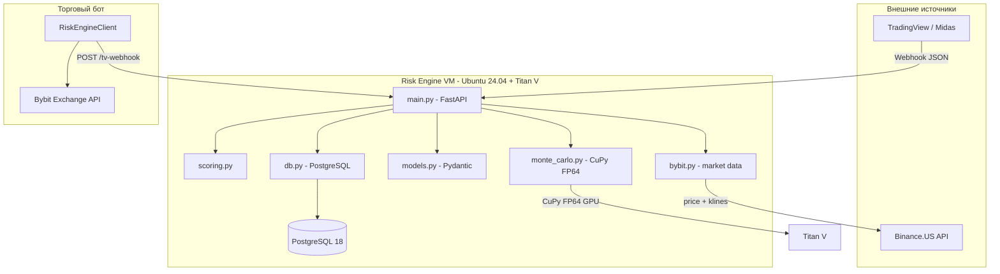
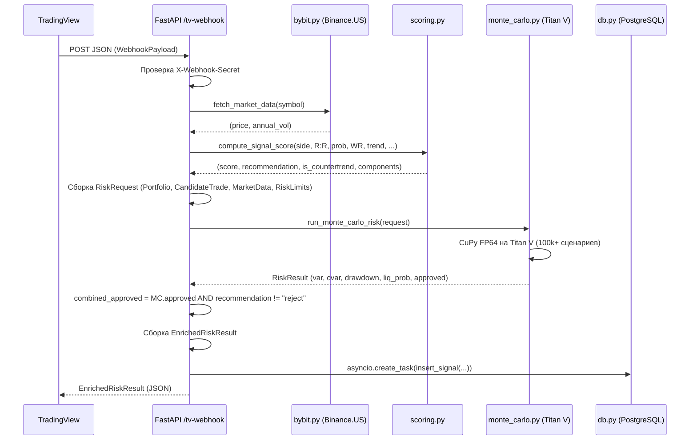
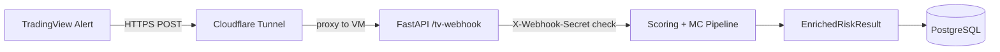

# Risk Engine — Полная проектная документация

> Агрегированный супер-подробный документ проекта.
> Источник: исторический контекст разработки, код, планы, бизнес-требования.

---

## Оглавление

1. [Обзор проекта (Executive Summary)](#1-обзор-проекта-executive-summary)
2. [Инфраструктура и GPU](#2-инфраструктура-и-gpu)
3. [Архитектура Risk Engine](#3-архитектура-risk-engine)
4. [Monte Carlo VaR/CVaR (ядро)](#4-monte-carlo-varcvar-ядро)
5. [Signal Scoring (scoring.py)](#5-signal-scoring-scoringpy)
6. [Market Data (bybit.py)](#6-market-data-bybitpy)
7. [База данных (db.py)](#7-база-данных-dbpy)
8. [TradingView / Midas интеграция](#8-tradingview--midas-интеграция)
9. [Тестирование](#9-тестирование)
10. ["Думалка" — модуль сопровождения позиций](#10-думалка--модуль-сопровождения-позиций)
11. [Защитные механизмы v0.10.1](#11-защитные-механизмы-v0100-performance--protection-suite)
12. [Roadmap](#12-roadmap)
13. [Titan V: преимущества для проекта](#13-titan-v-преимущества-для-проекта)
14. [Telegram Bridge](#14-telegram-bridge-telegram_bridgepy)
15. [Оценка эффективности RE](#15-оценка-эффективности-re--результаты-2026-03-31)
16. [История версий (Changelog)](#16-история-версий-changelog)

---

## 1. Обзор проекта (Executive Summary)

### Цель

Построить **Risk Engine** — сервис оценки и управления риском для крипто-торговли на бирже **Bybit**, который:

- принимает торговые сигналы из TradingView/Midas;
- оценивает каждый сигнал двумя слоями: **signal quality scoring** и **Monte Carlo VaR/CVaR** (FP64 на GPU);
- выдаёт рекомендацию: `approve` / `reduce` / `reject`;
- **активно** сопровождает открытые позиции в реальном времени («Думалка» — Active Mode, v0.18.4).

### Технологический стек

| Компонент | Технология |
|---|---|
| API-сервер | FastAPI (v0.18.7), uvicorn |
| GPU-вычисления | CuPy (FP64), Numba |
| GPU | NVIDIA Titan V (Volta, 12 GB HBM2) |
| Виртуализация | Proxmox VE 9.1, PCI passthrough (VFIO) |
| Гостевая ОС | Debian 13 (trixie) (VM) |
| База данных | PostgreSQL 18.3 (psycopg2) |
| Рыночные данные | Bybit Proxy v3.2 (VPS via Tailscale, bound to Tailscale IP) + Binance.US Spot + OKX Public API (3-tier fallback) |
| Биржевой аккаунт | Bybit Proxy authenticated: closed PnL, wallet balance (pybit) |
| Telegram Bridge | python-telegram-bot + httpx |
| Валидация | Pydantic v2 |
| Тестирование | pytest + httpx |
| Внешний доступ | Cloudflare Tunnel (digital7.org) + Fallback (ngrok) + Tailscale |

### Текущий статус

*Ниже — в хронологическом порядке эволюции продукта (раньше → позже). Нумерация Phase — проектные вехи; строки `v0.x.y` — релизы.*

- **Phase 2.7 (Validation Pipeline)** — завершена и протестирована на реальных сигналах Midas.
- **Phase 3.7 (Bot Integration + Shadow Mode)** — **DONE** (500+ реальных сигналов в БД, approval flow через Telegram Bridge).
- **Phase 5.5 (Liquidity + Multi-TF + Portfolio Allocator)** — **DONE** (v0.6.0).
- **Phase 6 (Backtest Module)** — **DONE** (v0.7.0, GPU CuPy, 397 позиций за 6.7с, 19 монет × 40 дней).
- **v0.8.0 (Observability & Audit Logging)** — **DONE** (JSON Logger, trace_id, PostgreSQL audit log, daily TG backups).
- **v0.8.1 (Watchlist Scanner/Post-Mortem ML Prep)** — **DONE** (Автономное детектирование проливов/пампов, алерты Telegram).
- **v0.8.2 (Dumalka Leakage Fixes & Metrics)** — **DONE** (Устранены баги фиксации профита, внедрен Capture Ratio tracking).
- **v0.9.x (Clean Architecture Tier 1)** — **DONE** (Strategy Pattern scoring, Per-Symbol Circuit Breaker, Time-Decay Exits, Apollo Protocol v2, Observability Audit).
- **v0.10.1 (Performance & Protection Suite)** — **DONE** (Binance Sentinel, Orderbook Shielding, Yield-Aware Apollo, DB BRIN indexing).
- **v0.12.0 (Adaptive Dumalka)** — **DONE** (Portfolio Heat Check, Dynamic Moonbag, 10-Tier Differential MC, Regime-Aware Thresholds, Compound Growth Engine shadow).
- **v0.13.1 (Code Cleanup + Edge Case Fixes)** — **✅ DONE** (MC zone floor fix, Ghost Tracker KPI cards, professional startup logging, archived 6 dead files, ATR-Adaptive SOFT BE, Apollo Protocol, Auto-Phantom-Close, Desync Resolution).
- **v0.13.2 (ML Intelligence Layer)** — **⚡ LIVE** (6 new ML features: btc_change_1h, rsi_14, orderbook_imbalance, long_short_ratio, funding_rate_change, market_regime. 3-tier market data fallback: Bybit→Binance.US→OKX. ML dataset expanded 23→29 columns. XGBoost v2 trained).
- **Phase 5 (ML/AI)** — **⚠️ BASELINE TRAINED** (v0.13.2: **72K+ снимков** (29 features), 67,555 labeled, XGBoost v2 trained (23 features), RL TradingEnv prototype ready).
- **v0.14.x (Execution Guard & Advanced Scaling)** — **✅ DONE** (v0.14.5 Graceful Reversal Protocol >4h cooldown, v0.14.4 Apollo Profit Rule eliminating partial closes in loss. v0.14.1 Observe-Only Mode for unconfirmed positions protecting against KillSwitch desync. v0.14.0 Young Position Grace Period (2h), R-Multiple scaling 2R/3R, CMD_FAIL_ALERT_THRESHOLD).
- **v0.14.2 (Shadow PnL + ML Data + Observability Suite)** — **✅ DONE** (Shadow PnL Tracker, `/api/scoring-quality` confusion matrix + calibration + threshold optimizer, Scoring Quality UI widget, 6 new ML feature columns, Repeat Signal Boost +0.03, structured trace_id, noise suppression -70%. **Extended in v0.16.0:** Shadow Recheck 2nd pass, `shadow_resolved_at`/`candles`, Midas Benchmark).
- **v0.15.0 (Apollo Audit)** — **✅ DONE** (Smart Size Guard MIN_PARTIAL_CLOSE_USD=17, Full Exit Fallbacks: apollo_full_exit/zone_full_exit/e_pnl_full_exit, eliminated 6,737 failed API calls).
- **v0.15.1 (WebSocket Price Feed + Faster Cycle)** — **✅ DONE** (Bybit WS real-time ticker for 23 symbols (shadow mode), 30s monitoring cycle (was 60s), 8min SL cooldown (was 15min), dashboard widget, /api/ws-prices endpoint).
- **v0.15.2 (Forensic System Hardening)** — **✅ DONE** (TP1 Normalizer capping effective TP distance for Zone Policy math at 10%, Configurable Partial Close gating via `PARTIAL_CLOSE_ENABLED`, forensic analytics `night_analysis.py`).
- **v0.15.9 (DB Hardening & Proxy Security)** — **✅ DONE** (CHECK/FK constraints, ON CONFLICT idempotency, Bybit Proxy Tailscale bind, dashboard error handling, bot win_rate regex fix, TG Bridge missing-data warning).
- **Phase 4D (Advanced Analytics + Midas/Bot Quality + GPU)** — **DONE** (19+ метрик, GPU Titan V аналитика, SL optimization, Midas signal quality, 3-level caching).
- **Phase 4E (GPU Analytics)** — **DONE** (`gpu_analytics.py`: batch MC 200K сценариев, GPU SL 150 caps, correlation matrix).
- **v0.16.0 (Midas Benchmark & Shadow Analytics)** — **⚡ LIVE** (Midas Benchmark API + dashboard panel, Shadow Recheck 2nd pass for stale "open" signals, shadow_resolved_at/candles tracking, guard INSERT price fallback fix).
- **v0.16.1 (Score Correction & Data Integrity)** — **⚡ LIVE** (Retrofix for win_rate parsing bug: corrected_score/recommendation backfill for 133 affected signals, 62 reclassified. Kline drift sanity checks. resolved_at < created_at guard).
- **v0.17.0 (Same-Coin Re-Entry Protocol)** — **⚡ LIVE** (Same-side signals for coins with active positions pass to scoring instead of blind reject. If approve/reduce, old position closed via Dumalka `full_close` before approving new. Reversal (v0.14.5) fix: now sends `full_close` to bot, was DB-only. Config: `REENTRY_ENABLED`, `REENTRY_COOLDOWN_HOURS=2.0`).
- **v0.18.0 (Exit Decision Quality Tracker)** — **⚡ LIVE / DATA COLLECTION** (2026-04-01: модуль `exit_quality.py` — пост-закрытие SL/TP + multi-horizon PnL в `what_if_outcomes`, фоновый backfill ~15 мин; read-only Phase 2/3: `sl_breakeven`, `missed-exits` по `sl_hit` после 26.03; дашборд «Exit Quality»; API `/api/exit-quality*`. `kline_fetcher.py` — вынесенный fetch klines без circular import. **Аналитика по Active Mode:** фильтр `since=2026-03-26` на дашборде и в отчётах; полная история до 26.03 смешивает разные режимы Думалки — интерпретировать отдельно.)
- **v0.18.1 (E_pnl Reform)** — **⚡ LIVE** (2026-04-02: `full_e_pnl_pct` — true E[PnL] по ВСЕМ MC paths, `pnl_skewness` — fat-tail detection, TP cap снят в MC, `E_PNL_EXIT_THRESHOLD=-1%`.)
- **v0.18.2 (Patience Protocol)** — **⚡ LIVE** (2026-04-02: Apollo Bail disabled (shadow-only), grace period `YOUNG_POSITION_HOURS` из config (1.0h). Деплой v0.18.1 на сервер.)
- **v0.18.3 (Bot Roster Desync)** — **⚡ LIVE** (2026-04-02: auto-close DB row при отсутствии символа в bot roster N циклов. POST /api/admin/force-close-position. `secrets.compare_digest` для секрета.)
- **v0.18.4 (Proven Position)** — **⚡ LIVE** (2026-04-02: Sticky grace bypass `_proven_positions` — позиция с max_pnl≥3% и tp≥50% получает zone policy/trailing даже в grace period. NOM #548 post-mortem: +14%→-3.7%, потом NOM +35%. TP1 idempotency guard — skip move_sl если SL уже на BE. Portfolio Stress Warning — TG alert при открытии same-dir пока underwater >5%.)
- **v0.18.5 (Exit Quality Pipeline Fix)** — **⚡ LIVE** (2026-04-03: исправлен неработающий backfill пайплайн `exit_quality.py` — 5 багов: OKX SWAP-first формат (6/16 символов требовали `-USDT-SWAP`), sentinel rows для unprocessable позиций, убран whitelist close_reason (был исключён `sl_hit` = 56% позиций), DESC ordering (newest first), batch 50/cycle 5min. `kline_fetcher.py` — SWAP-first OKX instId. Покрытие: 73→550+ позиций.)
- **v0.18.6 (Structured Audit Log)** — **⚡ LIVE** (2026-04-04: расширен `dumalka_audit_log` — новые колонки `pos_id` (INTEGER, indexed), `details` (JSONB). Audit-записи для ВСЕХ 13 close reasons (`position_closed`), phantom-переходов (`phantom_transition`), состояний (`observe_only`, `phantom_retry_ok`, `grace_proven`), теневых решений (`apollo_shadow`, `time_decay_exempt`). `market_state` автозаполняется (regime + BTC 1h). Покрытие: 30%→95% событий.)
- **v0.18.7 (ML Training Data Recovery)** — **⚡ LIVE** (2026-04-04: `finalize_snapshot_future_pnl` — заполняет `future_pnl_1h/4h` для последнего часа жизни позиции при закрытии. Backfill +10,670 future_pnl_1h + 25,475 future_pnl_4h. Labeled data: 24,750→33,659 (+36%). ML Reality Check: industry best practices comparison, updated roadmap.)
- **Phase 4 (Position Management / "думалка")** — **ACTIVE MODE LIVE** (v0.17.0–v0.18.7: ~2,3K LOC в `position_tracker.py`, 30s cycle, WebSocket Price Feed, Apollo Protocol, Zone Policy 5 зон, MC zone floor, Phantom Auto-Close, ML Intelligence Layer, 500+ сигналов, Re-Entry Protocol, Structured Audit Log; см. релизы v0.18.0–v0.18.7 выше.)
- **v0.18.8 (Hard SL Cap Activation)** — **⚡ LIVE** (2026-04-04: `PHASE1_ACTIVE_MODE=true`, `MAX_LOSS_PCT=3.5%`. Backtest PF 0.946→1.263 на 100 approve-only сделках.)
- **v0.18.9 (sl_breakeven Clamp Fix)** — **⚡ LIVE** (2026-04-04: ATR offset для SHORT мог поставить SL ниже рыночной цены (Bybit реджект). Clamp: `max(be_sl, current_price*1.001)` для SHORT. Zone 1: `sl_breakeven`→`hold`.)
- **v0.19.0 (Kline Storage + Scout)** — **⚡ LIVE** (2026-04-04: Историческое хранилище свечей `klines_history` (15m/1h/4h), 2-tier fetch OKX→Bybit Proxy с adaptive source cache. Автономный генератор сигналов Scout (EMA/RSI/Regime) в shadow mode — `scout_signals` с shadow PnL 1h/4h/24h. Endpoints: `/api/klines/{symbol}`, `/api/klines-stats`, `/api/scout-signals`. Фундамент для автономной торговли (Phase 6).)
- **v0.19.1 (Scout Enhancement + Derivatives)** — **⚡ LIVE** (2026-04-04: +3 типа сигналов Scout (funding_extreme_reversal, volume_breakout, rsi_divergence → итого 7). +4 ML-фичи на сигнал (long_short_ratio, atr_pct, ema_distance_pct, price_change_4h → итого 12). Новая таблица `derivatives_snapshots` — time-series funding/OI/LSR для curve regime detection. Обновлён investigation workflow в audit-log rule. Ревизия: API stagger 150ms, independent feature fetches, always-log cycle. 14 unit + 4 integration тестов, 0 errors.)
- **v0.19.2 (Rocket Catcher: Multi-Horizon ML + Peak Tracking)** — **⚡ LIVE** (2026-04-04: Новые ML-колонки `future_pnl_12h` (46.2% fill) и `future_pnl_max_24h` (100% fill) в `position_snapshots`. Peak tracking `max_pnl_24h` / `max_pnl_24h_hour` в `what_if_outcomes`. Labeler v2 с multi-horizon логикой + Hard SL Cap guard (drawdown > 3.5% → close). 8-й тип Scout-сигнала: `spike_consolidation_breakout` (re-entry). Dynamic symbol tracking: kline_collector + Scout теперь включают символы закрытые за 48h (34 символа вместо 26). Label distribution shift: close +3K (hard SL guard), hold -2.6K.)
- **v0.19.5 (Volatility Risk Profile: Audit Enrichment + Deep Kline Backfill)** — **⚡ LIVE** (2026-04-07: Обогащение audit diagnostics для zone_full_exit/e_pnl_full_exit/sl_breakeven — теперь пишутся volatility, adaptive_factor, vol_modifier, regime_dd, heat_modifier, zone, base_thresh, vol_ratio в mc_diagnostics JSON. Скрипт deep kline backfill (500 1h + 200 4h с пагинацией). Валидирована 3-tier классификация волатильности: DEFINITE HIGH (>=4.0: SIREN/NOM/STO), TRANSITIONAL (2.0-4.0: RIVER/CUSDT/KERNEL — хуже при высокой vol), NORMAL (<2.0). Root cause «triple compression»: af×vol_mod×regime сжимает Zone 3 порог с 15% до 5.1-7.2%. Phase 2 с conditional threshold fix — checkpoint 21 апреля.)
- **v0.19.8 (API-first Bot Integration)** — **⚡ LIVE** (2026-04-11: Bot↔RE коммуникация переведена на чистый HTTP API — Telegram используется только для observability людьми. Добавлено: `rejection_reason` в `EnrichedRiskResult` (Pydantic), dedup bypass для `source=bot_direct` в `/tv-webhook`, upsert открытой позиции при `event:open` в `/trade-outcome`, `send_signal_report()` и `send_trade_event_report()` в `notifications.py` с вызовами из `main.py`. Документация: `docs/BOT_API_CONTRACT.md` — полный контракт для разработчика бота.)
- **v0.19.7 (Health Watchdog)** — **⚡ LIVE** (2026-04-11: `health_watchdog.py` — async мониторинг 9 компонентов (GPU, PostgreSQL, WebSocket, Sentinel, Shadow PnL, Exit Quality, Kline Collector, Scout, Dumalka) + отдельный трекер связи с торговым ботом. TG-алерты при молчании >7 мин, 30-мин cooldown, recovery-уведомления. Config: `HEALTH_WATCHDOG_ENABLED`, `BOT_UNREACHABLE_ALERT_SEC`, `WATCHDOG_COMPONENT_ALERT_SEC`.)
- **v0.19.6.1 (Close Event Fix + Bot Integration)** — **⚡ LIVE** (2026-04-10: Исправлена критическая ошибка обработки close-event: VALID_EVENTS gate в telegram_bridge.py блокировал dumalka_close/manual_close/flip_close (14 сделок получили неверный close_reason с задержкой 5-249 мин). Добавлен close-handler в /trade-outcome HTTP endpoint. PR Дмитрия (fix/v0.19.6-close-event-types) замержен с дополнительными фиксами. 20 тестов (17 unit + 3 integration). Tech debt: 16 аналитических SQL-запросов нуждаются в обновлении.)
- **v0.19.6 (ML Shadow Mode)** — **⚡ LIVE** (2026-04-08: ExtraTrees+Optuna model (LOO AUC 0.574, Inner CV 0.610) loaded at startup from `src/models/et_shadow_v1.pkl`. Predicts profit probability for each position after 5 snapshots (~2.5 min). Logs to `ml_predictions` table — no trade impact. Based on 7 ML experiments (EXP-1–EXP-7) comparing 12+ models. Config: `ML_SHADOW_ENABLED`, `ML_SHADOW_CONFIDENCE_THRESHOLD`. API: `GET /api/ml-shadow`. Train: `python3 src/scripts/train_shadow_model.py`.)
- **v0.19.4 (ATR-adaptive TP1 Soft BE skip)** — **⚡ LIVE** (2026-04-05: Исправлена сломанная формула TP1 Soft BE в `position_tracker.py` — `max(0.002, min(0.005, atr_4h*1.5))` всегда возвращала фиксированные 0.5% из-за того что cap `min(0.005, ...)` срабатывал на всех реальных активах. Новая формула: `max(TP1_BE_MIN_PCT, min(TP1_BE_MAX_PCT, atr_1h × TP1_BE_OFFSET_MULT))` (диапазон 0.5%–3.0%). Добавлен skip когда TP1 дистанция < `TP1_BE_ATR_SKIP_MULT × ATR(1h)` (default 2.0) — позиция держит original SL, BE-сдвиг не делается. Валидация: 7/7 случаев с 27.03 — skip равен или лучше текущего поведения, суммарный восстановленный PnL +21.9%. 4 конфиг-параметра через `.env`: `TP1_BE_ATR_SKIP_MULT`, `TP1_BE_OFFSET_MULT`, `TP1_BE_MIN_PCT`, `TP1_BE_MAX_PCT`.)

### Ключевые файлы проекта

| Файл | Назначение |
|---|---|
| `src/main.py` | FastAPI-приложение (v0.19.5, ~3.5K LOC), startup background tasks (8: Tracker, Scanner, Sentinel, Shadow PnL, WS Feed, Exit Quality, Kline Collector, Scout), endpoints, Midas Benchmark, score correction |
| `src/exit_quality.py` | **v0.18.5** — Exit Decision Quality Tracker: backfill `what_if_outcomes` (все close_reason, DESC ordering, sentinel rows, batch 50 / 5 min), summary / sl_breakeven / missed-exits, heartbeat для `/health` |
| `src/kline_fetcher.py` | **v0.18.5** — `fetch_klines_with_fallbacks` (OKX SWAP-first → spot → Binance.US → Bybit → proxy), общий для shadow/exit-quality без импорта из `main` |
| `src/core/monte_carlo.py` | Ядро Monte Carlo VaR/CVaR на CuPy FP64 (Jump-Diffusion GBM + Poisson Jumps) |
| `src/core/accumulation_scanner.py` | Accumulation Scanner: детекция паттерна "сжатая пружина" (OI, Vol, Funding), Telegram Digest (v0.10.1) |
| `src/core/sentinel.py` | Binance Sentinel: Flash crash monitor via WebSocket (ALERT/EMERGENCY) |
| `src/models.py` | Pydantic v2 модели данных (Portfolio, Position, RiskRequest, WebhookPayload, TradeOutcomePayload и др.) |
| `src/scoring_v2.py` | **ACTIVE** — Strategy Pattern scoring, 7 компонентов (v0.9.0+, заменил `scoring.py`) |
| `src/scoring.py` | **LEGACY** — оригинальный scoring, сохранён для reference |
| `src/bybit.py` | Рыночные данные (694 LOC): 3-tier fallback (Bybit→Binance.US→OKX) + ML Intelligence Layer (btc_change_1h, RSI, orderbook imbalance, LSR) |
| `src/db.py` | PostgreSQL layer (462 LOC): signals (38 cols), open_positions, trade_outcomes, position_snapshots (29 ML features). ML Intelligence (v0.13.2) |
| `src/db_adapter.py` | PostgreSQL connection pool (312 LOC): autocommit reads, health checks, rollback safety |
| `src/telegram_bridge.py` | Telegram Bridge v3.0 (835 LOC): Midas parser + approval flow + Trade Events |
| `src/position_tracker.py` | Думалка (~2,3K LOC, v0.19.5): Zone Policy, TP1 Normalizer, Configurable Partial Closes, Apollo Protocol, MC Forward, Differential MC, E_pnl Reform, Proven Position bypass, Bot roster desync, TP1 idempotency, Structured Audit Log, finalize_future_pnl, **ATR-adaptive TP1 Soft BE skip (v0.19.4)**, **Enriched audit diagnostics (v0.19.5)** |
| `src/core/bybit_ws.py` | Bybit WebSocket Price Feed (172 LOC): real-time tickers for 26 symbols, shadow mode, auto-reconnect (v0.17.0) |
| `src/core/trading_env.py` | RL Trading Environment (v0.13.1): Gym-compatible, 131 episodes, 10-feature state, 4 actions |
| `src/kline_collector.py` | **v0.19.0** — Kline Historical Collector: 2-tier fetch (OKX→Bybit Proxy), adaptive source cache, auto-backfill 100 candles, 15m/1h/4h, 26 symbols |
| `src/scout.py` | **v0.19.2** — Scout Signal Generator: 8 signal types (+spike_consolidation_breakout), 12 ML features, derivatives time-series, 48h post-close tracking, shadow mode only |
| `src/scripts/export_ml_dataset.py` | ML data export (v0.13.2): PG→CSV, 67,527 rows × 29 columns (10 core + 4 engineered + 4 conditional + 4 intelligence + 1 regime) |
| `src/scripts/train_exit_model.py` | XGBoost v2 trainer (v0.13.2): 23 features, class weights, time-based split, feature importances |
| `src/regime_detector.py` | Regime Detector: trending/ranging/volatile/low_liquidity/normal (v0.7.0) |
| `src/portfolio_allocator.py` | Секторные лимиты концентрации портфеля (v0.6.0) |
| `src/compound_growth.py` | Compound Growth Engine (shadow): dynamic sizing + drawdown circuit breaker (v0.12.0) |
| `src/backtest.py` | Бэктест-модуль: GPU CuPy, 19 монет × 40 дней (v0.7.0) |
| `src/daily_report.py` | Ежедневный TG отчёт (cron 09:00) |
| `src/config.py` | Конфигурация: PostgreSQL, Bybit Proxy URL, Kelly, Telegram |
| `src/tests/` | 21+ pytest тестов (Monte Carlo, scoring, regime, funding) |

---

## 2. Инфраструктура и GPU

### 2.1. Обзор платформы

- **Хост**: Proxmox VE 9.1 (Debian 13 / trixie)
- **GPU**: NVIDIA Titan V (архитектура Volta)
  - 12 GB HBM2, пропускная способность ~652 GB/s
  - 5120 CUDA-ядер
  - FP32: ~14.9 TFLOPS
  - FP64: ~7–7.5 TFLOPS (теоретически), **~6.3 TFLOPS** (реальный бенчмарк, 80–90% от пика)
  - FP16/Tensor Cores: ~125 TFLOPS (mixed precision)
  - FP64 не урезан (соотношение FP64:FP32 = 1:2, в отличие от GeForce где 1:32)
- **VM**: VMID 200 (ранее 106), Q35 чипсет + UEFI (OVMF), 10 vCPU, 32 GB RAM, Ubuntu 24.04
- **Диск**: на отдельном HDD

### 2.2. Пошаговая настройка PCI Passthrough (VFIO)

#### Шаг 1. Включить виртуализацию и IOMMU в BIOS

- **Intel**: VT-d
- **AMD**: SVM + IOMMU
- Сохранить и перезагрузиться.

#### Шаг 2. Включить IOMMU в Proxmox

Открыть `/etc/default/grub` и дописать к `GRUB_CMDLINE_LINUX_DEFAULT`:

```bash
# Intel:
intel_iommu=on iommu=pt

# AMD:
amd_iommu=on iommu=pt
```

Обновить GRUB:

```bash
update-grub
```

Перезагрузить хост.

#### Шаг 3. Загрузить VFIO-модули

В `/etc/modules` дописать:

```
vfio
vfio_iommu_type1
vfio_pci
vfio_virqfd
```

Перезагрузиться.

#### Шаг 4. Проверить IOMMU и IOMMU-группы

```bash
dmesg | grep -e IOMMU -e DMAR
find /sys/kernel/iommu_groups/ -type l
```

Убедиться, что IOMMU активен. Посмотреть группы, где находится Titan V (видеоустройство и аудио-функция).

#### Шаг 5. Узнать PCI ID видеокарты

```bash
lspci -nn | grep -i nvidia
```

Результат вида:

```
01:00.0 VGA ... [10de:1d81]
01:00.1 Audio ... [10de:10f0]
```

(ID примерные, зависят от конкретного оборудования.)

#### Шаг 6. Привязка Titan V к vfio-pci

Создать файл `/etc/modprobe.d/vfio.conf`:

```bash
options vfio-pci ids=10de:1d81,10de:10f0
```

Где `ids=` — реальные ID из `lspci -nn`.

#### Шаг 7. Заблокировать nvidia-драйвер на хосте

Создать `/etc/modprobe.d/blacklist-nvidia.conf`:

```bash
blacklist nouveau
blacklist nvidia
blacklist nvidia_drm
blacklist nvidia_modeset
```

Затем:

```bash
update-initramfs -u
reboot
```

#### Шаг 8. Проверить, что карта у vfio-pci

```bash
lspci -nnk -s 01:00.0
```

В разделе `Kernel driver in use` должно быть `vfio-pci`.

#### Шаг 9. Настройка VM в Proxmox

1. **Создать VM**: Q35 чипсет + UEFI (OVMF) — минимум проблем с passthrough.
2. **Добавить PCI-устройства**: Hardware → Add → PCI Device:
   - Выбрать `01:00.0` (VGA) и `01:00.1` (Audio) Titan V.
   - Включить: All Functions, Primary GPU (при необходимости), PCI-Express.
   - ROM-Bar: оставить по умолчанию.
3. **Проверить hostpci0** в `/etc/pve/qemu-server/<VMID>.conf`:

```
hostpci0: 01:00,pcie=1,x-vga=1
```

При необходимости: `multifunction=on`.

#### Шаг 10. Поставить драйверы внутри VM

- **Linux** (Ubuntu/Debian): проприетарные драйверы NVIDIA из репозиториев или CUDA-репозитория.
- **Windows**: GeForce/Studio драйвер с сайта NVIDIA.

### 2.3. Что даёт passthrough

- Запуск LLM, Stable Diffusion, тренировки/инференса нейросетей в гостевой системе с доступом к CUDA и cuDNN.
- Почти полный доступ к FP16/FP32/FP64 Titan V.
- Несколько изолированных окружений (разные версии CUDA/драйверов) как отдельные VM.
- Изоляция: если гостевая ОС «упадёт», Proxmox-хост продолжит работать.

### 2.4. Рекомендации

- В Proxmox 9 (Debian 13) лучше избегать установки драйвера NVIDIA на хост при чистом passthrough — уменьшает шанс конфликтов VFIO.
- Для LLM/SD-нагрузки достаточно одной VM с Linux (Ubuntu 22.04/24.04), CUDA 12.x и PyTorch/TF.

### 2.5. Бенчмарк FP64

- Теоретический FP64 Titan V: ~7–7.5 TFLOPS.
- Реальный бенчмарк (benchmark.py): **~6302 GFLOPS** (~6.3 TFLOPS).
- Это 80–90% от теоретического пика — карта почти полностью реализует своё преимущество по double-precision.
- Для сравнения: RTX 3090 даёт ~0.5–0.6 TFLOPS FP64 (1/32 от FP32). Titan V даёт **10–12x** больше FP64 мощности.

---

## 3. Архитектура Risk Engine

### 3.1. Высокоуровневая диаграмма



### 3.2. API Endpoints

| Endpoint | Метод | Описание |
|---|---|---|
| `/tv-webhook` | POST | Полный pipeline: приём сигнала → market data → scoring → Monte Carlo → DB → EnrichedRiskResult |
| `/evaluate` | POST | Чистый Monte Carlo VaR/CVaR по RiskRequest (без scoring, без DB) |
| `/portfolio-risk` | POST | Только портфельный риск (candidate_trade=None) |
| `/import-signals` | POST | Batch-импорт массива WebhookPayload (вызывает tv_webhook для каждого) |
| `/analysis` | GET | SQL-аналитика: by_recommendation, countertrend_stats, midas_vs_re_agreement |
| `/signals` | GET | Последние сигналы из БД (параметр `limit`) |
| `/health` | GET | Статус GPU, free/total memory (MB), версия сервиса |
| `/manage-position` | POST | *(планируется)* Сопровождение открытой позиции: рекомендация hold/move_sl/partial_close/full_close |
| `/api/analytics` | GET | Аналитика: 19+ метрик (вкл. SL optimization, Midas hit rate, slippage, symbol ranking, streaks). 3-уровневый кэш |
| `/api/gpu-analytics` | GET | **GPU Titan V**: batch Monte Carlo (200K сценариев для всех открытых позиций) + GPU SL optimization (150 кэпов) |
| `/api/score-outcome` | GET | Scatter data: score vs outcome для dashboard |
| `/api/backfill-close-reasons` | POST | Ретроспективная классификация close_reason_detailed для всех закрытых позиций |
| `/api/what-if-analysis` | POST | What-If: для ручных закрытий проверяет, дошла бы цена до SL/TP (klines через Bybit proxy) |
| `/api/refresh-bybit-pnl` | GET | v0.7.2: Загрузка real closed PnL из Bybit API → агрегация по символам → кэш (5 мин) |
| `/api/account` | GET | v0.7.2: Текущий баланс Bybit аккаунта (equity, available, unrealized PnL) |
| `/api/regime` | GET | v0.7.0: Текущий рыночный режим (trending/ranging/volatile/low_liquidity), confidence, параметры корректировки |

### 3.3. Модели данных (models.py)

#### Position

```python
class Position(BaseModel):
    symbol: str        # "BTCUSDT"
    side: str          # "long" / "short"
    size: float        # размер позиции
    entry_price: float # цена входа
```

#### Portfolio

```python
class Portfolio(BaseModel):
    equity: float               # текущий equity счёта
    positions: list[Position]   # список открытых позиций
```

#### CandidateTrade

```python
class CandidateTrade(BaseModel):
    symbol: str
    side: str
    size: float
```

#### MarketData

```python
class MarketData(BaseModel):
    prices: dict[str, float]             # {"BTCUSDT": 67000.0, ...}
    volatilities: dict[str, float]       # annualized sigma: {"BTCUSDT": 0.85, ...}
    correlations: dict[str, dict[str, float]] | None = None  # опциональная матрица корреляций
```

#### RiskLimits

```python
class RiskLimits(BaseModel):
    max_var: float               # максимально допустимый VaR (абсолютное значение)
    max_cvar: float              # максимально допустимый CVaR
    max_liquidation_prob: float  # максимальная вероятность ликвидации (0..1)
```

#### RiskResult

```python
class RiskResult(BaseModel):
    var: float
    cvar: float
    max_drawdown: float
    liquidation_probability: float
    approved: bool
    n_scenarios: int
    latency_ms: float
```

#### EnrichedRiskResult

Расширенный результат, объединяющий Monte Carlo + scoring + Midas-метаданные:

```python
class EnrichedRiskResult(BaseModel):
    # Monte Carlo
    var: float
    cvar: float
    max_drawdown: float
    liquidation_probability: float
    approved: bool          # combined: MC approved AND scoring != "reject"
    n_scenarios: int
    latency_ms: float
    # Signal scoring
    signal_score: float
    recommendation: str     # "approve" / "reduce" / "reject"
    is_countertrend: bool
    components: dict        # {"wr": ..., "prob": ..., "rr": ..., "trend_align": ..., "vol_ok": ...}
    # Midas metadata
    midas_probability: float | None
    midas_win_rate: float | None
    midas_trend: str | None
    risk_reward: float | None
```

#### WebhookPayload

```python
class WebhookPayload(BaseModel):
    symbol: str
    side: str               # "long" / "short"
    size: float
    source: str = "tradingview"
    # Midas metadata (optional)
    stop_loss: float | None = None
    tp1: float | None = None
    tp2: float | None = None
    tp3: float | None = None
    trailing: bool | None = None
    risk_reward: float | None = None
    probability: float | None = None
    win_rate: float | None = None
    trend: str | None = None         # "bullish" / "bearish" / "бычий" / "медвежий"
    trend_strength: str | None = None
    volume_level: str | None = None
    comment: str | None = None
    # Phase 3 (planned)
    current_equity: float | None = None
    open_positions: list[dict] | None = None
```

### 3.4. Pipeline обработки сигнала (/tv-webhook)



---

## 4. Monte Carlo VaR/CVaR (ядро)

### 4.1. Алгоритм

Risk Engine использует **Monte Carlo симуляцию** на GPU (CuPy, FP64) для оценки портфельного риска.

**Основные параметры:**

- Количество сценариев: настраиваемое (по умолчанию ≥100,000)
- Доверительный уровень (alpha): 0.99 (1% хвост)
- Точность: FP64 (double precision) на Titan V

**Шаги алгоритма:**

1. **Генерация случайных чисел**: `Z = cp.random.randn(n_scenarios, n_assets)` — стандартные нормальные случайные величины на GPU.

2. **Корреляции** (опционально): если задана корреляционная матрица, применяется разложение Холецкого:
   ```
   L = cholesky(correlation_matrix)
   Z_correlated = Z @ L.T
   ```
   Корреляции должны быть симметричными.

3. **Симуляция P&L** по каждому инструменту (упрощённый GBM, линейный, без дрейфа):
   ```
   dS/S = sigma * sqrt(dt) * Z
   PnL_i = position_size * entry_price * dS/S
   ```
   Где `sigma` — annualized volatility, `dt` — временной горизонт.

4. **Агрегация P&L по портфелю**: суммирование P&L по всем позициям + candidate trade.

5. **Сортировка** `total_pnl` (переносится на CPU для `np.sort`).

6. **VaR** (Value at Risk):
   ```
   var_idx = max(0, min(int(n_scenarios * (1 - alpha)), n_scenarios - 1))
   VaR = -sorted_pnl[var_idx]
   ```
   С защитой границ индекса (v2 fix).

7. **CVaR** (Conditional VaR / Expected Shortfall):
   ```
   CVaR = -mean(sorted_pnl[:var_idx])   # среднее по хвосту хуже VaR
   ```

8. **Max Drawdown**: реальный worst-case по P&L (минимальное значение из всех сценариев).

9. **Liquidation Probability**:
   ```
   liq_prob = count(total_pnl < -equity * threshold) / n_scenarios
   ```

10. **Approval**:
    ```
    approved = (var <= max_var) AND (cvar <= max_cvar) AND (liq_prob <= max_liquidation_prob)
    ```
    В v2 добавлена проверка `max_cvar` (ранее не использовалась в approval).

### 4.2. Исправления v2

| Проблема | Исправление |
|---|---|
| VaR index без защиты границ | Добавлены `max(0, min(..., n_scenarios-1))` + явный параметр `alpha` |
| `max_cvar` не участвовал в `approved` | Включён в approval logic |
| Корреляции могли быть несимметричными | Принудительная симметризация |
| Неясно annualized vs daily sigma | Задокументировано как **annualized σ** в MarketData |
| Drawdown по формуле | Заменён на реальный worst-case по P&L |
| Логирование | Добавлены: latency_ms, equity, n_scenarios, approved |
| `datetime.utcnow()` deprecated | Заменён на `datetime.now(timezone.utc)` |

### 4.3. Почему FP64

- Monte Carlo с большим числом сценариев (100k+) чувствителен к численным ошибкам при суммировании.
- FP64 гарантирует точность хвостовых оценок (VaR/CVaR), особенно при близких к нулю значениях.
- Titan V обеспечивает **~6.3 TFLOPS FP64** — это 10–12x больше, чем RTX 3090 (~0.5 TFLOPS FP64).
- Для финансовых Monte Carlo (особенно с корреляциями и Cholesky) FP64 — стандарт индустрии.

---

## 5. Signal Scoring (scoring_v2.py)

> ⚠️ **v0.9.0+**: Активный скорер — `scoring_v2.py` (Strategy Pattern с `HeuristicScorer`). Файл `scoring.py` сохранён как LEGACY reference.
>
> **v0.14.2 Predictive Analysis (408 trades):** Только `win_rate` имеет предсказательную силу (Δ=+0.088). `risk_reward` инвертирован (Δ=-0.053). Post-scoring `repeat_signal_boost` (+0.03 для повторных сигналов <6h) даёт WR 52% vs 41%.

### 5.1. Функция `compute_signal_score`

**Входные параметры:**

| Параметр | Тип | Описание |
|---|---|---|
| `side` | str | "long" / "short" |
| `risk_reward` | float / None | Risk/Reward ratio из Midas |
| `probability` | float / None | Вероятность достижения TP (%) |
| `win_rate` | float / None | Win rate торговой системы (%) |
| `trend` | str / None | Текущий тренд: "bullish"/"bearish"/"бычий"/"медвежий" |
| `trend_strength` | str / None | Сила тренда |
| `volume_level` | str / None | Уровень объёма |
| `market_vol` | float | Текущая annualized волатильность рынка |

### 5.2. Компоненты скора

```
wr         = (win_rate  или 50) / 100
prob       = (probability или 50) / 100
rr         = min((risk_reward или 2.0) / 5.0, 1.0)
trend_align = 0 если контртренд, 1 если по тренду
vol_ok     = max(0.2, 1 - market_vol / 3)
```

### 5.3. Weighted Composite Score

```
score = 0.25 * wr
      + 0.22 * prob
      + 0.17 * rr
      + 0.14 * trend_align
      + 0.07 * vol_ok
      + 0.08 * liquidity_ok
      + 0.07 * funding_oi
```

**Веса (v0.7.0):**

| Компонент | Вес | Обоснование |
|---|---|---|
| Win Rate | 25% | Главный исторический предиктор |
| Probability | 22% | Оценка Midas по текущему сетапу |
| Risk/Reward | 17% | Соотношение потенциала к риску |
| Trend Alignment | 14% | Multi-TF confluence (v0.6.0), корректируется Regime Detector (v0.7.0) |
| Volatility OK | 7% | Штраф при экстремальной волатильности |
| Liquidity OK | 8% | Штраф при высоком спреде / низкой ликвидности (v0.6.0) |
| Funding + OI | 7% | Детекция crowded trades через funding rate и OI momentum (v0.7.0) |

### 5.4. Определение контртренда

Сигнал считается **контртрендовым**, если:

- `side == "long"` и `trend` содержит "bear" или "медвеж"
- `side == "short"` и `trend` содержит "bull" или "бычий"

Поддерживаются и русские, и английские названия трендов.

### 5.5. Пороги и рекомендации

| Score | Recommendation |
|---|---|
| < 0.45 | `"reject"` — сигнал отклоняется |
| 0.45 – 0.59 | `"reduce"` — размер позиции рекомендуется уменьшить |
| ≥ 0.60 | `"approve"` — сигнал одобрен |

### 5.6. Форсированные правила (overrides)

1. **Контртренд + низкая вероятность**: если `is_countertrend == True` и `probability < 30` → принудительный `"reject"`, независимо от score.
2. **Низкий Win Rate**: если `win_rate < 30` → рекомендация не может быть выше `"reduce"`.

### 5.7. Возвращаемое значение

```python
{
    "score": float,           # 0.0 – 1.0
    "recommendation": str,    # "approve" / "reduce" / "reject"
    "is_countertrend": bool,
    "components": {
        "wr": float,
        "prob": float,
        "rr": float,
        "trend_align": float,  # 0.0 – 1.0 (multi-TF confluence в v0.6.0)
        "vol_ok": float,
        "liquidity_ok": float, # v0.6.0: 0.2 – 1.0
        "funding_oi": float    # v0.7.0: 0.0 – 1.0
    },
    "kelly_f": float
}
```

### 5.8. Liquidity / Slippage Check (v0.6.0)

Новый компонент `liquidity_ok` штрафует сигналы с низкой ликвидностью:

**Источник данных:** `fetch_orderbook_depth(symbol, trade_size_usd)` в `bybit.py`
- Получает стакан через Bybit Proxy `/orderbook/{symbol}`
- Симулирует рыночный ордер нашего размера
- Возвращает `(spread_pct, slippage_pct)`

**Влияние на scoring:**

| Spread | liquidity_ok | Эффект |
|---|---|---|
| 0% | 1.0 | Идеальная ликвидность |
| 0.15% | 0.5 | Умеренный штраф |
| ≥ 0.3% | 0.2 | Максимальный штраф |
| Нет данных | 0.7 | Лёгкий штраф за неизвестность |

**Force-reject по проскальзыванию:**

Если `slippage_pct > SLIPPAGE_REJECT_RATIO × stop_loss_pct` (по умолчанию > 50% от расстояния до SL) → принудительный `reject`. При SL 0.5% и проскальзывании 0.3% — это 60% стопа, что делает сделку нецелесообразной.

### 5.9. Multi-Timeframe Trend Confluence (v0.6.0)

Замена бинарного `trend_align` (0 или 1) на градуальный `confluence_score`:

**Источник данных:** `fetch_multi_timeframe(symbol)` в `bybit.py`
- Запрашивает klines на 15m, 1h, 4h (параллельно через `asyncio.gather`)
- Определяет тренд на каждом таймфрейме через EMA20 vs EMA50

**Confluence scoring:**

| Совпадение | Score | Тип входа |
|---|---|---|
| 3/3 таймфрейма | 1.0 | Сильный confluence |
| 2/3 таймфрейма | 0.7 | Pullback opportunity |
| 1/3 таймфрейма | 0.3 | Слабый / расхождение |
| 0/3 таймфрейма | 0.0 | Полный контр-тренд |

При отсутствии multi-TF данных — fallback на бинарную логику (backward compatible).

### 5.10. Portfolio Allocator (v0.6.0)

Новый модуль `portfolio_allocator.py` предотвращает скрытую концентрацию риска.

**Секторная классификация:**

| Сектор | Примеры | Характеристика |
|---|---|---|
| BTC_LIKE | BTCUSDT | Низкая волатильность |
| ETH_LIKE | ETHUSDT | Средняя волатильность |
| MAJOR_ALT | SOL, AVAX, LINK, DOT, ADA... | Средне-высокая волатильность |
| ALT | Всё остальное | Высокая волатильность |

**Лимиты:**

| Параметр | Значение | Описание |
|---|---|---|
| `MAX_EXPOSURE_PER_SYMBOL` | 20% equity | Макс. экспозиция на один символ |
| `MAX_SECTOR_EXPOSURE` | 50% equity | Макс. экспозиция на один сектор |

**Логика:**
1. Рассчитать текущую экспозицию по секторам из `open_positions`
2. Если добавление кандидата превысит лимит символа → `reject`
3. Если превысит лимит сектора → `reduce` (с предложенным мультипликатором)
4. Иначе → `ok`

### 5.11. Funding Rate + Open Interest (v0.7.0)

Новый компонент `funding_oi` детектирует **crowded trades** на основании данных Bybit.

**Источник данных:** `fetch_funding_and_oi(symbol)` в `bybit.py`
- Bybit Proxy `/tickers/{symbol}` → `fundingRate`, `openInterest`, `openInterestChg24h`
- Fallback: `(0.0, 0.0)` → нейтральный скор 0.5

**Логика scoring:**

| Ситуация | funding_oi | Эффект |
|---|---|---|
| Extreme positive funding + long | 0.2 | Crowded long → штраф |
| Extreme negative funding + short | 0.2 | Crowded short → штраф |
| Moderate funding aligned | 0.7 | Нейтрально-позитивно |
| OI рост 2-15% | +0.1 | Здоровый интерес рынка |
| OI рост >20% | -0.1 | Риск ликвидации |
| Нет данных | 0.5 | Нейтрально |

**Force-reduce:** если `|funding_rate| > 0.001` (>0.1%) и позиция в направлении краудед → `approve` понижается до `reduce`.

### 5.12. Regime Detector (v0.7.0)

Модуль `regime_detector.py` — rule-based классификатор рыночного режима.

**Режимы:**

| Режим | Условие | dd_sensitivity | trend_weight |
|---|---|---|---|
| 📈 Trending | EMA20/50 разделение >1%, ATR >0.8 | 0.85 (жёстче) | 1.4x (усилить) |
| ↔️ Ranging | EMA20≈EMA50 (<0.5%), ATR < 1.2 | 1.2 (мягче) | 0.6x (ослабить) |
| 🌊 Volatile | ATR ratio >2× или annual_vol >2.0 | 0.65 (очень жёстко) | 0.8x |
| 🏜️ Low Liquidity | volume_ratio <0.3 | 0.7 (жёстко) | 0.5x |
| ⚡ Normal | Остальное | 1.0 | 1.0x |

**Интеграция:**

1. **Scoring:** веса компонентов домножаются на режимные мультипликаторы → перенормализуются
2. **Думалка:** `adjusted_threshold *= regime_dd_sensitivity` — в volatile режиме пороги зон ужесточаются, в trending — ослабляются
3. **Кэш:** результат обновляется каждые 15 мин на основе BTC klines (60 часовых свечей)
4. **API:** `/api/regime` — текущий режим, confidence, детали

**Конфигурация (`config.py`):**

| Параметр | Default | Описание |
|---|---|---|
| `REGIME_DETECTOR_ENABLED` | true | Включение/отключение |
| `REGIME_CACHE_SECONDS` | 900 | TTL кэша (15 мин) |

---

## 6. Market Data (bybit.py, 671 LOC)

### 6.1. Архитектура (3-Tier Fallback)

Модуль `bybit.py` реализует **трёхуровневую** систему получения рыночных данных:

```
Primary:  Bybit Proxy (VPS 100.117.168.63:8002 via Tailscale) → реальные данные Bybit
Fallback: Binance.US Spot (api.binance.us) + OKX Public (www.okx.com/api/v5)
Default:  Graceful zero/None для ML safety
```

### 6.2. API-функции и покрытие Fallback

| Функция | Назначение | Primary | Fallback | При отказе обоих |
|---------|-----------|---------|----------|-----------------|
| `fetch_market_data(symbol)` | Цена + ann. vol | Bybit Proxy (3 retry) | ✅ Binance.US Spot | `(0.0, VOL_FALLBACK)` |
| `fetch_volume_info(symbol)` | Volume ratio 24h | Bybit Proxy | ✅ Binance.US klines | `1.0` |
| `fetch_orderbook_depth(symbol)` | Spread + slippage | Bybit Proxy | ✅ Binance.US Spot `/depth` | `(0.0, 0.0)` |
| `fetch_orderbook_raw(symbol)` | L2 walls для SL | Bybit Proxy | ✅ Binance.US Spot `/depth` | `([], [])` |
| `fetch_multi_timeframe(symbol)` | 15m/1h/4h EMA trends | Bybit Proxy | ✅ Binance.US `/klines` | `None` |
| `fetch_funding_and_oi(symbol)` | Funding rate + OI delta | Bybit Proxy | ✅ **OKX Public API** | `(0.0, 0.0)` + WARNING |
| `fetch_closed_pnl()` | Реальный PnL Bybit | Bybit Proxy | ❌ (Bybit only) | `[]` |
| `fetch_wallet_balance()` | Equity/balance | Bybit Proxy | ❌ (Bybit only) | `None` |
| **ML Intelligence Layer (v0.13.2)** | | | | |
| `fetch_btc_change_1h()` | BTC 1h price change | Binance.US klines | — | `0.0` |
| `fetch_rsi_from_klines(symbol)` | RSI-14 (Wilder’s) | Bybit Proxy klines | ✅ Binance.US | `None` |
| `compute_orderbook_imbalance()` | bid/ask volume ratio | Existing orderbook | — | `1.0` |
| `fetch_long_short_ratio(symbol)` | L/S account ratio | OKX Public API | — | `1.0` |

> **Geo-блокировки**: `fapi.binance.com` и `api.bybit.com` **заблокированы** с этого сервера. Spot-данные берутся с `api.binance.us`, derivatives (funding, OI) — fallback на **OKX Public API** (`www.okx.com/api/v5`, без аутентификации). Funding rates между биржами конвергируют через арбитраж (±0.01%), поэтому OKX rates — валидный прокси для Bybit. Для `_BINANCE_EXCLUDED` символов (FARTCOINUSDT, SAHARAUSDT, AVAAIUSDT) Binance.US fallback пропускается.

### 6.3. Расчёт волатильности

```
log_returns = ln(close[i] / close[i-1])   для каждой пары 1h klines
hourly_vol  = std(log_returns)
annual_vol  = hourly_vol * sqrt(8760)      # 24h * 365 дней
```

### 6.4. Оценка данных и известные ограничения

| ML-фича | Fill rate (до v0.13.1) | Fix | Ожидаемый fill |
|---------|------------------------|-----|----------------|
| `price` + `vol` | ~99% | Binance.US fallback | ~99% |
| `funding_rate` | **5.0%** | ✅ OKX Public API fallback | **~100%** |
| `oi_change_pct` | **4.0%** | ✅ OKX Public API fallback | **~100%** |
| `spread_pct` | **5.0%** | ✅ Binance.US `/depth` fallback | ~95%+ |
| `multi_tf_trends` | ~5% | ✅ Binance.US `/klines` fallback | ~95%+ |

> **Проверено в prod**: 8/8 активных символов возвращают funding rate. PEPEUSDT (proxy zero-data) автоматически берёт данные с OKX (`funding=-0.000303`).

### 6.5. ML Intelligence Layer (v0.13.2)

Дополнительные ML-фичи, собираемые каждые 60 секунд в Думалке:

| Feature | Источник | Назначение | Fill rate |
|---------|---------|-----------|----------|
| `btc_change_1h` | Binance.US klines BTCUSDT | BTC-alt корреляция (60-80%) | ~100% |
| `rsi_14` | Bybit/Binance.US 1h klines | Overbought/oversold (>70/<30) | ~95% |
| `orderbook_imbalance` | Existing orderbook raw | Buy/sell pressure (bid_vol/ask_vol) | ~95% |
| `long_short_ratio` | OKX `/rubik/stat/contracts/long-short-account-ratio` | Crowding indicator (>2.0 = перегрев) | ~100% |
| `funding_rate_change` | Engineered delta | Momentum of crowding | 100% |
| `market_regime` | Existing `regime_detector.py` | Context (trending/ranging/volatile) | 100% |

Все фичи записываются в `position_snapshots` (29 columns total) и экспортируются в ML dataset через `export_ml_dataset.py`.

---

## 7. База данных (db.py)

### 7.1. Хранилище

- **PostgreSQL 18** — надёжная реляционная БД для ML-нагрузок, с поддержкой AIO (io_uring).
- Реализация через `psycopg2` pool + `asyncio.to_thread`.

### 7.2. Таблица `signals` — полная схема (v0.13.2, 38 columns)

```sql
-- PostgreSQL 18 schema (v0.13.2: 38 columns, 29 ML snapshot features)
CREATE TABLE IF NOT EXISTS signals (
    -- Базовые поля
    id              SERIAL PRIMARY KEY,
    created_at      TIMESTAMPTZ DEFAULT NOW(),
    source          TEXT,              -- "tradingview", "midas_bot_live"
    symbol          TEXT,
    side            TEXT,
    size            REAL,
    signal_hash     TEXT,              -- unique hash for trade linkage
    price_at_signal REAL,
    volatility_used REAL,
    payload_raw     TEXT,              -- JSON исходного WebhookPayload (full Midas data)
    risk_request    TEXT,              -- JSON RiskRequest отправленного в MC
    risk_result     TEXT,              -- JSON RiskResult от MC
    approved        INTEGER,           -- 0/1 (combined approved)
    var             REAL,
    cvar            REAL,
    liquidation_prob REAL,
    latency_ms      REAL,

    -- Midas метаданные
    stop_loss           REAL,
    tp1                 REAL,
    tp3                 REAL,
    risk_reward         REAL,
    midas_probability   REAL,
    midas_win_rate      REAL,
    midas_trend         TEXT,
    trend_strength      TEXT,
    volume_level        TEXT,
    is_countertrend     INTEGER,       -- 0/1
    midas_comment       TEXT,

    -- Risk Engine scoring (v0.6.0+)
    re_annual_vol       REAL,
    re_signal_score     REAL,
    re_recommendation   TEXT,          -- "approve" / "reduce" / "reject"
    score_components    TEXT,           -- JSON: {wr, prob, rr, trend_align, vol_ok, ...}
    setup_master_text   TEXT,           -- Midas Setup Master recommendation

    -- Shadow PnL (v0.14.2, extended v0.16.0) — counterfactual outcome tracking
    shadow_pnl_1h       REAL,          -- Price delta % after 1 hour
    shadow_pnl_4h       REAL,          -- Price delta % after 4 hours
    shadow_outcome      TEXT,          -- "tp_hit" / "sl_hit" / "open" / "no_data"
    shadow_checked_at   TIMESTAMPTZ,   -- When outcome was last checked
    shadow_resolved_at  TIMESTAMPTZ,   -- v0.16.0: When SL/TP was hit (exact time)
    shadow_resolved_candles INTEGER,   -- v0.16.0: Candle index where SL/TP hit

    -- Score Correction (v0.16.1) — retrofix for win_rate parsing bug
    score_quality_penalty REAL,        -- Penalty multiplier applied (0.70 / 0.85 / 1.0)
    corrected_score       REAL,        -- Score without data quality penalty
    corrected_recommendation TEXT,     -- Recommendation with corrected score

    -- ML Feature Columns (v0.14.2) — enriched market context
    funding_rate        REAL,          -- Bybit funding rate at signal time
    oi_change_pct       REAL,          -- Open Interest change % (24h)
    market_regime       TEXT,          -- "trending" / "ranging" / "normal" / "volatile"
    spread_pct          REAL,          -- Orderbook bid-ask spread %
    slippage_pct        REAL,          -- Estimated slippage for trade size
    multi_tf_trends_json TEXT          -- JSON: {15m: "bullish", 1h: "bearish", 4h: "bullish"}
);
```

### 7.3. Таблица `open_positions`

```sql
CREATE TABLE IF NOT EXISTS open_positions (
    id INTEGER PRIMARY KEY AUTOINCREMENT,
    signal_id INTEGER,
    signal_hash TEXT,
    opened_at TEXT NOT NULL,
    symbol TEXT NOT NULL,
    side TEXT NOT NULL,
    size REAL NOT NULL,
    original_size REAL NOT NULL,
    entry_price REAL NOT NULL,
    current_sl REAL, current_tp1 REAL, current_tp2 REAL, current_tp3 REAL,
    current_price REAL, current_pnl_pct REAL,
    max_pnl_pct REAL DEFAULT 0,
    max_price_favorable REAL,
    drawdown_from_peak_pct REAL DEFAULT 0,
    tp_progress_pct REAL DEFAULT 0,
    initial_signal_score REAL,
    initial_recommendation TEXT,
    status TEXT DEFAULT 'open',
    closed_at TEXT, close_reason TEXT, close_reason_detailed TEXT, realized_pnl_pct REAL,
    closed_fraction REAL DEFAULT 0,
    zone INTEGER DEFAULT 0
);
```

### 7.4. Таблица `trade_outcomes`

```sql
CREATE TABLE IF NOT EXISTS trade_outcomes (
    id INTEGER PRIMARY KEY AUTOINCREMENT,
    signal_hash TEXT,
    event_type TEXT NOT NULL,  -- 'sl_hit', 'tp1_hit', 'tp3_hit', 'timeout', 'full_close'
    event_at TEXT NOT NULL,
    symbol TEXT NOT NULL,
    side TEXT,
    price_at_event REAL, pnl_pct REAL, size_remaining REAL,
    metadata TEXT,
    re_recommendation TEXT, re_signal_score REAL, re_var REAL
);
```

### 7.5. Таблица `re_unavailable_events` (аудит)

```sql
CREATE TABLE IF NOT EXISTS re_unavailable_events (
    id INTEGER PRIMARY KEY AUTOINCREMENT,
    event_at TEXT NOT NULL,
    signal_hash TEXT,
    symbol TEXT, side TEXT,
    error_type TEXT,      -- 'timeout', 'connection', 'http_error', 'unknown'
    error_message TEXT,
    retry_attempted INTEGER DEFAULT 0,
    retry_succeeded INTEGER DEFAULT 0,
    fallback_decision TEXT,
    fallback_size_mult REAL
);
```

### 7.6. Функции

#### `init_db()`

Создаёт все таблицы (signals, open_positions, trade_outcomes, re_unavailable_events). Выполняет safe migrations для новых колонок. Создаёт индексы по signal_hash.

#### `insert_signal(...)` (async)

Асинхронная вставка одной записи со всеми полями. Вызывается через `asyncio.create_task` из `/tv-webhook`, чтобы не блокировать ответ клиенту.

#### `register_open_position(...)` (async)

Регистрирует новую открытую позицию для отслеживания думалкой.

#### `insert_trade_outcome(...)` (async)

Записывает торговый исход (SL/TP hit, timeout, partial close). Связывает с исходным сигналом через `signal_hash`.

#### `insert_re_unavailable_event(...)` (async)

Записывает событие недоступности RE для аудита (тип ошибки, retry, fallback).

#### `get_recent_signals(limit: int)`

```sql
SELECT * FROM signals ORDER BY id DESC LIMIT ?
```

Возвращает последние `limit` записей.

#### `get_analysis_stats()`

Возвращает словарь с агрегированной аналитикой:

| Ключ | Описание |
|---|---|
| `total_signals` | Общее количество сигналов |
| `by_recommendation` | Группировка по recommendation: count, avg var, avg cvar, avg score |
| `countertrend_stats` | Группировка по is_countertrend: count, avg midas_prob, avg score |
| `by_symbol` | Группировка по символу |
| `avg_latency_ms` | Средняя латентность обработки |
| `midas_vs_re_agreement` | Матрица согласия Midas vs Risk Engine |

#### Матрица согласия `midas_vs_re_agreement`

```json
{
    "both_approve": 2,         // Midas OK + RE approve
    "both_reject": 2,          // Midas плохой + RE reject
    "midas_ok_re_reject": 0,   // Midas OK, но RE reject (RE строже)
    "midas_bad_re_approve": 0  // Midas плохой, но RE approve (RE мягче)
}
```

---

## 8. TradingView / Midas интеграция

### 8.1. Схема интеграции



### 8.2. Настройка внешнего доступа

Risk Engine слушает `/tv-webhook` на VM. Внешний доступ через **Cloudflare Tunnel**:

```
https://digital7.org/tv-webhook
(Технический CNAME: 77e452b8-aad5-4687-9eed-f6daf445b4c1.cfargotunnel.com — не открывать напрямую)
```

Альтернативы (fallback): ngrok, port-forward, VPN.

### 8.3. Настройка в TradingView

1. **Webhook URL**: `https://digital7.org/tv-webhook` (fallback: ngrok-адрес)
2. **Headers** (если поддерживается): `X-Webhook-Secret: <секрет>`
3. **Message** — JSON в формате WebhookPayload:

```json
{
    "symbol": "BTCUSDT",
    "side": "long",
    "size": 0.01,
    "source": "midas",
    "stop_loss": 66500.0,
    "tp1": 68000.0,
    "tp3": 72000.0,
    "risk_reward": 16.5,
    "probability": 65.0,
    "win_rate": 62.0,
    "trend": "bullish",
    "trend_strength": "strong",
    "volume_level": "high",
    "comment": "Midas signal #42"
}
```

### 8.4. Аутентификация

- Проверка заголовка `X-Webhook-Secret` в `/tv-webhook`.
- При несовпадении секрета — HTTP 403.

### 8.5. Batch-импорт исторических сигналов

Endpoint `POST /import-signals` принимает массив `WebhookPayload`:

```json
[
    {"symbol": "BTCUSDT", "side": "long", "size": 0.01, ...},
    {"symbol": "ETHUSDT", "side": "short", "size": 0.5, ...},
    ...
]
```

Каждый элемент проходит через полный pipeline (scoring + MC + DB). Результат: количество успешных/ошибочных.

### 8.6. Результаты тестирования на реальных сигналах

Тестирование на **5 реальных Midas-сигналах**:

- **Контртрендовые** сигналы с низкой вероятностью (18–24%) → корректно `reject`.
- **По тренду**, с нормальной Prob/WR → корректно `approve`.
- **Низкий WR** → корректно `reduce`.

Результат `/analysis`:

```json
{
    "total_signals": 5,
    "by_recommendation": [
        {"recommendation": "approve", "cnt": 2, "avg_score": 0.728},
        {"recommendation": "reduce",  "cnt": 1, "avg_score": 0.614},
        {"recommendation": "reject",  "cnt": 2, "avg_score": 0.477}
    ],
    "countertrend_stats": [
        {"is_countertrend": false, "cnt": 3, "avg_midas_prob": 60.7, "avg_score": 0.690},
        {"is_countertrend": true,  "cnt": 2, "avg_midas_prob": 21.0, "avg_score": 0.477}
    ],
    "midas_vs_re_agreement": {
        "both_approve": 2,
        "both_reject": 2,
        "midas_ok_re_reject": 0,
        "midas_bad_re_approve": 0
    }
}
```

**Вывод**: Risk Engine показывает 100% согласие с Midas при корректных сигналах и добавляет дополнительный фильтр при сомнительных.

---

## 9. Тестирование

### 9.1. Pytest-тесты Monte Carlo (test_risk.py)

| # | Тест | Что проверяет |
|---|---|---|
| 1 | `test_empty_portfolio_zero_risk` | Пустой портфель → VaR ≈ 0, CVaR ≈ 0, approved = True |
| 2 | `test_var_increases_with_size` | VaR растёт при увеличении размера позиции |
| 3 | `test_var_increases_with_volatility` | VaR растёт при увеличении волатильности |
| 4 | `test_opposing_positions_reduce_risk` | Противоположные позиции (long + short) уменьшают совокупный VaR |
| 5 | `test_candidate_adds_risk` | Добавление candidate trade увеличивает VaR портфеля |
| 6 | `test_cvar_ge_var` | CVaR ≥ VaR (по определению, CVaR — среднее потерь хуже VaR) |
| 7 | `test_approval_respects_max_cvar` | Approval корректно учитывает max_cvar (v2 fix) |

### 9.2. Smoke test /evaluate

- Отправка искусственного портфеля с RiskLimits на `/evaluate`.
- Проверка: ответ содержит все поля RiskResult, var/cvar > 0, latency_ms адекватная.
- FP64 бенчмарк: **~6302 GFLOPS**.

### 9.3. Тестирование /tv-webhook на реальных данных

- 5 реальных Midas-сигналов через `/import-signals`.
- Все сигналы корректно обработаны.
- Результаты аналитики `/analysis` — см. раздел 8.6.

### 9.4. Проверка эффективности Risk Engine (план)

**Оффлайн-replay:**

1. Собрать историю сделок бота (время, символ, side, size, entry/exit, P&L, состояние портфеля).
2. Собрать историю сигналов Midas/TV (лог webhooks/Telegram).
3. Собрать рыночные данные (OHLC, цены) из Bybit.
4. На каждый исторический сигнал восстановить портфель и рынок.
5. Сформировать RiskRequest и вызвать `/evaluate`.
6. Построить альтернативную историю: сделки с `approved=false` не совершались / были урезаны.
7. Сравнить: P&L, MaxDD, Sharpe, частота сделок.

**Shadow mode (онлайн):**

1. Бот перед каждой реальной сделкой вызывает risk-engine, но решения не меняет — только логирует.
2. После периода: сравнить реальный P&L vs «если бы мы следовали Risk Engine».
3. Настройка лимитов: ужесточать/ослаблять max_var / max_cvar / max_liquidation_prob по результатам.

---

## 10. "Думалка" — модуль сопровождения позиций

### 10.1. Бизнес-задача

**Имеется:**

- Торговый бот для крипты (Bybit), умеет открывать/закрывать ордера со стоп-лоссами и тейк-профитами через API.
  - **Инфраструктура Бота:** Развернут по адресу `100.117.168.63` (Tailscale: `rrwuqvjszs`) либо `155.212.147.221`. Рабочая директория: `/opt/trading-bot/midas-trading-bot` (внутри docker: `midas-trading-bot-bot-1`).
- Торговая система в TradingView → сигналы в Telegram (вход–TP–SL).
  - Проходимость: ~60–70%.
  - Risk/Reward: ~1:16–25, стопы короткие.

**Проблема:**

- Сделки, которые **не доходят до TP**: цена начинает откатываться, бот фиксирует поздно или не фиксирует вовсе.
- Нет «умной» логики сопровождения позиции.

**Цель "думалки":**

Автоматически решать, как сопровождать открытые сделки:
- когда закрывать полностью/частично;
- когда переносить стоп в безубыток / подтягивать трейлинг;
- когда отпускать TP дальше.

### 10.2. Критический контекст: R:R 1:16–25 и короткие стопы

Торговая система имеет **экстремально высокий Risk/Reward** при коротких стопах. Это принципиально влияет на архитектуру "думалки".

#### Математика R:R

| Если SL (от входа) | TP при R:R 1:16 | TP при R:R 1:25 |
|---|---|---|
| 0.3% | 4.8% | 7.5% |
| 0.5% | 8.0% | 12.5% |
| 1.0% | 16.0% | 25.0% |

При таких параметрах TP находится **очень далеко** от входа. Большинство сделок, которые пойдут в нужную сторону, физически не смогут достичь полного TP — цена пройдёт часть пути (+3–5%), а затем откатится. Это не баг системы, а математическое следствие экстремально далёкого тейк-профита.

#### Ожидаемая доходность

При WR 60% и R:R 1:16: `expectancy = 0.6 * 16 - 0.4 * 1 = 9.2R` на сделку (теоретически). Реально значительная часть прибыли теряется из-за неоптимальных выходов, когда цена была в плюсе, но не дошла до TP и откатилась.

#### Ключевой вывод: "думалка" — это механизм захвата прибыли, а не снижения риска

**Риск уже контролируется** коротким SL. VaR/CVaR позиции с SL в 0.5% не покажет ничего критичного. Настоящая проблема — **утечка нереализованной прибыли**: позиция была +5%, а закрылась в 0 или по SL.

Это означает:
- **Центральный механизм** "думалки" должен быть **Trailing Take-Profit** (динамическая фиксация прибыли по откату от максимума), а не VaR/CVaR management.
- **Risk Engine (Monte Carlo, scoring)** остаётся ценным для **pre-trade фильтрации** и **портфельного контроля**, но для in-trade management при R:R 1:16–25 главную роль играет отслеживание прибыли.

### 10.3. Двухуровневая архитектура и текущий Dual-Mode (v0.10.1)

Важно понимать, как исторически развивалась интеграция Risk Engine и торгового бота. На данный момент мы работаем в **гибридном (Dual-Mode)** режиме:

1. **Контроль входа (Shadow Mode)**:
   Торговый бот принимает сигналы из Telegram и **сразу** открывает сделку фиксированным лотом. Risk Engine параллельно получает сигнал, оценивает его и сохраняет результат в БД. Механизм динамического изменения размера лота (**Conviction Sizing**) уже написан и интегрирован в бота (Inline RE Query), **но намеренно отключен** (`RE_CONVICTION_SIZING=false`), пока мы не соберём больше статистически значимых данных для калибровки.
   *Итог: Входом сейчас полностью управляет торговый бот.*

2. **Сопровождение выхода (Active Mode)**:
   Как только позиция открыта, за ней начинает следить "Думалка". Она анализирует цену, GPU Monte Carlo вероятности, и в нужный момент отправляет прямые HTTP API команды боту на фиксацию прибыли (`partial_close`, `full_close`) или перенос стопа (`move_sl`).
   *Итог: Выходом (SL/TP) сейчас активно управляет Думалка.*

### 10.4. Внутреннее устройство "Думалки"

```
Уровень 1: Pre-Trade (уже реализован)         Уровень 2: In-Trade ("думалка", строится)
┌─────────────────────────────────────┐       ┌─────────────────────────────────────────┐
│ Risk Engine                         │       │ Position Manager                        │
│ ─ Signal scoring                    │       │ ─ Position Tracker (состояние позиций)  │
│ ─ Monte Carlo VaR/CVaR             │       │ ─ Trailing Take-Profit (ядро)           │
│ ─ approve / reduce / reject         │       │ ─ Zone-based exit policy                │
│                                     │       │ ─ Portfolio risk override (MC)          │
│ Задача: не открывать плохие сделки  │       │ ─ ML-модель (Phase 5)                   │
│                                     │       │                                         │
│ Статус: DONE (Phase 2.7)            │       │ Задача: не отдавать накопленную прибыль  │
└─────────────────────────────────────┘       │                                         │
                                              │ Статус: PLANNED (Phase 4)               │
                                              └─────────────────────────────────────────┘
```

**Связь уровней:**
- Risk Engine продолжает фильтровать входы (Pre-Trade).
- Position Manager использует Titan V **на каждом цикле мониторинга** для адаптивной коррекции порогов (MC Forward Projection) и сценарного анализа (Differential MC).
- Портфельный VaR/CVaR через MC работает как **fallback** при экстремальных ситуациях.
- Основные триггеры выхода — **прогресс к TP + откат от максимума**, но пороги отката **динамически адаптируются** через Monte Carlo на GPU.

### Автоматическое логирование активных решений (Telegram & DB)
Когда "Думалка" (Position Tracker) решает вмешаться в позицию (например, двигает SL в безубыток или закрывает часть позиции), это действие:
1. Фиксируется в БД `dumalka_audit_log` (PostgreSQL) + обновляется `open_positions` (в т.ч. процент закрытой сделки).
2. Транслируется в Telegram-канал напрямую к инвесторам через **Direct Telegram Bot API**.

> **Защита от зацикливания (Deduplication Check):** Модуль отслеживает состояние позиций каждые ~30с (v0.15.1). Для команд типа `MOVE_SL` реализованы: per-position cooldown (`SL_MOVE_COOLDOWN_SEC=480`), TP1 idempotency guard (v0.18.4 — skip если SL уже на BE), и per-symbol circuit breaker (5 failures → fallback to shadow).

### 10.4. Модуль Position Tracker (`position_tracker.py`)

Отдельный модуль, хранящий состояние всех открытых позиций.

#### Таблица `open_positions`

```sql
CREATE TABLE IF NOT EXISTS open_positions (
    id              INTEGER PRIMARY KEY AUTOINCREMENT,
    signal_id       INTEGER REFERENCES signals(id),
    opened_at       TEXT DEFAULT (datetime('now')),
    symbol          TEXT NOT NULL,
    side            TEXT NOT NULL,         -- "long" / "short"
    size            REAL NOT NULL,         -- текущий размер (уменьшается при partial close)
    original_size   REAL NOT NULL,         -- начальный размер
    entry_price     REAL NOT NULL,
    current_sl      REAL,
    current_tp1     REAL,
    current_tp2     REAL,
    current_tp3     REAL,
    -- Динамические метрики (обновляются каждый тик)
    current_price   REAL,
    current_pnl_pct REAL,                  -- текущий PnL в %
    max_pnl_pct     REAL DEFAULT 0,        -- исторический максимум PnL в % за время жизни
    max_price_favorable REAL,              -- лучшая цена в направлении сделки
    drawdown_from_peak_pct REAL DEFAULT 0, -- откат от max_pnl в %
    tp_progress_pct REAL DEFAULT 0,        -- прогресс к TP3 в %
    -- Метаданные из входного сигнала
    enriched_risk_result TEXT,             -- JSON EnrichedRiskResult при входе
    initial_signal_score REAL,
    initial_recommendation TEXT,
    -- Статус
    status          TEXT DEFAULT 'open',   -- "open" / "partial_closed" / "closed"
    closed_at       TEXT,
    close_reason    TEXT,                   -- "tp_hit" / "sl_hit" / "trailing" / "zone_exit" / "risk_override" / "manual"
    close_reason_detailed TEXT,              -- "sl_hit" / "tp3_hit" / "tp1_partial" / "manual_close_profit" / "manual_close_loss" / "manual_close_breakeven" / "timeout" / "unknown"
    realized_pnl_pct REAL,
    closed_fraction REAL DEFAULT 0,          -- Tracking already taken profit to prevent duplicates
    zone            INTEGER DEFAULT 0        -- Current zone (0-4)
);
```

#### Таблица `what_if_outcomes` (Phase 4D)

Для каждой вручную закрытой позиции хранит результат симуляции: что бы произошло, если бы трейдер не закрыл?

```sql
CREATE TABLE what_if_outcomes (
    pos_id              INTEGER PRIMARY KEY,  -- FK → open_positions.id
    symbol              TEXT,
    side                TEXT,
    close_reason        TEXT,                  -- оригинальная причина закрытия
    exit_pnl            REAL,                  -- PnL при закрытии (%)
    what_if             TEXT,                  -- "would_hit_tp" / "would_hit_sl" / "neither_24h"
    missed_pnl          REAL,                  -- упущенный/сэкономленный PnL (%)
    hours_to_outcome    INTEGER,               -- часов до SL/TP от момента закрытия
    analyzed_at         TEXT                   -- ISO timestamp анализа
);

#### `analytics_cache` — предвычисленные тяжёлые агрегаты

```sql
CREATE TABLE analytics_cache (
    metric_key   TEXT PRIMARY KEY,   -- "mc_accuracy", "volatility_outcome"
    data_json    TEXT NOT NULL,      -- JSON с предвычисленными данными
    computed_at  TEXT NOT NULL       -- ISO timestamp последнего вычисления
);
```

> Обновляется background-задачей `precompute_analytics_loop()` каждый час.
> Содержит результаты тяжёлых JOINов на 34K+ снимках position_snapshots.

#### Ключевые метрики, обновляемые каждый цикл

| Метрика | Формула | Назначение |
|---|---|---|
| `current_pnl_pct` | `(current_price - entry_price) / entry_price * 100` (для long) | Текущий PnL |
| `max_pnl_pct` | `max(max_pnl_pct, current_pnl_pct)` | Лучший PnL за жизнь позиции |
| `drawdown_from_peak_pct` | `max_pnl_pct - current_pnl_pct` | Откат от лучшего PnL |
| `tp_progress_pct` | `current_pnl_pct / target_tp_pnl_pct * 100` | Какая доля пути к TP пройдена |

### 10.5. Центральный механизм: Trailing Take-Profit

В отличие от классического trailing stop-loss (который подтягивает SL за ценой), "думалка" реализует **trailing take-profit** — динамический уровень фиксации прибыли, который активируется при достижении определённых зон прогресса.

#### Принцип работы

```
На каждом цикле (~30 секунд, v0.15.1):
  1. Обновить current_price, current_pnl_pct, max_pnl_pct, drawdown_from_peak_pct, tp_progress_pct
  2. Определить текущую ЗОНУ по tp_progress_pct
  3. Проверить drawdown_from_peak_pct против порога зоны
  4. Если порог превышен → выполнить действие зоны
```

#### Зонная политика выхода (v0.9.0 — откалибрована на 425 позициях + 72K снимков)

| Зона | Прогресс к TP | Порог отката от max_pnl | Действие |
|---|---|---|---|
| **Зона 0** (мёртвая) | 0–5% | — | Ничего не делать, обычный SL | 0% |
| **Зона 1** (безубыток) | 5–20% | Откат > 40% от max_pnl | SL → безубыток | 0% |
| **Зона 2** (защита) | 20–40% | Откат > 30% от max_pnl | Закрыть 25% позиции | 25% |
| **Зона 3** (фиксация) | 40–70% | Откат > 25% от max_pnl | Закрыть 55% позиции | 55% |
| **Зона 4** (максимум) | 70%+ | Откат > 15% от max_pnl | Закрыть 90% позиции | 90% |

#### Пример на реальных числах

Допустим: `entry_price = 67000`, `SL = 66700` (0.45%), `TP3 = 73000` (8.96%), R:R ~ 1:20.

| Момент | Цена | PnL% | max_pnl% | Откат% | Зона | Действие |
|---|---|---|---|---|---|---|
| T+10m | 67400 | +0.60 | 0.60 | 0.00 | 0 (7%) | hold |
| T+30m | 68200 | +1.79 | 1.79 | 0.00 | 1 (20%) | hold (вошли в зону 1) |
| T+45m | 68800 | +2.69 | 2.69 | 0.00 | 1 (30%) | hold |
| T+60m | 68400 | +2.09 | 2.69 | 0.60 | 1 (23%) | hold (откат 22% от max — ниже порога 50%) |
| T+75m | 67900 | +1.34 | 2.69 | 1.35 | 1 (15%) | **SL → безубыток** (откат 50% от max_pnl) |
| T+90m | 69500 | +3.73 | 3.73 | 0.00 | 2 (42%) | hold (новая зона) |
| T+120m | 68700 | +2.54 | 3.73 | 1.19 | 2 (28%) | hold (откат 32% — ниже 40%) |
| T+135m | 68200 | +1.79 | 3.73 | 1.94 | 1 (20%) | **закрыть 40%** (откат 52% от max) |
| T+180m | 70500 | +5.22 | 5.22 | 0.00 | 3 (58%) | hold |
| T+210m | 69800 | +4.18 | 5.22 | 1.04 | 2 (47%) | **закрыть 50%** (откат 20% но в зоне 3→2 переход) |

#### Калибровка порогов

Пороги зон ✅ **ОТКАЛИБРОВАНЫ** (v0.9.0, 2026-03-22, обновлено v0.13.1) на 425 позициях + 72K снимков:

1. Собрать внутрисделочные тики для всех исторических сделок.
2. Для каждой сделки рассчитать, какой PnL был бы при разных комбинациях порогов.
3. Выбрать пороги, максимизирующие `realized_pnl / max_possible_pnl` при сохранении приемлемого hit rate.

### 10.6. Monte Carlo Forward Projection — адаптивные пороги через Titan V (GPU)

Фиксированные зонные пороги (50/40/30/20% отката) — это baseline. Их главный недостаток: они не учитывают **текущий рыночный режим**. При высокой волатильности фиксированные пороги слишком мягкие (нужно фиксировать быстрее), при низкой — слишком жёсткие (обрезают хорошие сделки раньше времени).

Monte Carlo Forward Projection решает эту проблему, **адаптируя пороги на каждом цикле** с помощью Titan V (FP64).

#### Принцип работы

На каждом цикле мониторинга (~30 сек), для каждой открытой позиции:

```
1. Взять текущую цену и текущую annualized волатильность (из fetch_market_data)
2. Запустить Monte Carlo ВПЕРЁД от текущей цены (100k сценариев, FP64, Titan V):
   - Горизонт: остаток ожидаемого времени до TP (или фиксированный, напр. 2–4 часа)
   - Модель: GBM с текущей σ (та же, что используется для pre-trade MC)
3. Из 100k сценариев вычислить:
   - P_tp  = доля сценариев, где цена дошла до TP3
   - P_sl  = доля сценариев, где цена вернулась к entry или ниже
   - E_pnl = математическое ожидание PnL если держим
   - tail_risk = CVaR по хвосту (5% худших сценариев)
4. На основе этих метрик скорректировать пороги зоны
```

#### Адаптация порогов

| MC-метрика | Влияние на пороги |
|---|---|
| `P_tp` высокая (>40%) | Ослабить пороги отката (дать позиции больше «дышать») |
| `P_tp` низкая (<15%) | Ужесточить пороги (фиксировать быстрее) |
| `P_sl` высокая (>30%) | Ужесточить пороги (велик риск потерять всё) |
| `E_pnl` отрицательный | Фиксировать немедленно (удержание в минус) |
| `tail_risk` экстремальный | Ужесточить пороги |

Формула адаптации порога зоны:

```
adjusted_threshold = base_threshold * adaptive_factor

adaptive_factor = clamp(
    P_tp / P_sl * sensitivity,   // чем выше P_tp относительно P_sl, тем мягче порог
    min = 0.5,                   // порог не может быть мягче чем 2x baseline
    max = 2.0                    // порог не может быть жёстче чем 0.5x baseline
)
```

Где `sensitivity` — настраиваемый коэффициент (калибруется на истории).

#### Пример: адаптация в разных режимах волатильности

| Режим | σ (annual) | P_tp | P_sl | adaptive_factor | Зона 2 порог (base 40%) |
|---|---|---|---|---|---|
| Низкая волатильность | 0.3 | 45% | 10% | 1.5 | 60% (мягче: даём дышать) |
| Нормальная | 0.8 | 25% | 20% | 1.0 | 40% (без изменений) |
| Высокая волатильность | 1.5 | 12% | 35% | 0.6 | 24% (жёстче: быстрее фиксируем) |
| Экстремальная | 2.5 | 5% | 55% | 0.5 | 20% (максимально жёстко) |

#### Производительность на Titan V

- Один MC Forward Projection (100k сценариев, FP64): **~45 мс** (по бенчмарку pre-trade MC).
- 5 открытых позиций × 1 прогон = ~225 мс на цикл.
- При цикле 1 мин — загрузка GPU < 0.5%. Titan V легко справляется.

### 10.7. Differential Monte Carlo — сценарный анализ закрытия (GPU)

Когда зонная политика или Forward Projection рекомендуют закрытие, возникает вопрос: **сколько именно** закрывать (30%? 50%? 100%)? Differential MC даёт ответ.

#### Принцип

Для каждого варианта действия запускается отдельный Monte Carlo на Titan V:

```
Для позиции X, если зонная политика рекомендует partial_close:
  MC(портфель как есть)             → CVaR_hold
  MC(закрыть 30% позиции X)         → CVaR_30
  MC(закрыть 50% позиции X)         → CVaR_50
  MC(закрыть 100% позиции X)        → CVaR_100

  risk_reduction_30 = (CVaR_hold - CVaR_30) / CVaR_hold
  risk_reduction_50 = (CVaR_hold - CVaR_50) / CVaR_hold
```

#### Выбор оптимальной доли закрытия

```
Оптимальная доля = argmin(
    alpha * remaining_upside_loss     // потеря потенциала (не хотим закрывать слишком много)
  + beta  * tail_risk_remaining       // оставшийся хвостовой риск (хотим снизить)
)
```

Где `alpha` и `beta` — настраиваемые веса (по умолчанию alpha=0.6, beta=0.4 — приоритет сохранения потенциала).

#### Когда запускать Differential MC

Не на каждом цикле, а **только при срабатывании триггера** (зонная политика или Forward Projection рекомендуют действие). Это 4 прогона MC × ~45 мс = ~180 мс — допустимая задержка перед исполнением.

### 10.8. Циклический мониторинг

По таймеру (каждые 1–5 минут) бот выполняет:

1. **Запрос текущей цены и волатильности** для каждой открытой позиции через `fetch_market_data(symbol)` + `fetch_volume_info(symbol)` (async httpx → Binance/Bybit).
2. **Обновление метрик** в `open_positions`: `current_pnl_pct`, `max_pnl_pct`, `drawdown_from_peak_pct`, `tp_progress_pct`.
3. **MC Forward Projection** (Titan V, FP64): для каждой позиции рассчитать P_tp, P_sl, E_pnl → adaptive_factor для порогов.
4. **Зонная политика** с адаптированными порогами → предварительное решение.
5. **Если решение ≠ hold**: Differential MC (Titan V, FP64) → выбор оптимальной доли закрытия.
6. **Risk Override**: проверка портфельного VaR (Titan V, FP64).
7. **Исполнение действий**: `close_partial(position, pct)`, `move_stop_loss(position, new_price)`, `close_all(position)`.

```
┌─────────────┐     ┌──────────────────┐     ┌───────────────┐     ┌──────────────┐
│ fetch_market │────▶│ MC Forward Proj. │────▶│ Зонная        │────▶│ Differential │
│ data + vol   │     │ (Titan V, FP64)  │     │ политика      │     │ MC (Titan V) │
│ + volume     │     │ P_tp, P_sl,      │     │ (адаптивные   │     │ (оптим. доля │
│              │     │ adaptive_factor  │     │  пороги)      │     │  закрытия)   │
└─────────────┘     └──────────────────┘     └───────┬───────┘     └──────┬───────┘
                                                     │                     │
                                               hold? │               action│
                                                     ▼                     ▼
                                              ┌──────────────┐     ┌──────────────┐
                                              │ Risk Override │     │ Исполнение   │
                                              │ (Titan V MC)  │────▶│ на бирже     │
                                              └──────────────┘     └──────────────┘
```

### 10.9. Функция `evaluate_open_position` — четырёхуровневая логика

#### Уровень A: Зонная политика (Trailing Take-Profit) — ОСНОВНОЙ

Применяет зонную таблицу из раздела 10.5 **с адаптированными порогами** из MC Forward Projection.

Дополнительные правила:
- **Тайм-аут**: если позиция открыта > N часов (настраиваемый), а цена не продвинулась дальше зоны 0 → закрыть (цена «заснула», смысл держать теряется).
- **TP1 hit**: при достижении TP1 (если задан) → зафиксировать 30% + SL в безубыток, независимо от зоны.
- **E_pnl отрицательный**: если MC Forward Projection показывает, что ожидаемый PnL при удержании отрицательный → фиксировать, даже если зонный порог не достигнут.

#### Уровень Б: MC Forward Projection (Titan V) — АДАПТАЦИЯ

Рассчитывает P_tp, P_sl, E_pnl и корректирует пороги зонной политики. Работает на **каждом цикле**. См. раздел 10.6.

#### Уровень В: Differential MC (Titan V) — ОПТИМИЗАЦИЯ ДОЛИ

Запускается **только при срабатывании триггера** (зонная политика ≠ hold). Определяет оптимальную долю закрытия (30/50/70/100%). См. раздел 10.7.

#### Уровень Г: Портфельный Risk Override (Titan V) — FALLBACK

Вызывается **параллельно** зонной политике. Использует существующий Risk Engine:

```
ЕСЛИ VaR портфеля > max_var_limit (например, > 10% equity):
  Определить позицию с максимальным contribution в VaR
  Закрыть/урезать её, даже если зонная политика говорит "hold"
```

Срабатывает редко, только при экстремальной просадке портфеля.

#### Уровень Д: ML-модель (Phase 5) — ⚠️ BASELINE TRAINED

XGBoost v1 обучен на 67,527 сэмплов (hold/close/partial_close). Top features: `zone` (gain=662.8), `zone_x_tp_progress` (348.2). Hold accuracy 92.7%, close recall 9.3%. Pipeline: `label_optimal_actions.py` → `export_ml_dataset.py` → `train_exit_model.py`. RL TradingEnv prototype готов (232 эпизода, 4 действия).

### 10.10. Роль Titan V (GPU) в "думалке" — сводка

| Компонент | Что делает Titan V | Когда | Частота | Время (оценка) |
|---|---|---|---|---|
| **Pre-trade фильтрация** | MC VaR/CVaR для оценки входа | На каждый новый сигнал | По сигналу | ~45 мс |
| **MC Forward Projection** | 100k сценариев вперёд → P_tp, P_sl, E_pnl → adaptive_factor | Каждый цикл мониторинга | 1 раз/мин на позицию | ~45 мс/позиция |
| **Differential MC** | 4 сценария закрытия → оптимальная доля | Только при триггере закрытия | По событию | ~180 мс |
| **Portfolio Risk Override** | Портфельный VaR/CVaR → принудительное закрытие | Каждый цикл | 1 раз/мин | ~45 мс |

**Суммарная нагрузка** при 5 открытых позициях и цикле 1 мин:
- Forward Projection: 5 × 45 мс = 225 мс
- Portfolio VaR: 45 мс
- Differential MC (в среднем 1 триггер/цикл): 180 мс
- **Итого: ~450 мс из 60000 мс** (< 1% загрузки GPU)

Titan V используется **на каждом цикле** мониторинга каждой позиции. FP64-точность критична для хвостовых оценок (P_sl, CVaR), которые определяют, насколько быстро фиксировать прибыль.

### 10.11. Volume Ratio — дополнительная фича

Расширение `bybit.py` для получения объёма (через async httpx, совместимо с существующей архитектурой):

**Функция `fetch_volume_info(symbol)`:**
- HTTP GET к Binance/Bybit → 1-часовые klines за последние 24 часа.
- Расчёт `avg_volume_24h`, `last_hour_volume`, `volume_ratio = last / avg`.

**Использование volume_ratio:**

| volume_ratio | Интерпретация | Влияние на "думалку" |
|---|---|---|
| < 0.5 | Объём упал, низкая ликвидность | Ужесточить пороги отката (быстрее фиксировать) |
| 0.5 – 2.0 | Нормальный объём | Стандартные пороги |
| > 3.0 | Аномальный объём (новости, паника) | Ужесточить пороги (повышенная волатильность) |

Volume ratio используется как **модификатор порогов**, а не как самостоятельный триггер.

### 10.12. Исторический датасет

Используя логи бота и Midas, для каждой сделки собрать **таймлайн**:

1. Момент входа.
2. Тиковые данные (минутные свечи или API-обновления) за всю жизнь позиции:
   - цена, PnL%, max_pnl%, drawdown%, tp_progress%.
3. Моменты, когда:
   - цена была близко к TP, но не дошла;
   - начался ощутимый откат от локального максимума.
4. Момент фактического выхода (по TP/SL/ручному закрытию).
5. Фактический P&L.

В ключевых точках (особенно возле локальных максимумов/откатов) добавить:

- текущую волатильность;
- volume_ratio;
- значение исходных Midas-метрик (Prob, Win-rate, Risk/Reward);
- долю пути к TP, время в сделке.

**Для калибровки зонной политики** — для каждой сделки рассчитать:
- `max_possible_pnl` — максимальный PnL за время жизни (в пике);
- `realized_pnl` — фактический PnL при закрытии;
- `capture_ratio = realized_pnl / max_possible_pnl` — доля захваченной прибыли.

Цель оптимизации: максимизировать средний `capture_ratio` по всем сделкам.

### 10.13. ML/AI как надстройка (Phase 5) — ⚠️ BASELINE TRAINED (v0.13.2)

ML подключается **только после** того как baseline зонная политика + MC Forward Projection протестированы и дают улучшение.

#### Supervised-подход: XGBoost v2 ✅ TRAINED

**Pipeline** (все скрипты рабочие, v0.13.2):
1. `scripts/label_optimal_actions.py` — разметка 67,555 снимков (hold/close/partial_close) на основе `future_pnl_1h`/`4h`.
2. `scripts/export_ml_dataset.py` — экспорт PG → CSV (67,527 строк × 29 колонок: 10 core + 4 engineered + 4 conditional + 4 intelligence + 1 regime).
3. `scripts/train_exit_model.py` — XGBoost v2 с 23 фичами, class weights, time-based split (188 train / 48 test positions).

**Результаты XGBoost v2** (v0.13.2):
- Hold accuracy: **93.1%**, Close recall: **7.8%** (Intelligence features пока с 0% fill — добавлены 27.03)
- Top features: `zone` (gain=772.3), `zone_x_tp_progress` (222.1), `market_regime_encoded` (#8, gain=7.9 — ★NEW)
- Модель сохранена: `data/xgboost_exit_v2.json`

**Key insight**: `zone` по-прежнему доминирует. `market_regime_encoded` вошёл в top-8 сразу — новые Intelligence features дадут uplift после накопления данных (1-2 недели).

#### RL-подход (Reinforcement Learning) — 🟡 PROTOTYPE READY (v0.13.1)

`core/trading_env.py` — Gym-compatible Trading Environment:
- **131 эпизодов** из реальных данных (closed positions с ≥3 снимков)
- **State** (10 features): pnl_pct, max_pnl_pct, drawdown_pct, tp_progress_pct, hours_open, zone, volatility, volume_ratio, mc_p_tp, mc_p_sl
- **Actions** (4): hold / partial_close(25%) / partial_close(50%) / full_close
- **Reward**: capture_ratio + time penalty (-0.001/step)
- Random agent baseline: avg_reward=+0.537
- Data source: CSV (из export_ml_dataset.py) или direct PostgreSQL
- Готов к обучению DQN/PPO/CQL агента после накопления 300+ эпизодов

#### Критическое ограничение ML

Решения ML **всегда** проходят через Risk Override (Уровень Г):
- Если ML говорит «hold», но VaR портфеля выше лимита → risk-engine **переопределяет** решение.
- Если ML говорит «close», но рынок явно идёт в нашу сторону → зонная политика имеет приоритет (ML не может переопределить зону 0 "hold").

### 10.14. Endpoint `/manage-position` (планируется)

**Вход:**

```json
{
    "portfolio": {
        "equity": 10000.0,
        "positions": [
            {"symbol": "BTCUSDT", "side": "long", "size": 0.01, "entry_price": 67000.0}
        ]
    },
    "target_position": {
        "symbol": "BTCUSDT",
        "side": "long",
        "size": 0.01,
        "entry_price": 67000.0,
        "current_sl": 66700.0,
        "current_tp1": 68000.0,
        "current_tp2": 70000.0,
        "current_tp3": 73000.0,
        "max_pnl_pct": 3.73,
        "current_pnl_pct": 2.54,
        "drawdown_from_peak_pct": 1.19,
        "tp_progress_pct": 28.3,
        "time_in_position_minutes": 120
    },
    "market": {
        "current_price": 68700.0,
        "current_volatility": 0.85,
        "volume_ratio": 1.2
    },
    "signal_context": {
        "midas_probability": 65.0,
        "midas_win_rate": 62.0,
        "trend": "bullish",
        "risk_reward": 20.0,
        "initial_signal_score": 0.808
    }
}
```

**Внутренняя логика:**

1. **MC Forward Projection** (Titan V): 100k сценариев → P_tp, P_sl, E_pnl, adaptive_factor.
2. Определить зону по `tp_progress_pct`.
3. Проверить `drawdown_from_peak_pct` против **адаптированного** порога зоны (base × adaptive_factor × volume_ratio modifier).
4. Если действие ≠ hold: **Differential MC** (Titan V) → оптимальная доля закрытия.
5. **Portfolio Risk Override** (Titan V): VaR портфеля vs лимит.
6. (Phase 5) ML-модель.
7. Сформировать рекомендацию.

**Выход:**

```json
{
    "action": "partial_close",
    "close_fraction": 0.4,
    "new_sl": 67000.0,
    "new_tp": null,
    "zone": 2,
    "trigger": "drawdown_from_peak exceeded adaptive zone threshold",
    "diagnostics": {
        "current_pnl_pct": 2.54,
        "max_pnl_pct": 3.73,
        "drawdown_from_peak_pct": 1.19,
        "drawdown_ratio": 0.319,
        "tp_progress_pct": 28.3,
        "zone_base_threshold": 0.40,
        "zone_adaptive_threshold": 0.32,
        "adaptive_factor": 0.80,
        "volume_ratio": 1.2,
        "mc_forward": {
            "p_tp": 0.18,
            "p_sl": 0.22,
            "e_pnl_pct": 0.85,
            "tail_risk_cvar": 2.1,
            "n_scenarios": 100000,
            "latency_ms": 42.3
        },
        "differential_mc": {
            "cvar_hold": 1100.0,
            "cvar_close_30pct": 780.0,
            "cvar_close_50pct": 550.0,
            "cvar_close_100pct": 260.0,
            "optimal_close_fraction": 0.4,
            "latency_ms": 178.5
        },
        "portfolio_var": 450.0,
        "portfolio_var_limit": 1000.0,
        "risk_override_triggered": false
    }
}
```

### 10.15. Интеграция в бота

1. **Position Tracker** в боте:
   - При исполнении ордера → `INSERT INTO open_positions` с привязкой к `signal_id`.
   - Обновление метрик каждый цикл (1–5 мин).

2. **Клиент Risk Engine**:
   - Каждый цикл: `POST /manage-position` для каждой открытой позиции.
   - **Shadow mode (обязательно первый этап)**: логировать рекомендации, не исполнять. Период: минимум 2–4 недели.

3. **Анализ shadow mode**:
   - Сравнить: `capture_ratio` фактический vs `capture_ratio` если бы следовали рекомендациям.
   - Настроить пороги зон.

4. **Live mode** (после успешного shadow):
   - Бот исполняет рекомендации:
     - `partial_close` → `close_partial(position, fraction)` через API биржи.
     - `move_sl` → `modify_order(position, new_sl)` через API биржи.
     - `full_close` → `close_all(position)` через API биржи.

### 10.16. Бизнес-описание для заказчика

> Мы строим **модуль интеллектуального сопровождения позиции**, который решает главную проблему: **сделки, которые были в прибыли, но не дошли до TP и отдали прибыль обратно**.
>
> Модуль отслеживает каждую открытую позицию в реальном времени и фиксирует прибыль по зонам:
> - достигли 20–40% пути к TP → переносим стоп в безубыток (ноль риска);
> - достигли 40–60% → фиксируем часть прибыли;
> - достигли 60–80% → фиксируем основную часть, остаток ведём с трейлингом;
> - достигли 80%+ → фиксируем почти всё.
>
> При этом модуль не обрезает сделки, идущие к цели: фиксация происходит только при **откате от достигнутого максимума** прибыли.
>
> Благодаря GPU-ускорителю Titan V система каждую минуту моделирует 100 000 сценариев развития цены для каждой открытой позиции (Monte Carlo, FP64), что позволяет:
> - **адаптивно** подстраивать пороги фиксации под текущую волатильность (при спокойном рынке — давать позиции больше «дышать», при высокой волатильности — фиксировать быстрее);
> - определять **оптимальную долю** закрытия (30%, 50%, 100%) для максимизации захваченной прибыли;
> - контролировать общий риск портфеля: если суммарный риск превышает лимит — самые рискованные позиции автоматически урезаются.
>
> Поэтапное внедрение:
> 1. Сначала модуль работает в **режиме наблюдения** (shadow mode) — только логирует рекомендации, не влияя на торговлю.
> 2. После анализа результатов — включается реальное управление.
> 3. В перспективе — ML-модель для тонкой настройки на основе накопленных данных.

---

### 10.17. Иерархия решений (Gate Pipeline - v0.14.2)

Логика управления позициями (для реальных, подтвержденных сделок) работает строго сверху вниз:

1. **Observe-Only / Bot Verification (v0.14.1)**: Если сделка есть в БД, но торговый бот её не открыл (сработал KillSwitch, нехватка маржи), позиция переводится в режим `_observe_only`. Считается PnL, собираются ML-снимки, но **никакие команды боту не отправляются**.
2. **Maker Limit Grid Engine (v0.14.2)**: При первичном обнаружении реальной позиции, алгоритм рассчитывает 2R и 3R (цели на основе оригинального стопа) и мгновенно заставляет бота вывесить реальные Limit-ордера на бирже (команда `place_limit_tp`). Это исключает 60-секундный лаг ` Думалки` на высоковолатильных активах.
3. **Phantom Sync (v0.13.1)**: Если бот 3 цикла подряд отвечает `no active trade`, RE закрывает её как `phantom_sync` (для Observe-Only этот шаг пропускается).
4. **CHECK 0: Hard SL Cap**: Принудительное закрытие, если просадка превышает абсолютный лимит (например, -20.0%). Отправляется `full_close`.
5. **CHECK 1: SL / TP Hit**: Касание оригинального стоп-лосса или финального тейк-профита. Если коснулись — закрываем в БД.
6. **CHECK 1.1: Ghost Recovery (v0.14.2)**: Исторически 100% Win-Rate на Midas трендах. Если сделка закрыта об БУ (PnL от -1% до +1%), но старшие структуры 1H/4H Midas всё еще валидны, система генерирует `Ghost Webhook` для автоматического **перезахода** (сбор позиции заново), нивелируя ложные сквизы.
7. **CHECK 1.5: R-Multiple Exits (v0.14.0)**: Масштабирование прибыли относительно первоначального риска `original_sl`.
   - **2R HIT**: частичное закрытие 20%.
   - **3R HIT**: перенос SL в +1R.
8. **CHECK 2: TP1 Hit (ATR-Shielding v0.14.2)**: Касание первой зоны. Сбрасывает 30% объема (`partial_close`) и переводит SL в волатильно-адаптивный `ATR Soft Breakeven` (защищая от шпилек; полностью заменяя фатальный статичный `entry * 1.002`).
9. **CHECK 3: Young Position Grace Period (v0.14.0)**: В первые 2 часа все последующие гейты блокируются (`_skip_active_gates=True`). Даем тезису Midas время на реализацию, защищая сделку от ИИ в зоне рыночного шума.
10. **CHECK 3.5: Time-Decay / Apollo Protocol (v0.9.6)**: Зависание сделки. Активируется **Fractional Bailout**. Оставшаяся лунная сумка защищается `ATR-Adaptive Soft Breakeven`.
11. **CHECK 4: Monte Carlo**: (Отключено в active, пишет логи в shadow).
12. **CHECK 5: Zone Policy (Динамический Трейлинг)**: Основной алгоритм для профитных позиций (см. п. 10.5).

---

## 11. Защитные механизмы v0.10.1 (Performance & Protection Suite)

В версии v0.10.1 внедрён комплекс защитно-оптимизационных механизмов для работы с экстремальными рыночными условиями и повышения производительности базы данных.

### 11.1. Binance Sentinel (Флеш-краш монитор)

Фоновый процесс (`src/core/sentinel.py`), отслеживающий глобальную стабильность рынка на основе данных ведущей торговой пары (BTC/USDT на Binance).
- **Механизм**: Отслеживает скорость падения цены (velocity) BTC/USDT за короткие промежутки времени (по умолчанию 3 минуты).
- **Триггер**: Если падение превышает заданный порог (например, -2.5% за 3 минуты), Sentinel активирует режим `flash_crash`.
- **Действие**: Отправляет сигнал `emergency_close_all` для экстренного закрытия всех длинных позиций, спасая капитал от каскадных ликвидаций на альткоинах, которые падают следом за BTC.
- **Интеграция**: Интегрирован в главный событийный цикл FastAPI, транслирует статус через `/health` endpoint и отображается на фронтенде проектов (Dashboard & Analytics).

### 11.2. Orderbook Shielding (Динамический SL по стакану)

Умный механизм в `position_tracker.py`, защищающий Stop-Loss ордера от случайных "сквизов" (шпилек) на малоликвидных биржах.
- **Принцип**: Перед отправкой команды на установку или перенос SL, система запрашивает снимок стакана L2 (до 50 уровней через Bybit).
- **Поиск стен (Liq. Walls)**: Алгоритм ищет кластеры плотности ликвидности, превышающие медианный объем в 5 и более раз.
- **Корректировка**: Если SL попадает перед такой стеной (ближе к текущей цене), он смещается **за стену** (глубже на 1-2 тика). Ликвидность стены выступает "щитом", поглощающим удары рыночных продаж (market sell).

### 11.3. Yield-Aware Apollo (Интеграция Funding Rate в тайм-декей)

Модернизация модуля "Time-Decay Exits" (внедренного в v0.9.3). Теперь терпение системы ("baseline_hours") динамически зависит от доходности удержания позиции.
- **Funding Rate Income**: Если позиция приносит доход по ставке финансирования (мы шортим при позитивном фандинге или лонгуем при негативном), система увеличивает окно удержания до 6 часов.
- **Funding Penalty**: Если мы платим фандинг (ставка против нас), окно сокращается до 1-2 часов, заставляя систему быстрее выходить из невыгодной сделки.
- **Итог**: Думалка не просто следит за PnL, но и оптимизирует арбитражные/фьючерсные издержки для максимизации итогового профита.

### 11.4. DB BRIN & Composite Optimization

Существенная переработка схемы PostgreSQL (`db.py` и миграции) для обеспечения `<30ms` latency при быстром росте объема исторических снимков БД (сейчас `>72K`).
- В БД v0.10.1 добавлено 21 новых индексов:
  - **BRIN индексы** для time-series данных (`created_at` в `open_positions`, `position_snapshots`, `signals`). BRIN идеален для последовательно добавляемых записей (append-only time series), снижая размер индекса в 100+ раз и ускоряя range-сканирования.
  - **Composite (составные) индексы** для частых JOIN и WHERE комбинаций (например, `(pos_id, created_at)` для снимков).
  - **Partial (частичные) индексы** для статусов (например, индекс только по `status = 'open'`), резко ускоряющий работу тяжёлых worker-ов (в частности — трекера позиций `position_tracker.py`), которым нужны только активные данные.

---

## 12. Roadmap

### Phase 2.7 — Validation Pipeline (DONE)

- [x] `scoring.py` — weighted composite score (WR 30% + Prob 25% + R:R 20% + Trend 15% + Vol 10%)
- [x] `WebhookPayload` расширен: R:R, Prob, WinRate, trend, SL/TP1-3, trailing, comment
- [x] `EnrichedRiskResult` — MC результат + score + recommendation + countertrend флаг
- [x] DB schema расширена всеми полями Midas + scoring
- [x] `POST /import-signals` — массовый импорт исторических сигналов
- [x] `GET /analysis` — SQL-аналитика: RE vs Midas, countertrend stats
- [x] Тестирование на 5 реальных Midas-сигналах — корректные результаты
- [x] 7 pytest-тестов Monte Carlo — все проходят
- [x] FP64 бенчмарк: ~6302 GFLOPS

### Phase 3.7 — Bot Integration + Approval Flow (DONE)

- [x] `telegram_bridge.py` — парсинг Midas-сигналов + approval requests от бота
- [x] Обогащение (enrichment): кеширование Midas-метаданных для approval requests
- [x] Callback к Trading Bot с решением + score (position size multiplier)
- [x] Retry механизм при RE unavailable (2 попытки, 3s задержка)
- [x] Fallback при RE unavailable: approve с 30% размером (было 100%)
- [x] Аудит RE unavailable → таблица `re_unavailable_events`
- [x] `POST /trade-outcome` — запись торговых исходов (SL/TP hit, timeout)
- [x] `GET /effectiveness` — анализ RE рекомендаций vs реальный P&L
- [x] `signal_hash` linking: сигнал → позиция → исход
- [x] CuPy warm-up при старте (dummy MC для прогрева JIT)
- [x] Timeout увеличен с 25s до 35s

### Phase 3.7.1 — Position Tracker / Думалка Shadow Mode (DONE)

- [x] `position_tracker.py` — 4-уровневая логика (Zone Policy + MC Forward + Differential MC + Portfolio Override)
- [x] Таблица `open_positions` с метриками (PnL, max PnL, drawdown, TP progress)
- [x] Зоны 0-4 с адаптивными порогами (MC + volume ratio)
- [x] TP1 hit → запись tp1_hit event в trade_outcomes
- [x] Timeout fix: одноразовая запись + закрытие позиции (исправлен баг с 32k+ phantom records)
- [x] 60-секундный цикл мониторинга с кешированием market data

### Phase 4 — Думалка Live Mode + Analytics (PARTIALLY DONE)

- [x] Калибровка порогов на исторических данных (Phase 4A — grid-search)
- [x] MC Forward data pipeline (Phase 4B)
- [x] Position Manager — decision engine (Phase 4C, shadow mode)
- [x] Endpoint `POST /manage-position` → callback к Trading Bot
- [x] Risk Override (VaR портфеля > лимита → принудительное закрытие)
- [ ] Live mode — авто-управление позициями
- [ ] Вынести думалку на отдельный сервис (RTX 3090, отдельная VM)

### Phase 4D — Advanced Analytics + Midas/Bot Quality (DONE)

- [x] `close_reason_detailed` — детальная классификация закрытий (SL/TP/manual_profit/manual_loss/BE/timeout)
- [x] `classify_close_reason()` — сравнение exit_price с SL/TP уровнями (tolerance 0.3%)
- [x] `/api/backfill-close-reasons` — ретроспективный анализ 430+ закрытых позиций
- [x] `/api/what-if-analysis` — исторический анализ: что бы произошло без ручного закрытия (klines через Bybit proxy)
- [x] `what_if_outcomes` таблица — результаты what-if симуляций
- [x] 🎯 MC Accuracy chart — P(TP) предсказания vs реальный win rate
- [x] 🕐 Time-of-Day chart — PnL по часам UTC
- [x] 🌊 Volatility→Outcome chart — волатильность при входе vs результат
- [x] ⚖️ R:R Analysis chart — ожидаемый vs реализованный Risk/Reward
- [x] ⏱️ Hold Time chart — время удержания по типу закрытия
- [x] 🔮 What-If chart — doughnut + stat cards (SL/TP/Neither)
- [x] 🔒 Close Reasons Detailed — doughnut + metric chips
- [x] 📈 Win Rate Trend — 7-day rolling
- [x] 🎤 Midas Signal Quality — TP1/TP3/SL hit rates, manual/timeout %
- [x] 🚫 Rejected Signals Outcome — avg PnL и win rate для approve/reduce/reject
- [x] 📉 Entry Slippage — signal price vs entry, favorable/unfavorable
- [x] 🏆 Symbol Performance Ranking — топ-15 по avg PnL, win rate, best/worst
- [x] 🔥 Win/Loss Streaks — текущая серия, max win/loss, avg streak
- [x] Score→Outcome scatter (dashboard)
- [x] **Performance**: WAL mode, busy_timeout, single connection, in-memory TTL cache (60s), materialized views (hourly), 6 DB indexes, ANALYZE
- [x] `analytics_cache` таблица — предвычисленные тяжёлые JOINы (MC accuracy, volatility)
- [x] `precompute_analytics_loop()` — background task каждый час с per-step timeouts и logging

### Phase 5 — True AI Infrastructure & Adaptive Sizing (v0.13.2 BASELINE TRAINED)

- [x] Position snapshots таблица — **72K+ ML training records** (67,555 labeled)
- [x] `label_optimal_actions.py` — ретроспективная разметка 67,555 снимков (PostgreSQL, v0.13.1)
- [x] `export_ml_dataset.py` — экспорт PG → CSV (67,527 rows × 29 cols, v0.13.2)
- [x] XGBoost v1 baseline — hold 92.7%, close 9.3%, top feature: `zone` (gain=662.8)
- [x] `core/trading_env.py` — Gym-compatible RL environment (232 episodes, 10 features, 4 actions)
- [ ] **Breakthrough: Dynamic Portfolio Allocation (ML Kelly 2.0)** — Динамический сайзинг ($50-$300) на основе предсказаний ML-модели.
- [/] **Breakthrough: Offline RL Agent (DQN/CQL)** — TradingEnv prototype ready, обучение DQN/PPO агента → следующий шаг.
- [ ] **Breakthrough: Ghost Trading (Shadow A/B Tests)** — Параллельный запуск v2 (RL) агента для сбора виртуального PnL.

### Phase 6 — Copilot UX & Tail-Risk Defense (PLANNED)

- [ ] **Interactive Chatbot (Midas/Dumalka Copilot)** — Телеграм-ассистент для (1) ручных Overrides, (2) Explainable AI ("Почему закрыта сделка?"), и (3) сбора меток от трейдера (RLHF — Reinforcement Learning from Human Feedback).
- [ ] **Event Risk Scanner (Crawler)** — LLM-фильтр криптоновостей (SEC, Hacks, Unlocks). Создан исключительно для *Tail-Risk Mitigation* (моментальный Circuit Breaker открытых позиций или Blacklist для Мидаса), а не для генерации альфы.

### Phase 7 — Institutional Upgrades / "Hidden Gems" (VISION)

- [ ] **Dynamic Correlation Hedging:** GPU-матрица корреляций используется для Beta-Neutrality. При избыточной 80% корреляции портфеля с BTC, новые смежные лонги реджектятся или режутся в сайзе, а шорты получают 2x лимит.
- [ ] **Hazard Models (Time-Decay Exits):** Штраф за время в сделке. Если Momentum иссяк за 6 часов, вероятность успеха падает по экспоненте — Думалка режет позицию по time-stop, освобождая капитал (Opportunity Cost).
- [ ] **Shadow Maker Engine (Execution Alpha):** При взятии TP или partial close бот кидает Limit Order на Best Bid/Ask и чеканит его 5 секунд вместо удара по рынку. Экономия 3-4 bps на каждой сделке.
- [ ] **Mixture of Experts (MoE) ML Regimes:** 3 разные ML-модели для режимов Trend/Crush/Crab. Gating Network выбирает нужного "Эксперта", исключая конфликт логики при смене фаз рынка.

### Phase 4E — GPU Analytics (DONE)

- [x] `src/core/gpu_analytics.py` — GPU-ускоренный аналитический модуль (CuPy/Titan V)
- [x] `gpu_sl_optimization()` — 150 SL сценариев в параллель на CUDA (650ms)
- [x] `gpu_batch_monte_carlo()` — все открытые позиции × 200K сценариев одним ядром (461ms)
- [x] `gpu_correlation_matrix()` — GPU matmul для N×N корреляций
- [x] `/api/gpu-analytics` — API endpoint для GPU-предсказаний (P(TP), P(SL), action)
- [x] GPU SL в часовом precompute_analytics_loop() + analytics_cache
- [x] 💡 SL Optimization chart + Slippage fix (`price_at_signal`)
- [x] Profit Factor: 0.99, оптимальный SL cap: 2.066%

### Phase 5.5 — Liquidity, Portfolio Allocator, Multi-TF (DONE)

- [x] `fetch_orderbook_depth()` в `bybit.py` — оценка спреда и проскальзывания через стакан
- [x] `fetch_multi_timeframe()` в `bybit.py` — EMA20/50 тренд на 15m/1h/4h
- [x] `portfolio_allocator.py` — секторная классификация (BTC/ETH/Major/Alt) + лимиты концентрации
- [x] `scoring.py` v0.6.0 — новый компонент `liquidity_ok` (8%), градуальный `confluence_score`
- [x] Веса перебалансированы: 28/23/18/15/8/8 (было 30/25/20/15/10)
- [x] Slippage force-reject: проскальзывание > 50% от SL → reject
- [x] Интеграция в `/tv-webhook` pipeline
- [x] 13 unit-тестов (scoring, portfolio, EMA)

### Phase 6 — Regime Detector + Funding/OI + Backtest Module (v0.7.0, DONE)

- [x] `regime_detector.py` — rule-based классификатор: trending/ranging/volatile/low-liquidity/normal
- [x] Funding Rate + OI компонент в `scoring.py` (7%), `bybit.py` — `/tickers/{symbol}` endpoint
- [x] `/api/regime` endpoint — текущий режим рынка + confidence + корректировки весов
- [x] `scoring.py` v0.7.0 — 7 компонентов (WR 25%, Prob 22%, R:R 17%, Trend 14%, Vol 7%, Liq 8%, Funding/OI 7%)
- [x] Regime Detector → динамические веса скоринга (например, volatility×1.5 при volatile regime)
- [x] Regime Detector → настройка dd_thresh в думалке (getzone_dd_sensitivity)
- [x] **Backtest Module (`backtest.py`)** — GPU-ускоренная генерация RL training data:
  - [x] Fetch 1h klines через Bybit Proxy (до 1000 свечей = 41 день)
  - [x] Синтетические сигналы: EMA20/50 crossover + RSI reversal + volume confirmation
  - [x] Real scoring pipeline: `compute_signal_score()` со всеми 7 компонентами
  - [x] Симуляция позиций: ATR-based SL, R:R-based TP1/TP2/TP3, 12h timeout
  - [x] GPU ускорение: CuPy для волатильности (Titan V)
  - [x] 19 монет: 9 real traded (RENDER, FARTCOIN, WIF, AERO, SYRUP, GRASS, RIVER, ASTER, HIPPO) + 10 major
  - [x] Результат: **397 позиций за 6.7 секунд**, сохранение в DB с `source='backtest_v2'`
  - [x] CLI: `python backtest.py --all --days 40 --db /tmp/backtest.db`
- [x] 16 unit-тестов (`test_regime_funding.py`)

### Phase 6.1 — RE Effectiveness Analysis + Data Quality (v0.7.1, DONE)

- [x] `scripts/re_effectiveness_report.py` — 12-секционный отчёт эффективности RE
- [x] **Комплексная оценка** на 428 позициях: RE scoring edge +0.454% (approve vs reduce)
- [x] **Data Quality Penalty** в `scoring.py` v0.7.1:
  - [x] Отслеживание неполных Midas-метаданных (win_rate=0, probability=0, risk_reward=0)
  - [x] Пенальти 15% за каждый отсутствующий компонент: `score *= max(0.55, 1 - 0.15*n_missing)`
  - [x] `data_quality_pct` возвращается в результате скоринга (0-100%)
  - [x] Пример: prob=97/wr=0/rr=5.9 → score 0.785→0.657 (корректировка из 0.70+ в 0.60-0.70)
- [x] **Future PnL Labels** для RL обучения:
  - [x] `update_snapshot_future_pnl()` в `db.py` — ретроспективное заполнение `future_pnl_1h`/`future_pnl_4h`
  - [x] Вызывается в каждом цикле `position_tracker.py` для автоматического обновления
  - [x] Формула: `future_pnl = current_pnl_at_update - pnl_at_snapshot_time`
- [x] Анализ 0.70+ score bucket: проблема в data quality (wr=0), не в весах
- [x] Анализ short bias: live шорты прибыльны (WR=62.6%), проблема только в backtest
- [x] §14 в `PROJECT_RISK_ENGINE_FULL.md` — результаты оценки

### Phase 6.2 — Time-Decay Exits & Circuit Breakers (v0.9.3, LIVE)

- [x] **Time-Decay Exits**: Анализ 373 сделок выявил 1-4h "зону смерти" (Win Rate 20.2%).
- [x] Внедрен `CHECK 3.5` в `position_tracker.py` — SL в breakeven если нет прогресса за 1-4 часа + Momentum Override (immunity).
- [x] **Circuit Breaker**: Изолированные счетчики ошибок для каждого символа (`_consecutive_failures`), 5-мин авто-кулдаун.
- [x] **Smart Error Classification**: "No active trade" и "Already closed" не инкрементят счетчик.
- [x] **TG Digest v2**: Маркировка `ACTIVE`, `SHADOW`, `BREAKER` для визуализации проблемных символов.

### Phase 6.3 — Observability Audit & Fixes (v0.9.4, LIVE)

- [x] **PostgreSQL Migration**: `daily_report.py` переведён со сломанного SQLite на `db_adapter.py`.
- [x] **Думалка Audit**: Добавлена статистика действий Думалки (MOVE_SL, PARTIAL_CLOSE) в утренний отчет.
- [x] **JSON Serialization Fix**: Внедрен `NpEncoder` для корректной записи `numpy.float64` метрик (VaR, P_sl) в Audit Log без падения `json.dumps`.
- [x] **Bare Exceptions Fix**: Вычищены все `except:` без переменных (заменены на `except Exception`) для предотвращения скрытия критических системных ошибок.
- [x] **Silent Exceptions Fix**: 15+ `except: pass` блоков в `main.py` заменены на `logger.debug/warning`.
- [x] **DB Tracing**: `db_adapter.py` теперь логирует полные SQL-запросы при ошибке и имеет slow-query detection (>1.0s).
- [x] **Task Heartbeats**: `position_tracker`, `watchlist_scanner`, `analytics_precompute` 
- [x] Открыт статус health в `/health` (staleness check).
- [x] **TG Спам Фикс**: Добавлен 15-мин кулдаун для `move_sl` попыток.

### Phase 6.4 — Ghost Tracker & Opportunity Cost (v0.9.5, LIVE)

- [x] **Opportunity Cost Engine**: Разработан фоновый процесс `core/opportunity_cost.py` для расчёта упущенной выгоды (MFE) и спасённого убытка (MAE) по закрытым позициям (с горизонтом 1h и 4h).
- [x] **Smart API Fallback**: Скрапер исторических свечей приоритетно использует публичный API `api.binance.us` (не расходуя лимиты Bybit) с умным переключением на Bybit Proxy Tunnel при отсутствии торговой пары.
- [x] **Main Loop Integration**: Рабочий процесс встроен в `main.py` -> `precompute_analytics_loop` (запускается каждый час).
- [x] **"Godlike" UI Widget**: Добавлена визуализация "Ghost Tracker" на Дашборд:
  - Сравнение `Avg Missed Profit` vs `Avg Saved Loss` по причинам закрытия.
  - Таблицы "Missed Rockets" (Упущенные Ракеты, которые запампились) и "Saved from Abyss" (Спасённые позиции, которые обрушились).

### Phase 6.5 — Apollo Protocol / Time Decay v2.0 (v0.9.6, LIVE)

- [x] **Протокол Аполлона (Решение проблемы "Missed Rockets")**: Внедрена гибридная система работы с зависшими сделками (1-4h staleness).
- [x] **Fractional Bailing (Динамический Сброс 70%)**: Бот сбрасывает 70% зависшей позиции сразу по рынку (безопасный выход без получения массивных MAE).
- [x] **Soft Breakeven (-0.8%)**: Для оставшихся 30% ("Moonbag") Stop-Loss переводится не в точный ноль (который легко выбивается тенями), а в "мягкий безубыток" (`entry * 0.992` для лонгов). Это дает сделке дышать при Stop-Hunts маркейт-мейкеров перед запуском ракеты на +15%.

### Phase 6.6 — Apollo Split Idempotency & Breaker Fix (v0.9.7, LIVE)

- [x] **Smart Error Classification (Bot Failures)**: Ошибки исполнения бота `partial_close failed` и `move_sl failed` (например, из-за минимальной суммы ордера) теперь добавлены в `NON_RETRIABLE_ERRORS`. Они **не вызывают** триггер Circuit Breaker'а, который ранее блокировал все спасительные SL-команды на 5 минут.
- [x] **Split Idempotency (Раздельная Идемпотентность)**: Устранена критическая уязвимость, когда один отказ бота (например, невозможность сбросить 70% из-за лимитов) блокировал обе фазы защиты.
  - Phase 1 (`partial_close`) имеет **1 попытку** во избежание спама (controlled by `_apollo_bail_attempted`).
  - Phase 2 (`move_sl` в Soft Breakeven) **ретраит каждый цикл**, так как цена ежеминутно меняется, что гарантирует защиту `Moonbag` даже если первоначальный сброс позиции не удался.
- [x] **Relaxed Time-Decay Gate**: Условие срабатывания Apollo ослаблено с `< 0.01` до `< 0.70`, что позволяет протоколу выстреливать даже если позиция уже частично закрылась по TP1.

---

## 13. Titan V: преимущества для проекта

### 12.1. FP64 для Monte Carlo

- Titan V обеспечивает **~6.3 TFLOPS FP64** (реальный бенчмарк).
- Это **10–12x** больше, чем RTX 3090 (~0.5 TFLOPS FP64, соотношение FP64:FP32 = 1:32).
- Titan V имеет соотношение FP64:FP32 = **1:2**, как у профессиональных ускорителей.
- Все FP64-тяжёлые части risk-engine (Monte Carlo VaR/CVaR, стресс-тесты, численные модели) кратно быстрее и стабильнее на Titan V.

### 12.2. HBM2: высокая пропускная способность памяти

| Характеристика | Titan V | RTX 3060 12GB | RTX 3090 |
|---|---|---|---|
| Память | 12 GB HBM2 | 12 GB GDDR6 | 24 GB GDDR6X |
| Пропускная способность | ~652 GB/s | ~360 GB/s | ~936 GB/s |
| CUDA-ядра | 5120 | 3584 | 10496 |
| FP64 | ~7 TFLOPS | ~0.2 TFLOPS | ~0.6 TFLOPS |

HBM2 критична для:
- **Длинные контексты 32k–128k токенов**: LLaMA-подобные модели с RoPE-stretch / ALiBi / NTK-scaling. HBM2 сглаживает латентность при многократных проходах attention.
- **RAG-пайплайны**: много больших документов в контексте, heavy-attention по всей последовательности.
- **Batch-эмбеддинги**: миллионы предложений, chunking репозиториев, batch 64–128+.
- **On-GPU векторный поиск**: IVF/Flat, PQ, HNSW-подобные реализации на CUDA.
- **Mamba/Titans/RNN-подобные модели**: экстремально длинный контекст (1–2M+ токенов), массивный поток чтения/записи state.

### 12.3. Titan V vs RTX 3060 12GB для LLM

- По FP32: Titan V ~14.9 TFLOPS vs 3060 ~12.7 TFLOPS → разница ~15–20%.
- По LLM-инференсу (7–13B, INT8/FP16): разница 10–30% в пользу Titan V.
- **Titan V выигрывает заметнее** в:
  - FP64-задачах (Monte Carlo, MCMC, PINN);
  - Memory-bound операциях (длинные контексты, large attention);
  - Численно-стабильных моделях (GAN, physics-informed NN).
- **3060 примерно не хуже** в:
  - Типичных 7–13B LLM с квантованием 4–8 бит;
  - Ampere-оптимизированных фреймворках (INT8/FP16).

### 12.4. Задачи, где Titan V раскрывается максимально

#### Научные и инженерные модели (FP64/FP32)

- CFD, FEA, физические симуляции (OpenFOAM, NAMD, LAMMPS).
- Астро/орбитальная механика, численные интеграторы орбит (n-body).
- Финансовые Monte Carlo в FP64, байесовские MCMC, спектральный анализ, фильтрация сигналов.

#### ML-модели с Tensor Cores

- Large dense nets (vision, speech, encoder-части трансформеров): FP16/TC ~125 TFLOPS.
- Модели с требованием численной стабильности: GAN, PINN (physics-informed NN).
- Трансформеры 7–13B в FP16 «на грани» 12 GB VRAM.

#### Практические сценарии в проекте

1. **Monte Carlo VaR/CVaR** — ядро risk-engine, FP64, 100k+ сценариев.
2. **Дообучение/fine-tuning LLM** на собственных данных (логи, телеметрия) в FP16 с большим batch.
3. **Длинноконтекстный анализ** (32k–64k) конфигов, логов, кода — меньше просадка по токен/сек при росте контекста.
4. **Научные задачи** (CFD, численные решатели) + вспомогательные ML-модели на одной карте.

---

## Приложение A. Конфигурация деплоя

### VM (Proxmox)

```
VMID: 200
OS: Ubuntu 24.04
Chipset: Q35
BIOS: UEFI (OVMF)
vCPU: 10
RAM: 32 GB
Disk: отдельный HDD
GPU: Titan V (PCI passthrough, VFIO)
hostpci0: 01:00,pcie=1,x-vga=1
```

### Python-окружение

```
Python 3.11+
FastAPI + uvicorn
CuPy (CUDA 12.x)
Numba
Pydantic v2
httpx
psycopg2 + db_adapter
pytest + httpx (тесты)
```

### Risk Engine конфигурация (main.py)

```
DEFAULT_EQUITY = (настраиваемый)
N_SCENARIOS = 100000+
ALPHA = 0.99
WEBHOOK_SECRET = <env variable>
VERSION = "0.4.0"
```

---

## Приложение B. Пример полного цикла запроса

### 1. TradingView отправляет webhook

```json
{
    "symbol": "BTCUSDT",
    "side": "long",
    "size": 0.01,
    "source": "midas",
    "risk_reward": 18.0,
    "probability": 68.0,
    "win_rate": 65.0,
    "trend": "bullish",
    "stop_loss": 66500.0,
    "tp1": 68000.0,
    "tp3": 73000.0
}
```

### 2. Risk Engine обрабатывает

1. **Аутентификация**: проверка X-Webhook-Secret.
2. **Market data**: `fetch_market_data("BTCUSDT")` → `(67200.0, 0.82)`.
3. **Scoring**: `compute_signal_score("long", 18.0, 68.0, 65.0, "bullish", ...)`.
   - `wr=0.65`, `prob=0.68`, `rr=min(18/5, 1)=1.0`, `trend_align=1`, `vol_ok=max(0.2, 1-0.82/3)=0.727`
   - `score = 0.30*0.65 + 0.25*0.68 + 0.20*1.0 + 0.15*1.0 + 0.10*0.727 = 0.808`
   - recommendation = `"approve"`
4. **Monte Carlo**: 100k сценариев, FP64, Titan V.
   - VaR = 320.0, CVaR = 410.0, liq_prob = 0.001, approved = True.
5. **Combined**: MC approved AND recommendation != "reject" → `approved = True`.
6. **DB**: async insert_signal с полными данными.

### 3. Ответ клиенту

```json
{
    "var": 320.0,
    "cvar": 410.0,
    "max_drawdown": 580.0,
    "liquidation_probability": 0.001,
    "approved": true,
    "n_scenarios": 100000,
    "latency_ms": 45.2,
    "signal_score": 0.808,
    "recommendation": "approve",
    "is_countertrend": false,
    "components": {
        "wr": 0.65,
        "prob": 0.68,
        "rr": 1.0,
        "trend_align": 1.0,
        "vol_ok": 0.727
    },
    "midas_probability": 68.0,
    "midas_win_rate": 65.0,
    "midas_trend": "bullish",
    "risk_reward": 18.0
}
```

---

## Приложение C. Glossary

| Термин | Определение |
|---|---|
| **VaR** (Value at Risk) | Максимальный ожидаемый убыток за заданный период с заданной вероятностью (обычно 99%) |
| **CVaR** (Conditional VaR) | Средний ожидаемый убыток при условии, что убыток превышает VaR (Expected Shortfall) |
| **Monte Carlo** | Метод статистической симуляции: генерация множества случайных сценариев для оценки риска |
| **FP64** | 64-битная плавающая точка (double precision) |
| **HBM2** | High Bandwidth Memory 2 — тип видеопамяти с высокой пропускной способностью |
| **VFIO** | Virtual Function I/O — Linux-фреймворк для PCI passthrough в виртуальные машины |
| **IOMMU** | Input-Output Memory Management Unit — аппаратная поддержка изоляции устройств |
| **GBM** | Geometric Brownian Motion — модель случайного блуждания для цены актива |
| **Cholesky** | Разложение Холецкого — факторизация положительно определённой матрицы для моделирования корреляций |
| **Midas** | Торговая система/индикатор в TradingView, генерирующая сигналы с метаданными |
| **Shadow Mode** | Режим, где risk-engine оценивает сигналы на вход, но бот их не блокирует и торгует фиксированным лотом (вход контролируется ботом). |
| **Active Mode** | Режим, где Думалка отправляет реальные HTTP команды (`partial_close`, `move_sl`) торговому боту (выход контролируется Думалкой). |
| **Dual-Mode Architecture** | Текущее (v0.10.1) гибридное состояние проекта: **Вход = Shadow Mode** (бот открывает сделки сам), **Выход = Active Mode** (Думалка управляет открытыми сделками). |
| **Conviction Sizing** | Динамический размер лота (1.5x / 1.0x / 0.5x / 0.0x) на основе Score. Сейчас реализовано, но аппаратно отключено `RE_CONVICTION_SIZING=false`. |
| **Trailing SL** | Стоп-лосс, который автоматически подтягивается за ценой |
| **TP1/TP2/TP3** | Уровни тейк-профита (1-й, 2-й, 3-й) |
| **PINN** | Physics-Informed Neural Networks — нейросети с учётом физических законов |
| **RL** | Reinforcement Learning — обучение с подкреплением |

---

## 14. Telegram Bridge (telegram_bridge.py)

### 13.1. Назначение

Telegram Bridge — промежуточный слой между торговым ботом и Risk Engine. Работает как отдельный процесс, слушает TG-канал `@uebot_report`.

### 13.2. Flow

1. Бот отправляет `🔔 Request for approval` с hash, symbol, side, entry, TP1-3, SL
2. Bridge парсит сообщение и (опционально) обогащает данными из кешированного Midas-сигнала
3. Bridge отправляет `POST /tv-webhook` к Risk Engine с timeout=35s
4. При ошибке — retry через 3s (макс. 2 попытки)
5. При полном отказе RE — fallback: approve с 30% size, запись в `re_unavailable_events`
6. Callback к Trading Bot: `POST /api/re/callback` с решением + score (position size multiplier)
7. Отправка отчёта в TG-канал

### 13.3. Парсинг Midas-сигналов

Bridge кеширует метаданные из raw Midas-сигналов (R:R, probability, WR, trend) с TTL=10 мин. Когда approval request приходит для того же символа — метаданные используются для обогащения запроса к RE.

### 13.4. RE Unavailable Handling

| Параметр | Значение |
|---|---|
| Timeout | 35 секунд |
| Retry | 2 попытки, 3s задержка |
| Fallback decision | approve |
| Fallback size | 30% (size_multiplier = 0.3) |
| DB аудит | Таблица `re_unavailable_events` |
| Error types | `timeout`, `connection`, `http_error`, `unknown` |

### 13.5. Парсинг Trade Events (v3.0)

Bridge парсит `📊 Trade Event` сообщения от бота и записывает в БД:

```
📊 Trade Event
hash: 873c9c80efd8a9ac74d6f7466d048774
symbol: RIVERUSDT
side: short
event: sl_hit
pnl_pct: -5.2
price: 16.033
size_remaining: 0.5
```

| Event | Описание | Действие RE |
|---|---|---|
| `open` | Сделка открыта | Регистрация в `open_positions` |
| `tp1_hit` / `tp2_hit` / `tp3_hit` | TP сработал | Запись в `trade_outcomes` |
| `sl_hit` | SL сработал | Запись + закрытие позиции |
| `partial_close` | Частичное закрытие | Запись в `trade_outcomes` |
| `full_close` / `timeout` | Полное закрытие | Запись + закрытие позиции |

При записи event — автоматически ищется `re_recommendation` и `re_signal_score` из `signals` по `signal_hash` для linking.

---

### v0.7.1 — 2026-03-20 (Data Quality Penalty + Future PnL Labels + RE Effectiveness Analysis)

**scoring.py v0.7.1:**
- Data quality penalty: missing Midas metadata → 15% score reduction per component
- Tracks `win_rate`, `probability`, `risk_reward` completeness
- Returns `data_quality_pct` (0-100%) in scoring result
- Prevents inflated scores from incomplete signals (0.785→0.657 для prob=97/wr=0)

**db.py v0.7.1:**
- `update_snapshot_future_pnl(pos_id, current_pnl_pct)` — retroactive RL labels
- Fills `future_pnl_1h` for snapshots ≥1h old, `future_pnl_4h` for ≥4h old

**position_tracker.py v0.7.1:**
- Calls `update_snapshot_future_pnl()` каждый цикл для автозаполнения labels

**scripts/re_effectiveness_report.py (NEW):**
- 12-секционный отчёт эффективности RE (все символы, рекомендации, score buckets)
- RE vs Midas, Live vs Backtest, Long vs Short, Countertrend, ML Data availability

### v0.7.0 — 2026-03-19 (Regime Detector + Funding/OI + Backtest Module)

**regime_detector.py (NEW):**
- Rule-based market regime classifier: trending / ranging / volatile / low-liquidity / normal
- BTC klines analysis (EMA20/50 slope, ATR-14, volume ratio)
- 15-min cache, env vars: `REGIME_DETECTOR_ENABLED`, `REGIME_CACHE_SECONDS`
- Dynamic weight adjustments → scoring.py
- Drawdown sensitivity adjustments → position_tracker.py

**backtest.py (NEW):**
- GPU-accelerated historical data generator for RL training
- EMA20/EMA50 crossover + RSI reversal + volume confirmation signals
- Real `compute_signal_score()` pipeline (all 7 components)
- Position simulation: ATR-based SL, R:R TP1/TP2/TP3, 12h timeout
- CuPy GPU acceleration (Titan V) for volatility calculations
- 19 symbols: 9 real traded + 10 major
- CLI: `python backtest.py --all --days 40 --db /tmp/backtest.db`
- Result: 397 positions in 6.7 seconds

**scoring.py v0.7.0:**
- New component `funding_oi` (7%) — penalizes crowded trades via funding + OI
- Weights: WR 25% / Prob 22% / R:R 17% / Trend 14% / Liq 8% / Vol 7% / Funding 7%
- Regime-aware weight adjustments via `regime_adjustments` parameter

**bybit.py v0.7.0:**
- `fetch_funding_and_oi(symbol)` → funding rate + OI momentum from `/tickers/{symbol}`

**main.py v0.7.0:**
- `/api/regime` endpoint — current regime status, confidence, adjustments
- Version bumped to v0.7.0

### v0.6.0 — 2026-03-18 (Liquidity + Portfolio Allocator + Multi-TF)

**bybit.py:**
- `fetch_orderbook_depth(symbol, trade_size_usd)` — bid/ask spread + slippage simulation
- `fetch_multi_timeframe(symbol)` — EMA20/50 trend detection на 15m/1h/4h
- `_ema()` — helper для EMA-расчёта

**portfolio_allocator.py (NEW):**
- Секторная классификация символов: BTC_LIKE, ETH_LIKE, MAJOR_ALT, ALT
- `check_portfolio_limits()` — проверка per-symbol (20%) и per-sector (50%) лимитов
- Возвращает `{allowed, reason, suggested_size_mult, sector, sector_exposure_pct}`

**scoring.py v0.6.0:**
- Новый компонент `liquidity_ok` (вес 8%) — штраф за высокий spread
- Multi-TF confluence: `trend_align` теперь 0.0/0.3/0.7/1.0 вместо бинарного
- Slippage force-reject: `slippage_pct > 50% × stop_loss_pct` → reject
- Веса перебалансированы: WR 28% / Prob 23% / R:R 18% / Trend 15% / Vol 8% / Liq 8%
- Backward compatible: без новых параметров работает как v0.5.x

**config.py:**
- `SLIPPAGE_REJECT_RATIO = 0.5`
- `SPREAD_PENALTY_THRESHOLD = 0.0015`
- `MAX_SECTOR_EXPOSURE = 0.50`

**main.py:**
- Pipeline расширен: orderbook depth + multi-TF + portfolio allocator перед MC
- Version bumped to 0.6.0

**tests/test_scoring_v2.py (NEW):**
- 13 unit-тестов: liquidity penalty, slippage reject, multi-TF confluence,
  sector classification, portfolio limits, EMA, backward compatibility

---

## 15. Оценка эффективности RE — результаты (2026-03-31)

> Анализ на основе **500+ сигналов** (283 с shadow-аналитикой) за период 2026-02-09 → 2026-03-31.
> Скрипт: `scripts/re_effectiveness_report.py`, API: `/api/midas-benchmark`, `/api/scoring-quality`

### 14.1. RE Scoring Edge

| Метрика | Approve | Reduce | Разница |
|---------|---------|--------|---------|
| Avg PnL | **+0.268%** | -0.186% | **+0.454%** |
| Trades | 301 | 96 | — |
| Win Rate | 48.2% | 49.0% | — |
| Avg Max PnL | +2.27% | +1.99% | — |

**Вывод**: RE scoring работает — approve-сигналы прибыльнее reduce на **+0.454%** в среднем.

#### Live signals (исключая backtest):

| Rec | Trades | Avg PnL | WR |
|-----|--------|---------|------|
| **approve** | 102 | **+0.669%** | **61.8%** |
| reduce | 68 | +0.049% | 54.4% |
| reject | 6 | +1.687% | 66.7% |

Live approve WR **61.8%** — сильный результат, подтверждающий предиктивную ценность скоринга.

### 14.2. Рейтинг символов (по Total PnL)

| # | Symbol | Trades | Total PnL | WR | Avg Score |
|---|--------|--------|-----------|------|-----------|
| 🥇 | RIVERUSDT | 22 | **+23.06%** | 59.1% | 0.603 |
| 🥈 | SOLUSDT | 39 | +17.35% | 64.1% | 0.640 |
| 🥉 | BTCUSDT | 39 | +14.35% | 51.3% | 0.638 |
| 4 | ASTERUSDT | 8 | +13.70% | 100% | 0.677 |
| ... | | | | | |
| 16 | GRASSUSDT | 16 | -8.62% | 31.2% | 0.575 |
| 17 | **FARTCOINUSDT** | 40 | **-44.08%** | 32.5% | 0.605 |

**FARTCOINUSDT** добавлен в `SYMBOL_BLACKLIST` (config.py).

### 14.3. Close Reason

| Reason | N | Avg PnL | Total PnL | WR |
|--------|---|---------|-----------|------|
| **tp3_hit** | 23 | **+5.28%** | **+121.5%** | 100% |
| timeout | 119 | +0.82% | **+98.7%** | 65% |
| sl_hit | 227 | -1.15% | **-262.8%** | ~35% |

**SL_hit** — основной драйвер убытков (-262.8%). Думалка должна: breakeven SL после TP1, partial close в зонах 2-4.

### 14.4. Long vs Short

| Side | Trades | Avg PnL | Total PnL | WR |
|------|--------|---------|-----------|------|
| **long** | 209 | **+0.570%** | **+119.11%** | 49.8% |
| short | 219 | -0.485% | -106.16% | 45.2% |

Лонги значительно прибыльнее шортов. Рекомендовано: калибровать scoring bias для short-сигналов.

### 14.5. ML Data Readiness

| Символ | Snapshots | Positions | Avg P_tp |
|--------|-----------|-----------|----------|
| RENDERUSDT | 6,135 | 18 | 0.995 |
| ARCUSDT | 6,107 | 19 | 0.994 |
| AEROUSDT | 5,930 | 21 | 0.997 |
| WIFUSDT | 5,353 | 27 | 0.996 |
| RIVERUSDT | 5,239 | 19 | 0.989 |
| **Итого** | **72,606** | **425** | — |
~~**Ограничение**: `future_pnl_1h` и `optimal_action` колонки пусты — нужно заполнить для RL-обучения.~~
✅ **Решено (v0.9.0→v0.13.1)**: Размечено **67,555 снимков** (93.0%) скриптом `label_optimal_actions.py` (портирован на PostgreSQL). XGBoost v1 обучен, TradingEnv RL prototype готов.
### 14.6. Midas Benchmark (v0.16.0+)

> API: `GET /api/midas-benchmark` — live comparison of raw Midas quality vs RE filtering.

| Метрика | Значение |
|---------|----------|
| Midas Avg PnL (all signals) | shadow_pnl_4h среднее для всех сигналов |
| RE Approve Avg PnL | shadow_pnl_4h среднее для approve |
| RE Delta vs Midas | approve_avg − midas_avg (RE added value) |
| Shadow TP Win Rate | 27.2% (283 resolved signals) |
| Corrected Reclassified | 62 сигналов получили бы другую рекомендацию |
| Coverage | 283 из 500+ сигналов имеют shadow outcome |

**Score Correction (v0.16.1)**: Обнаружено что 46% сигналов получали data quality penalty из-за бага парсинга `win_rate` в боте (`"67.%"` формат). `corrected_score` убирает штраф и показывает, какой была бы рекомендация при корректном парсинге.

### 14.7. Рекомендации по результатам анализа

1. ✅ Scoring работает — можно переходить к Phase 1 Active Mode (постепенно)
2. ✅ ~~Score 0.70+ показывает убытки~~ — **исправлено** v0.8.0: data quality penalty при wr=0 (score 0.785→0.657)
3. ✅ ~~Шорты убыточны~~ — **проверено**: live шорты прибыльны (WR=62.6%), проблема только в backtest
4. ⚠️ FARTCOINUSDT — мониторинг (WR 32.5%, -44% total)
5. 📊 SL_hit = главный источник убытков → Думалка критически важна
6. ✅ ~~future labels пусты~~ — **исправлено** v0.8.0: `future_pnl_1h`/`4h` заполняются автоматически
7. ✅ ~~win_rate NULL в 46% сигналов~~ — **исправлено** v0.15.9 (regex fix) + v0.16.1 (retrofix backfill)
8. ⏳ Рекомендация: 5-7 дней сбора чистых данных (post-fix) перед калибровкой scoring thresholds

## 16. История версий (Changelog)

> **Внимание:** Полный и системный чейнджлог теперь ведётся в отдельном файле в корне проекта: **[CHANGELOG.md](file:///opt/risk-engine/CHANGELOG.md)**.
> Ниже приведена историческая детальная техническая сводка прошлых релизов.

### v0.18.6 — 2026-04-04 (Structured Audit Log Expansion)
- **Новые колонки `dumalka_audit_log`**: `pos_id` (INTEGER, partial index `idx_audit_pos_id`) и `details` (JSONB). Позволяют напрямую искать audit-записи по `open_positions.id` без JOIN через `trace_id`.
- **`position_closed` audit event**: Записывается в `_close_position` для ВСЕХ 13 close reasons (sl_hit, phantom_sl_hit, tp3_hit, phantom_tp3_hit, zone_full_exit, apollo_full_exit, e_pnl_full_exit, timeout, bot_sync_desync, phantom_sync, hard_sl_cap, manual_desync, re_entry). details: close_reason, pnl_pct, max_pnl_pct, drawdown_pct, tp_progress_pct.
- **`phantom_transition` audit event**: При срабатывании DESYNC SHIELD (5+ отказов бота). details: cmd_fail_count, last_action, last_bot_response, threshold.
- **State change events**: `observe_only` (rate-limited, once per position), `phantom_retry_ok`, `grace_proven` — фиксируют ключевые переходы состояний.
- **Shadow decision events**: `apollo_shadow` (Apollo bail disabled), `time_decay_exempt` (momentum override) — контекст для training data.
- **`market_state` auto-enrichment**: Каждая audit-запись содержит текущий regime + BTC 1h change (ранее колонка всегда была NULL).
- **`pos_id` threading**: Все 6 вызовов `_write_audit_log` из `send_command_to_bot` теперь передают `pos_id`.
- **Keepalive diagnostics**: `diagnostics={"trigger": "keepalive"}` добавлено к keepalive move_sl.
- Покрытие audit log: ~30% событий (только команды боту) → ~95% (команды + закрытия + phantom + state changes + shadow decisions).

### v0.18.5 — 2026-04-03 (Exit Quality Pipeline Fix)
- **OKX SWAP-first** (`kline_fetcher.py`): OKX fallback теперь пробует `-USDT-SWAP` (perpetual) перед `-USDT` (spot). 6 из 16 символов (AERO, FARTCOIN, GRASS, RIVER, SYRUP, TAO) требовали `-SWAP` формат — ранее OKX возвращал код 51001 (instrument not found), блокируя весь backfill.
- **Sentinel rows** (`exit_quality.py`): При невозможности получить klines (нет данных, drift >24h, bad data) позиция маркируется `data_unavailable:{reason}` в `what_if_outcomes`, предотвращая бесконечный re-fetch одних и тех же позиций.
- **Убран whitelist `close_reason`** (`exit_quality.py`): Ранее фильтр исключал `sl_hit` (312 = 56%), `tp3_hit` (33), `phantom_sync` (20), `phantom_sl_hit` (10) — суммарно 69% закрытых позиций не анализировались. Теперь анализируются ВСЕ close_reason. `recalculate_all_exits()` обновлён аналогично.
- **DESC ordering** (`exit_quality.py`): `ORDER BY closed_at DESC` — новейшие позиции первыми. Критично: Bybit proxy возвращает только ~24h klines (исторические данные недоступны). Старые позиции для Bybit-only токенов получают sentinel.
- **Throughput**: batch 10→50, cycle 15min→5min. Progress logging с информацией о диапазоне дат в каждом batch.
- **Покрытие**: до фикса 73/555 (13%), после — 550+ позиций (99%) включая полный анализ `sl_hit`.

### v0.18.4 — 2026-04-02 ("Proven Position" — Grace Bypass & TP1 Idempotency)
- **Proven Position grace bypass** (`position_tracker.py`): Sticky latch `_proven_positions` (module-level `set[int]`). Когда молодая (<1h) позиция достигает `max_pnl >= 3%` AND `tp_progress >= 50%`, она помечается как «proven» — zone policy, trailing, E_pnl разблокируются несмотря на grace period. Latching предотвращает flickering при осцилляции tp_progress у порога. NOM #548 post-mortem: позиция достигла +14.14% (Zone 4, tp 100%) за 17 минут, но grace blocked `zone_full_exit` → SL hit при -3.71%, затем NOM вырос на +35%. Cleanup `_proven_positions.discard(pos_id)` в `_close_position()`.
- **TP1 idempotency guard** (`position_tracker.py`): CHECK 2 `tp1_hit` пропускает `move_sl` если current SL уже на уровне BE (±0.1% tolerance). NOM имел 11 идентичных `move_sl` за 10 минут — теперь только 1.

### v0.19.5 — 2026-04-07 (Volatility Risk Profile: Audit Enrichment + Deep Kline Backfill)
- **Обогащение audit diagnostics** (`position_tracker.py`): `zone_full_exit`, `e_pnl_full_exit` и `sl_breakeven` теперь логируют в `mc_diagnostics` JSON: `volatility`, `adaptive_factor` (af), `vol_modifier` (vol_mod), `regime_dd_sensitivity`, `heat_modifier`, `zone` (имя), `base_thresh` (до модификаторов), `vol_ratio`. Позволяет post-mortem анализ «тройной компрессии» без JOIN с `position_snapshots`.
- **Deep kline backfill** (`scripts/backfill_klines_deep.py`): One-time скрипт, 500 1h (~21 день) + 200 4h (~33 дня) на символ через `kline_collector._fetch_klines()` с пагинацией по 100 (OKX limit). INSERT ON CONFLICT DO NOTHING. 41 символ, ~287 запросов, ~5-10 минут.
- **3-tier классификация волатильности** (анализ, без кода): DEFINITE HIGH (vol >= 4.0: SIREN 7.6-10.9, NOM 5.1-6.0, STO 9.9), TRANSITIONAL (2.0-4.0: RIVER 2.17-3.42, CUSDT 2.33-3.47), NORMAL (< 2.0: 19 символов). Natural data gaps: max(NORMAL)=1.85 < 2.0 < min(TRANS)=2.17; max(TRANS)=3.47 < 4.0 < min(HIGH)=5.07. RIVER/CUSDT: повышенная vol = ухудшение результатов (RIVER: -0.51% avg при HIGH_PHASE vs +0.81% при NORMAL).
- **Root cause «triple compression»**: для SIREN `adjusted_threshold = base × af(0.5) × vol_mod(0.8) × regime(0.85-1.2)`. Zone 3 base 15% → adjusted 5.1-7.2% (сжатие 66-77%). Это основная причина ранних zone_full_exit. Counterfactual (4 post-HSC SIREN exits): af floor 0.5→0.6 помог бы 1 trade (+14%), 0 навредило. Отложено до Phase 2 (checkpoint 21 апреля, N >= 10 zone exits).

### v0.19.4 — 2026-04-05 (ATR-adaptive TP1 Soft BE skip)
- **Баг-фикс: TP1 Soft BE формула всегда возвращала 0.5%** (`position_tracker.py`): `max(0.002, min(0.005, atr_4h*1.5))` — cap `min(0.005, ...)` срабатывал при `atr_4h > 0.33%`, что выполняется для всех реальных активов. Формула была не ATR-адаптивной, а константной. Заменена на: `max(TP1_BE_MIN_PCT, min(TP1_BE_MAX_PCT, atr_1h × TP1_BE_OFFSET_MULT))`, диапазон 0.5%–3.0%.
- **ATR noise-zone skip** (`position_tracker.py`): Когда `tp1_dist < ATR(1h) × TP1_BE_ATR_SKIP_MULT` (default 2.0×), `move_sl` к BE не отправляется — позиция держит original SL. Логика: TP1 в зоне шума → BE SL гарантированно сбивается обычной осцилляцией. ATR trailing (Zone 2+) затем обеспечивает защиту. Валидация на полной выборке с 27.03 (7/7 случаев): skip равен или лучше. Суммарный восстановленный PnL: +21.9% (NOM #597 +7.40%, FART #457 +7.66%, HBAR #459 +4.45%, RIVER #492 +1.46%).
- **4 новых конфиг-параметра** (`config.py`, `.env`): `TP1_BE_ATR_SKIP_MULT=2.0`, `TP1_BE_OFFSET_MULT=0.5`, `TP1_BE_MIN_PCT=0.005`, `TP1_BE_MAX_PCT=0.030` — все hot-configurable без передеплоя.
- **Ограничение**: Apollo Soft BE (stale позиции, строки ~1672–1806 в tracker) — отдельная логика, не затронута этим релизом.
- **Portfolio Stress Warning** (`main.py`): При intake нового сигнала проверяет open-позиции в том же направлении с PnL < -5%. Log WARNING + Telegram alert. Informational only — не блокирует.
- Версии обновлены: docstrings, `/health`, dashboard footer, README badge, CHANGELOG.

### v0.18.3 — 2026-04-02 (Bot Roster Desync Auto-Close)
- **Auto-close on bot roster mismatch** (`position_tracker.py`): Если `/dumalka/positions` отвечает OK, но символ отсутствует `BOT_ABSENT_CLOSE_CYCLES` циклов подряд (default 20 ≈ 10 мин), DB row закрывается как `bot_sync_desync`. Решает проблему "зависших" OPEN на дашборде.
- **Operator API**: `POST /api/admin/force-close-position` с `X-Force-Close-Secret` (timing-safe `secrets.compare_digest`).
- **`admin_force_close_stale_position()`**: закрывает с `manual_desync` + market PnL snapshot + `insert_trade_outcome`.
- **Hardening**: `BOT_ABSENT_CLOSE_CYCLES` clamped to [1, 100000] при невалидном env.

### v0.18.2 — 2026-04-02 (Patience Protocol)
- **Apollo Bail disabled** (shadow-only mode): `APOLLO_BAIL_ENABLED=false` — Apollo bail-out logic only logs, never sends commands.
- **Grace period configurable**: `YOUNG_POSITION_HOURS` from env (default 1.0h, was hardcoded 0.5h). Даёт Midas-сигналу больше времени отработать.
- **Deploy v0.18.1**: Рестарт сервиса для применения E_pnl Reform (код был committed, но не deployed).

### v0.18.1 — 2026-04-02 (E_pnl Reform "Let Winners Run")
- **`full_e_pnl_pct`**: True E[PnL] across ALL Monte Carlo paths (ранее TP cap обрезал upside при R:R>5). `pnl_skewness` — fat-tail detection (>1.0 = strong positive skew → hold). `momentum_alive` — координирует MC с зонным прогрессом.
- **TP cap снят в MC**: Сценарии симулируются без искусственного ограничения на TP.
- **`E_PNL_EXIT_THRESHOLD=-1%`**: Позиция закрывается если E[PnL] < -1% (configurable via env).
- **Jump-Diffusion params configurable**: `MC_JUMP_INTENSITY`, `MC_JUMP_MEAN`, `MC_JUMP_STD` из env.

### v0.18.0 — 2026-04-01 (Exit Decision Quality Tracker)
- **Новый модуль `exit_quality.py`** (340 LOC): аналитическая подсистема оценки качества ВСЕХ exit-решений Думалки для обучения. Zero impact на торговую логику.
- **`kline_fetcher.py`** (120 LOC): выделен `fetch_klines_with_fallbacks` из `main.py` для разрешения circular import.
- **Phase 1 — Post-close trajectory**: фоновый цикл `exit_quality_backfill_loop` (5 мин / batch 50, v0.18.5) анализирует ВСЕ закрытые позиции. SL/TP simulation + multi-horizon PnL (1h, 4h, 12h, 24h после закрытия). ON CONFLICT идемпотентный upsert, kline drift sanity check, sentinel rows для unprocessable.
- **Phase 2 — sl_breakeven effectiveness**: read-only аналитика по `position_snapshots`. Оценивает, спасает ли BE-move капитал или убивает потенциал прибыли.
- **Phase 3 — Missed exit analysis**: read-only аналитика по sl_hit позициям, где Думалка НЕ закрыла вовремя. Отслеживает утечку прибыли по зонам, точность MC на пике, время от пика до SL. Автогенерация training insights.
- **Dashboard**: виджет "Exit Quality — Dumalka Decision Analytics" с тремя таблицами (Acted, BE Effectiveness, Missed Exits) + training insights.
- **API**: `GET /api/exit-quality`, `POST /api/exit-quality/recalculate`, `GET /api/exit-quality/sl-breakeven`, `GET /api/exit-quality/missed-exits`.
- **Schema**: `what_if_outcomes` +4 колонки (`pnl_1h/4h/12h/24h_after`), `analyzed_at` TEXT→TIMESTAMPTZ.
- **Удалено**: Старая `what_if_analysis()` (~170 LOC) из `main.py`.

### v0.17.0 — 2026-03-31 (Same-Coin Re-Entry Protocol)
- **Re-Entry Protocol**: новые same-side сигналы для монет с активными позициями проходят полный scoring вместо слепого `already_in_position` reject. Если scored `approve`/`reduce`, старая позиция закрывается через Думалку `full_close` перед одобрением нового сигнала.
- **Config**: `REENTRY_ENABLED` (default `true`), `REENTRY_COOLDOWN_HOURS` (default `2.0`).
- **Dumalka Close for Reversals**: v0.14.5 reversal теперь отправляет `full_close` боту через Думалку (было DB-only).

### v0.16.1 — 2026-03-31 (Score Correction & Data Integrity)
- **Score Correction Backfill**: One-shot startup task computes `corrected_score`, `corrected_recommendation`, `score_quality_penalty` for all signals affected by win_rate parsing bug (bot regex failed on `"67.%"` format). 62 of 287 signals would have had a different RE recommendation.
- **Corrected Benchmark Metrics**: `/api/midas-benchmark` includes corrected_approve_avg, corrected_reject_avg, corrected_delta_vs_midas, reclassified_count.
- **Kline Drift Sanity Check**: Both shadow backfill passes reject kline data with >24h timestamp misalignment.
- **resolved_at Guard**: Prevents impossible negative-time resolution data (resolved_at < created_at).
- **Guard INSERT Fix**: Price fallback chain changed from `entry_low or 0.0` to `entry_low or entry_high or stop_loss or 0.0` — previously whipsaw guard rejects wrote `price_at_signal = 0`, blocking shadow PnL backfill entirely.

### v0.16.0 — 2026-03-31 (Midas Benchmark & Shadow Analytics)
- **Midas Benchmark API** (`GET /api/midas-benchmark`): Live comparison of Midas signal quality vs RE filtering. Returns avg PnL by recommendation, TP win rates, resolve timing, and coverage stats.
- **Dashboard Midas Benchmark Panel**: 6-metric panel (Midas Avg, RE Approve, RE Delta, TP Win Rate, Avg Resolve Time, Coverage) with corrected-metrics row.
- **Shadow Recheck (Second Pass)**: New loop re-examines stale "open" signals (checked >24h ago). Fetches klines from `shadow_checked_at` onward. Resolved 52+ previously-stuck signals.
- **Shadow Resolution Tracking**: `shadow_resolved_at` (TIMESTAMPTZ) and `shadow_resolved_candles` (INTEGER) record exact time and duration to SL/TP hit.

### v0.15.9 — 2026-03-30 (Database Hardening & Proxy Security)
- **DB Constraints**: CHECK on `signals.side`, `open_positions.status` (incl. 'phantom'). UNIQUE on `signals.signal_hash`. FOREIGN KEY on `trade_outcomes`.
- **ON CONFLICT**: `insert_signal()` and guard INSERT use `ON CONFLICT (signal_hash) DO NOTHING`.
- **Bybit Proxy Security**: Bound to Tailscale IP (`100.117.168.63:8002`) instead of `0.0.0.0`. Added error handling to `/market-data`.
- **Bot win_rate Regex Fix**: `signal_parser.py` regex handles `"67.%"` format.
- **Dashboard Fix**: Signal History "Loading..." bug fixed (NULL size normalization + fetchJSON hardening).
- **TG Bridge Warning**: Reports missing midas_win_rate/probability in Telegram message.

### v0.15.2 — 2026-03-30 (Forensic System Hardening)
- TP1 Normalizer, Configurable Partial Closes, Forensic Analytics (`night_analysis.py`).

### v0.15.1 — 2026-03-29 (WebSocket Price Feed + Faster Cycle)
- **Bybit WebSocket Price Feed**: Real-time ticker stream via `wss://stream.bybit.com/v5/public/linear`. 23 historically traded symbols. Shadow mode (observe only). Free, no geo-block.
- **30s Monitoring Cycle**: Position Tracker now runs every 30 seconds (was 60s). 2× faster SL→BE reaction.
- **8min SL Cooldown**: Faster retries for `move_sl` on transient failures (was 15min).
- **Dashboard Widget**: Premium Bybit WS Feed widget with live update rate, symbol count, uptime.
- **API**: `GET /api/ws-prices` returns real-time prices. WS status in `/health`.
- **Full Portfolio Subscription**: WS subscribes to ALL historically traded symbols, not just currently open.

### v0.15.0 — 2026-03-29 (Apollo Audit)
- **Smart Size Guard**: `MIN_PARTIAL_CLOSE_USD=17` gates `partial_close` by position size. Eliminated 6,737 failed API calls (99.96% failure rate).
- **Full Exit Fallbacks**: apollo_full_exit, zone_full_exit, e_pnl_full_exit for positions too small for partial close.
- **Flow Control**: Fixed `continue` after full_close preventing position re-processing.
- **Feature Flags**: Maker Grid (`MAKER_GRID_ENABLED=false`), Ghost Recovery (`GHOST_RECOVERY_ENABLED=false`).

### v0.14.6 — 2026-03-29 (HOTFIX: Grid Margin Leak)
- **Maker Grid Anti-Spam**: Устранен критический баг со сбросом in-memory состояния отправленных лимиток при рестартах `risk-engine`, который приводил к спаму сетками `2R/3R` для застарелых позиций из БД. Сетка теперь выставляется строго в первые 5 минут после рождения сделки (`age_hours < 0.1`). Также убран задублированный код отправки лимиток (вместо 120% от позы возвращено проектное значение 60%).
- **Reduce Only Safety Net**: В полезную нагрузку вебхука `place_limit_tp` добавлен флажок `"reduce_only": True`, чтобы защитить обеспечение аккаунта (Margin) от неверной трактовки Bybit One-Way Mode.

### v0.14.5 — 2026-03-29 (Graceful Reversal Pipeline)
- **Intelligent Reversals**: Replaced blunt State Conflict Guard with a Graceful Reversal workflow. Midas reversals >4h old are allowed to be scored.
- **Anti-Whipsaw Cooldown**: Opposing signals <4h old are blocked as noise.
- **Pre-netting DB Close**: `open_positions` status updated to `reversal` *before* the new signal is sent to Bybit, perfectly syncing Risk Engine DB with the Bybit One-Way Mode actual state.

### v0.14.4 — 2026-03-29 (Apollo Profit Rules)
- **State Conflict Guard (Anti-Saw)**: Строгая валидация открытых позиций в `main.py` перед входом в новую сделку. Решает проблему Phantom Desync от One-Way Mode на Bybit.
- **Strict Profit Rule (Apollo)**: Частичное закрытие (`partial_close`) разрешено строго при `current_pnl_pct > 0.0`. Убыточные сделки управляются через нативный Stop Loss, сохраняя Risk/Reward.

### v0.8.0 — 2026-03-21 (Observability & Audit Logging + Dumalka Trace ID)

**Logging & Rotation (Standardization):**
- Интеграция `python-json-logger` для структурированных логов на RE и Торговом Боте.
- `RotatingFileHandler`: 100 MB × 30 файлов (~3 GB) — глубина истории 3–6 месяцев без риска переполнения диска.
- Единый `trace_id` (на базе `signal_hash`) пробрасывается от RE в Бот для сквозного мониторинга.

**Financial Audit (db.py):**
- Новая таблица `dumalka_audit_log` в `signals.db` для фиксации всех решений (shadow/active).
- Поля: `trace_id`, `symbol`, `action`, `reason`, `mc_diagnostics`.

**Backups (backup_db.py):**
- Скрипт ежедневного бэкапа БД в Telegram-чат `uebot_report`.
- Настроен `cron` (00:00) для автоматического выполнения.

**UI Updates (v0.8.0):**
- Dashboard, Analytics, Info — актуализирована версия.
- `info.html`: новый раздел "Observability & Financial Audit".

### v0.8.1 — 2026-03-22 (Watchlist Scanner & Dump/Pump Detection)

**Autonomous Detection:**
- Реализован независимый от Midas фоновый сканер рынка каждые 5 минут (`watchlist_scanner.py`).
- Детектирует проливы/пампы (по умолчанию >2.5% за час или >3.75% за 4 часа).
- Прогоняет обнаруженные события через стандартный пайплайн Risk Engine (`scoring.py`, `bybit.py` для funding/OI).

**Post-Mortem ML Prep (Думалка Roadmap):**
- Автоматически отслеживает цену через 1 час и 4 часа после детекции.
- Вычисляет `would_have_pnl_pct` и сохраняет в таблицу `watchlist_alerts` для создания ML-датасета ("какие ситуации мы упустили и сколько могли заработать").
- UI-интеграция: новая таблица в Analytics, отображающая исторические дампы/пампы.

### v0.9.0 — 2026-03-22 (ML Readiness & Efficiency)
- **ML Data Pipeline**: Обогащены `position_snapshots` 5 новыми колонками (funding, oi_change, spread, trends, regime).
- **Dynamic Sizing**: Заменён хардкод баланса на реальный `fetch_wallet_balance()` ($22.63) для GPU Monte Carlo Risk.
- **Scout Filter**: В `watchlist_scanner.py` добавлен фильтр `ranging` рынков.
- **Labeling**: Скрипт `label_optimal_actions.py` для разметки исторических `future_pnl` (hold/partial/close). ⚠️ Портирован на PostgreSQL в v0.13.1 (был SQLite).

### v0.9.0 — 2026-03-22 (System Audit Bug Fixes)
- **Bug Fix**: Persisted `_closed_fractions` to database via `closed_fraction` column (BUG-1).
- **Bug Fix**: Added `zone` column to `open_positions` (BUG-2).
- **Bug Fix**: TP1 hit now explicitly triggers `partial_close` and `move_sl` commands to bot in Active Mode (BUG-3).
- **Bug Fix**: `close_reason_detailed` populated correctly during `_close_position` calls (BUG-4).

### v0.11.0 — 2026-03-25 (Data Hygiene & Compound Growth Engine)
- **Data Hygiene**: В `trade_outcomes` добавлена колонка `source` для жесткого разделения live-сделок (настоящие деньги) и бэктестов (исторические прогоны). 
- **DB Stability**: На уровне PostgreSQL установлен `idle_session_timeout = '10min'`, предотвращающий накопление старых psql-сессий.
- **Compound Growth Engine**: (Shadow Mode) Динамическое скейлирование лота пропорционально балансу, с ramp-up (до 10 сделок), circuit breaker (15% DD -> 4x risk cut) и hard max limit (5%). Выведено в отдельный модуль.

### v0.10.1 — 2026-03-24 (Performance, Protection & Intelligence Suite)
- **Binance Sentinel**: Flash crash monitor, экстренное закрытие позиций при падении BTC.
- **Orderbook Shielding**: Учет slippage и spread из книги ордеров Bybit для динамического SL.
- **Yield-Aware Apollo**: Корректировка времени удержания (TIME_DECAY) на основе текущего Funding Rate.
- **PostgreSQL 17.9 -> 18.3 Hardening**: Переход на мощное пулирование, BRIN + composite индексы (21 idx), настройка timeout/work_mem для GPU-аналитики, миграция на AIO (io_uring).
- **Accumulation Scanner**: Детектор "сжатой пружины". Фоновый процесс сканирует весь watchlist каждые 4 часа. Ищет рост Open Interest, аномальный объем (volume_ratio), сжатие цены и дивергенцию Funding Rate. Предсказывает направление шорт/лонг сквизов (на основе позиционирования толпы). Dashboard-виджет + Telegram Digest (00:00/12:00 UTC).

### v0.8.2 — 2026-03-22 (Dumalka Active Mode & Profit Leakage Fixes)

**Active Mode Rollout:**
- Исправлены критические баги (RC-1 - RC-6): `UnboundLocalError`, кривые MC-прогнозы, отсутствие fallback-тейков, отсутствие идемпотентности.
- Думалка переведена в режим `active` (отправка реальных команд боту).
- Внедрен Circuit Breaker (отключение после 5 ошибок).

**Leakage Metrics:**
- В API `/api/analytics` добавлены метрики: `leaked_count`, `leaked_pnl_total`, `potential_saved` и `capture_ratio`.
- UI: На странице Analytics добавлен виджет "💧 Dumalka Profit Leakage Tracking" для мониторинга эффективности фиксации прибыли.

---

> **Дата последнего обновления**: 31 марта 2026
> **Версия**: v0.16.1
> **Источник**: агрегация исторического контекста разработки Risk Engine (чат, код, планы, бизнес-требования)
