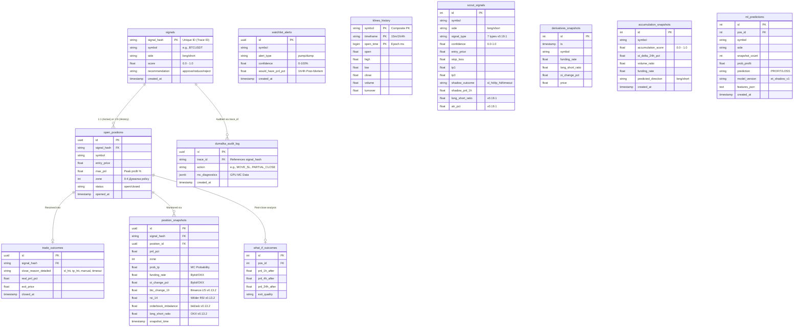

# Risk Engine — Technical Architecture

> **Version**: v0.19.9 · **Updated**: 2026-04-12 · **Status**: PRODUCTION

---

## Overview

Risk Engine (RE) — количественная платформа риск-менеджмента для крипто-торговли на **Bybit**.

Система работает в connection с торговым ботом (VPS Hetzner) через Tailscale VPN и включает 8 фоновых систем:

```
┌────────────────────────────────────────────────────────────────────────────────┐
│                           RISK ENGINE PLATFORM v0.19.8                         │
│                                                                                │
│  ┌──────────┐  ┌──────────┐  ┌──────────┐  ┌──────────┐  ┌───────────────┐   │
│  │ СКОРИНГ  │  │ ДУМАЛКА  │  │ WATCHLIST│  │  SCOUT   │  │  АНАЛИТИКА    │   │
│  │          │  │          │  │ SCANNER  │  │ v0.19.8  │  │               │   │
│  │ 7-компо- │  │ 5-зонная │  │          │  │ 8 signal │  │ 19+ метрик    │   │
│  │ нентный  │  │ политика │  │ Dump/Pump│  │ types    │  │ GPU batch MC  │   │
│  │ scoring  │  │ + MC GPU │  │ Detector │  │ 12 ML    │  │ Dashboard     │   │
│  │ + MC VaR │  │ + Active │  │ + Accum. │  │ features │  │ Chart.js      │   │
│  │ + Kelly  │  │ + SL Cap │  │ + Alerts │  │ Shadow   │  │               │   │
│  └────┬─────┘  └────┬─────┘  └────┬─────┘  └────┬─────┘  └──────┬────────┘   │
│       │             │             │              │               │             │
│  ┌────┴─────┐  ┌────┴─────┐  ┌───┴────────┐                                  │
│  │ SENTINEL │  │ KLINE    │  │ DERIVATIVES│                                   │
│  │ BTC flash│  │COLLECTOR │  │ SNAPSHOTS  │                                   │
│  │ crash WS │  │ OKX→Proxy│  │ FR/OI/LSR  │                                   │
│  └────┬─────┘  └────┬─────┘  └─────┬──────┘                                   │
│       │             │              │                                           │
│  ─────┴─────────────┴──────────────┴───────────────────────────────────────    │
│                  PostgreSQL 18 (13 tables) · NVIDIA Titan V                    │
└────────────────────────────────────────────────────────────────────────────────┘
```

### Результаты (реальные данные)

| Метрика | Значение |
|---|---|
| Депозит | $14 → **$26** (+85% за 6 нед) |
| Обработано сигналов | **500+** (с shadow-аналитикой) |
| Win Rate (approve, Apr 2+) | **63%+** |
| Закрытых позиций | **700+** |
| ML-снимков позиций | **103,000+** (multi-horizon, 34 колонки) |
| Kline хранилище | **10,000+** candles (34 symbols, 3 TF) |
| Scout сигналов | accumulating (8 types, shadow mode) |
| ML Shadow predictions | live (v0.19.6, ET+Optuna, LOO AUC 0.574) |
| Bot communication | HTTP API-first (v0.19.8, no Telegram parsing) |
| Health Watchdog | 9 components monitored, TG alerts (v0.19.7) |
| Watchlist алертов | **339+** |
| MC latency (GPU) | ~300ms |
| Hard SL Cap | 3.5% (active v0.18.8) |

---

## System Architecture

```
                          ┌─────────────────────┐
                          │   Midas AI Signal    │
                          │  (Telegram Channel)  │
                          └──────────┬──────────┘
                                     │ webhook
                                     ▼
┌──────────────────┐      ┌─────────────────────┐      ┌──────────────────┐
│   VPS (Hetzner)  │◄────►│   Risk Engine (RE)   │◄────►│  NVIDIA Titan V  │
│                  │      │   FastAPI + Python    │      │  CuPy FP64 GPU   │
│ • Trading Bot    │ HTTP │   Port 8000           │      │  100K+ scenarios  │
│   Port 8001      │ API  │                       │      └──────────────────┘
│ • Bybit Proxy    │v0.19.8 • Signal Scoring      │
│   Port 8002      │      │ • MC VaR/CVaR         │      ┌──────────────────┐
│                  │      │ • Position Tracker    │◄────►│  PostgreSQL 18   │
└──────────────────┘      │ • Kline Collector     │      │  riskengine_db   │
    ▲  Tailscale VPN      │ • Scout Generator     │      │  13 tables       │
    │                      │ • ML Shadow (v0.19.8) │      │  100K+ records   │
    │                      │ • Health Watchdog     │      └──────────────────┘
    │                      └─────────────────────┘
    │                              │ alerts
    │                              ▼
    │                     ┌─────────────────────┐
    └─────────────────────│   Telegram Bot API  │
                          │ (Direct HTTP / httpx)│
                          └─────────────────────┘
```

### Network Topology

| Component | Location | Address | Purpose |
|---|---|---|---|
| **Risk Engine** | Proxmox VM (Debian 13) | `localhost:8000` | Core service |
| **Trading Bot** | VPS Hetzner | `100.117.168.63:8001` | Order execution (Bybit) |
| **Bybit Proxy** | VPS Hetzner | `100.117.168.63:8002` | Market data + authenticated API |
| **GPU** | Proxmox Host (PCIe passthrough) | — | Monte Carlo simulations |
| **Tailscale** | Mesh VPN | `100.x.x.x` | Secure inter-node comms |
| **Cloudflare Tunnel** | Edge | `digital7.org` | External HTTPS access (fallback: ngrok) |

---

## Signal Processing Pipeline

```
Midas Signal (TG)
    │
    ▼
POST /webhook (main.py)
    │
    ├─► 1. Parse WebhookPayload (models.py)
    │
    ├─► 2. Fetch Market Data (bybit.py)
    │       ├── Price + Klines (168h)         ← Bybit Proxy → Binance.US
    │       ├── Orderbook Depth (20 levels)   ← Bybit Proxy → Binance.US
    │       ├── Multi-TF Trends (15m/1h/4h)   ← Bybit Proxy → Binance.US
    │       ├── Funding Rate                   ← Bybit Proxy → OKX
    │       └── OI Change (in-memory delta)    ← Bybit Proxy → OKX
    │
    ├─► 3. Detect Market Regime (regime_detector.py)
    │       └── trending / ranging / volatile / low_liquidity / normal
    │
    ├─► 4. Compute Signal Score (scoring_v2.py)
    │       ├── 7 weighted components (0.0–1.0)
    │       ├── Data Quality Penalty (-15% per missing field)
    │       └── Kelly Criterion sizing
    │
    ├─► 5. Monte Carlo VaR/CVaR (core/monte_carlo.py)
    │       ├── Jump-Diffusion GBM (GPU FP64)
    │       ├── 100K scenarios × N assets
    │       └── VaR(99%), CVaR, Liquidation Prob
    │
    ├─► 6. Portfolio Limits (portfolio_allocator.py)
    │       └── Sector exposure check (max 50%)
    │
    ├─► 7. Save to DB + Send TG Alert
    │
    └─► 8. Callback → Trading Bot
            └── approve/reduce/reject + position size
```

---

## Scoring Engine (v0.7.0+)

### Component Weights (v0.18.1 rebalance)

| Component | Weight | Source | Range | Predictive? (408 trades) |
|---|---|---|---|---|
| `win_rate` | 25% | Midas metadata | 0.0–1.0 | ✅ Δ=+0.088 |
| `probability` | 22% | Midas metadata | 0.0–1.0 | ⚪ Δ=-0.012 |
| `risk_reward` | 17% | Midas metadata | 0.0–1.0 (cap 5.0) | ❌ Δ=-0.053 (inverted) |
| `trend_align` | 14% | Multi-TF EMA (15m/1h/4h) | 0.0–1.0 | ⚪ Δ=-0.022 |
| `liquidity_ok` | 8% | Orderbook spread | 0.0–1.0 | ⚪ Δ=-0.028 |
| `vol_ok` | 7% | Annualized volatility | 0.0–1.0 | ⚪ Δ=+0.018 |
| `funding_oi` | 7% | Funding rate + OI delta | 0.0–1.0 | ⚪ Δ=-0.026 |

> **v0.14.2 Insight**: Only `win_rate` has statistically significant predictive power (Δ=+0.088). `risk_reward` is inversely correlated. Post-scoring `repeat_signal_boost` (+0.03 for same symbol+side <6h) has WR 52% vs 41%.

### Decision Thresholds

| Score | Recommendation | Action |
|---|---|---|
| ≥ 0.60 | **Approve** | Full size (Kelly-adjusted) |
| 0.45–0.60 | **Reduce** | Half size |
| < 0.45 | **Reject** | No trade |

### Data Quality Penalty (v0.7.1, see v0.16.1 retrofix)
Missing `win_rate`, `probability`, or `risk_reward` → −15% per field. Floor: 55% of original score.

> **v0.16.1 Note**: A bot-side regex bug (`signal_parser.py`) caused `win_rate` to parse as NULL
> for `"67.%"` format, triggering this penalty for 46% of historical signals. Fixed 2026-03-31.
> Affected signals are annotated with `corrected_score` / `corrected_recommendation` in the DB.

### Graceful Reversal Protocol (v0.14.5) & Same-Coin Re-Entry (v0.17.0)
When a signal arrives for a symbol that already has an active trade:
*   **Same Direction (< REENTRY_COOLDOWN_HOURS)**: Rejected (`reentry_cooldown`). Too soon to re-enter.
*   **Same Direction (>= REENTRY_COOLDOWN_HOURS)**: **(v0.17.0)** Passes to full scoring. If `approve`/`reduce`, RE sends Dumalka `full_close` to bot (await), closes old position in DB (`close_reason='re_entry'`), then approves the new signal. If close fails, new signal is rejected.
*   **Same Direction (REENTRY_ENABLED=false)**: Rejected (`already_in_position`) — legacy behavior.
*   **Opposite Direction (< 4h old)**: Rejected (`whipsaw_protection`).
*   **Opposite Direction (> 4h old)**: Passes to scoring. If `approve`, RE sends Dumalka `full_close` to bot (await), closes old position in DB (`close_reason='trend_reversal'`), then approves. **(v0.17.0 fix: was DB-only, now sends full_close to bot.)**

---

## Operational State: Dual-Mode Architecture (v0.10.1)

Risk Engine и Trading Bot функционируют в **гибридном двухуровневом режиме**:

1. **Контроль входа (Shadow Mode)**:
   Торговый бот самостоятельно принимает решения об открытии позиций фиксированным лотом. Механизм динамического лота (**Conviction Sizing**) встроен в код интеграции бота (Inline RE Query), но намеренно **отключен** (`RE_CONVICTION_SIZING=false`) для безопасного сбора статистической корреляции Score ↔ Win Rate.
2. **Контроль выхода (Active Mode)**:
   Как только позиция открыта, в работу вступает "Думалка". Она непрерывно анализирует рынок и отправляет прямые HTTP API команды боту для проактивной фиксации прибыли (`partial_close`, `full_close`) и защиты капитала (`move_sl`).

---

## Думалка — Position Management (Active Mode)

### Zone Policy (v0.18.9 — Z1 hold, calibrated on 425 positions + 72K snapshots)

| Zone | TP Progress | DD Threshold | Action | Close Fraction |
|------|-------------|-------------|--------|---------------|
| **0** (start) | 0–5% | — | Hold, normal SL | 0% |
| **1** (early profit) | 5–20% | >40% from max_pnl | **Hold** (was sl_breakeven, changed v0.18.9) | 0% |
| **2** (protect) | 20–40% | >30% from max_pnl | Partial close | 25% |
| **3** (lock-in) | 40–70% | >25% from max_pnl | Main close | 55% |
| **4** (maximum) | 70%+ | >15% from max_pnl | Near-full close | 90% (Dynamic: 5-30% moonbag) |

> **v0.18.8**: Hard SL Cap active at 3.5% (`MAX_LOSS_PCT`). Force-closes positions regardless of zone if loss exceeds cap.

### 4-Level Decision Pipeline

```
Every 30 seconds:
    │
    ├─► Level A.0: Portfolio Correlation Shield (v0.12.0)
    │     └── If avg open positions correlation to BTC > 80% → tighten all thresholds by 30%
    │
    ├─► Level A.1: Zone Policy
    │     └── Determine zone (0-4) by TP progress
    │     └── Check drawdown vs adaptive zone threshold (regime-aware cap)
    │
    ├─► Level B: MC Forward Projection (GPU)
    │     └── 100K scenarios, 4h horizon
    │     └── P(TP), P(SL) → adjust thresholds
    │
    ├─► Level C: Differential MC (on trigger)
    │     └── Compare CVaR: hold vs 10 different close fractions (v0.12.0)
    │     └── Select optimal close fraction
    │
    └─► Level D: Portfolio Risk Override
          └── Force close if portfolio VaR > limit
```

### Smart Time-Decay Exits (v0.9.3 — CHECK 3.5)

Data-driven rule: trades lasting **1-4 hours** without TP progress have **20.2% Win Rate** (-$113.6 cumulative loss).

```
Every 30 seconds (after MC projection):
    │
    └─► CHECK 3.5: "Danger Zone" 1-4h
          ├── Is trade 1-4h old with no TP progress (<15%)?
          ├── Momentum Override:
          │     ├── TP progress ≥ 15%?  → EXEMPT (winners avg 27.1%)
          │     ├── Current PnL ≥ 2%?    → EXEMPT (winners avg 2.69%)
          │     └── MC P_tp > 1.5×P_sl?  → EXEMPT (strong statistical edge)
          │
          ├── Is Current PnL ≤ 0%?
          │     ├── YES (Red)   → ⏳ EXEMPT (SL will handle properly, NEVER partial close in a loss)
          │     └── NO (Green)  → ⏳ APOLLO Fractional Bail (70% partial close, 30% moonbag)
          │
          └── ANY signal alive → ⏳ EXEMPT, let it ride
```

### v0.10.1 Enhancements

#### Orderbook Shielding (Apollo Step 2)
Dynamic SL placement behind L2 orderbook "walls" instead of static -0.8%:

| Step | Action |
|---|---|
| 1. | Fetch raw orderbook via `fetch_orderbook_raw()` |
| 2. | Scan bids (long) / asks (short) in range -0.3% to -2.0% from entry |
| 3. | Find "wall" = level with volume ≥5× median |
| 4. | Place SL 2 ticks behind wall |
| 5. | Safety cap: max -2% from entry. Fallback: static -0.8% |

#### Yield-Aware Apollo (Time-Decay)
Funding Rate dynamically adjusts the time-decay window:

| Funding vs Position | TIME_DECAY_END_H | Logic |
|---|---|---|
| Extreme IN our favor | **6.0h** | Earning carry → hold longer |
| Neutral (|FR| < 0.05%) | **4.0h** (default) | Standard behavior |
| Extreme AGAINST us | **2.0h** | Bleeding carry → exit faster |

#### Binance Sentinel (`core/sentinel.py`)
Flash crash monitor via Binance Futures WebSocket:

| Level | Threshold | Action |
|---|---|---|
| ALERT | ≥0.5% drop in 5s | Log + buffer |
| EMERGENCY | ≥1.0% drop in 5s | TG alert + (optional: full close) |

Features: auto-reconnect, 60s heartbeat, 1m emergency cooldown, `/health` integration.

#### Bybit WebSocket Price Feed (`core/bybit_ws.py`, v0.15.1)
Real-time ticker stream via `wss://stream.bybit.com/v5/public/linear`:

| Feature | Value |
|---|---|
| Symbols | All 23 historically traded |
| Update rate | ~0.7-1.5 msg/s |
| Mode | Shadow (observe only) |
| Data | price, bid, ask, mark, spread, 24h change |
| Auto-reconnect | Exponential backoff (5s → 60s) |
| Re-subscription | Every 5 min (picks up new positions) |

Free, no geo-block from Proxmox server. Dashboard widget + `/api/ws-prices` endpoint.

#### DB Optimization
Continuous `vacuum_snapshots()` prevents performance degradation by removing stale AI snapshots.

### v0.14.2 Active Mode HFT Engine

#### Maker Limit Grid Engine
Bybit Taker fees (0.055%) eat 8-12% of total PnL. The new Limit Grid eliminates this by dynamically placing `Reduce-Only Maker Limits` the exact second a position is mathematically confirmed.
1. When target 2R/3R levels are calculated, RE sends a `place_limit_tp` action mapped to Midas Bot.
2. Midas bot sets the limit order.
3. This completely bypasses the historic 60-second RE polling lag.

#### Ghost Recovery Engine
To solve the "Missed Rocket" Whipsaw problem where a high-conviction trade is stopped out by an institutional wick by just 0.05% before flying to TP3.
1. **Trigger:** Trade closes with PnL between -1.0% and +1.0% (Break-Even or tight Stop).
2. **Validation:** RE queries the `multi_tf_trends_json` parameters. If 1H/4H trend strength is still > 0.7...
3. **Ghost Webhook:** RE forces the bot to re-enter (Re-open) the position immediately without waiting for a new TradingView signal.

### v0.14.2 Shadow PnL & Scoring Quality

#### Shadow PnL Tracker (`shadow_pnl_backfill_loop`)
Background loop (every 5 min) that backfills counterfactual outcomes for ALL signals:

| Phase | What | When | Columns |
|---|---|---|---|
| **1a** | Price snapshot delta vs entry | Signal age ≥ 1h | `shadow_pnl_1h` |
| **1b** | Price snapshot delta vs entry | Signal age ≥ 4h | `shadow_pnl_4h` |
| **2** | SL/TP klines simulation | Signal age ≥ 4h + has SL/TP | `shadow_outcome` (sl_hit/tp_hit/open/no_data) |

Phase 2 fetches 15-min klines via Bybit Proxy and simulates candle-by-candle
whether the signal's own SL or TP would have been hit first.

#### Shadow Recheck — Second Pass (v0.16.0, 2026-03-31)
Signals that remain `open` after the initial 48h window are periodically rechecked:
- Fetches klines starting from `shadow_checked_at` (last processed point)
- Batch of 5 signals per cycle, rechecked every 24h until resolved
- Records `shadow_resolved_at` (exact timestamp) and `shadow_resolved_candles` (total 15m candles from signal creation to SL/TP hit)
- Kline drift sanity check: rejects kline data with >24h misalignment

#### Score Correction Backfill (v0.16.1, 2026-03-31)
Retrofix for the win_rate parsing bug (bot regex failed on `"67.%"` format):
- 133 of 287 signals (46%) had `midas_win_rate = NULL` → scoring_v2 applied data quality penalty (×0.85 per missing field)
- One-shot startup backfill computes `corrected_score`, `corrected_recommendation`, `score_quality_penalty` for all affected signals
- 62 signals would have received a different recommendation without the bug
- Columns: `score_quality_penalty` (REAL), `corrected_score` (REAL), `corrected_recommendation` (TEXT)

#### Midas Benchmark (`/api/midas-benchmark`, v0.16.0+)
Live comparison of Midas signal quality vs RE filtering effectiveness:
- `midas_avg_pnl` — average shadow PnL for ALL signals (baseline: what if no RE filter)
- `re_approve_avg` — average shadow PnL for RE-approved signals only
- `re_delta_vs_midas` — the value RE adds (positive = RE helps, negative = RE reduces returns)
- `corrected_*` metrics (v0.16.1) — what-if analysis undoing win_rate bug penalty
- Dashboard panel with 6 live metrics, auto-refreshed every 30s

#### Scoring Quality (`/api/scoring-quality`)
Comprehensive ML-ready analysis endpoint:
- **Confusion Matrix**: True/False Reject × True/False Approve
- **Calibration Curve**: Score bucket → actual win rate (monotonicity check)
- **Threshold Optimizer**: F1-maximizing cutoff across 9 threshold levels
- **Timing Analysis**: 1h vs 4h PnL correlation (signal decay measurement)

### v0.12.0 Adaptive Dumalka (Dmitry's Feedback)

#### Portfolio Heat Check (Correlation Shield)
Integrated `gpu_correlation_matrix()` directly into the fast Execution Loop. If the average correlation of open positions to BTC exceeds `0.80`, a `heat_modifier` of 0.7x is applied to all zone drawdown thresholds, forcing proactive profit-taking across the board to shield against correlated BTC network drops.

#### Expanded & Dynamic Exits
- **Dynamic Moonbag (Zone 4)**: Instead of a hardcoded 10% moonbag (0.90 close fraction), the remaining position size dynamically scales between 5% and 30% based on real-time Monte Carlo Confidence (`p_tp * 0.40`).
- **10-Tier Differential MC**: Expanded the GPU optimizer from testing 4 coarse fractions to 10 fine-grained options `[0.0, 0.15, 0.25, ..., 0.95, 1.0]`.
- **Regime-Aware Threshold Caps**: The maximum adaptive multiplier is now regime-dependent: `1.5x` in trending markets (let profits run), `1.2x` in normal, and `0.9x` in ranging (aggressive exit).
- 8 new indexes: 2 BRIN + 3 composite + 3 partial
- `create_weekly_partitions()` function for 1M+ row scalability
- Total: 21 indexes across `position_snapshots` + `open_positions`

### Per-Symbol Circuit Breaker (v0.9.3)

| Feature | Description |
|---|---|
| **Isolation** | Each symbol has its own failure counter (`_consecutive_failures[symbol]`) |
| **Smart Classification** | Non-retriable errors ("no active trade", "already closed") don't increment counter |
| **Auto-Cooldown** | Breaker resets after 5 min, re-attempting operations automatically |
| **TG Digest Labels** | ✅ ACTIVE / 👻 SHADOW / ⚡ BREAKER clearly differentiated in hourly digest |

### Bot ↔ RE Communication (v0.19.8 — API-first)

All machine-to-machine communication between Trading Bot and Risk Engine uses **pure HTTP API** (v0.19.8+). Telegram is used exclusively for human-facing observability.

| Path | Direction | Endpoint | Purpose |
|------|-----------|----------|---------|
| Signal approval | Bot → RE | `POST /tv-webhook` (`source=bot_direct`) | Risk scoring + MC, returns `EnrichedRiskResult` synchronously |
| Trade events | Bot → RE | `POST /trade-outcome` | Lifecycle events (open, tp_hit, sl_hit, close) — 14 types |
| Position commands | RE → Bot | `POST /dumalka/command` | move_sl, full_close, partial_close, place_limit_tp, move_tp |
| Roster sync | RE → Bot | `GET /dumalka/positions` | Bot's active symbols (every 30s) |

Full contract: **[docs/BOT_API_CONTRACT.md](../docs/BOT_API_CONTRACT.md)**

**Migration status**: Phase 1 complete (RE side ready). Phase 2: bot switches to direct API calls.

---

### Telegram Notifications (v0.9.1)

| Type | Delivery | Trigger |
|---|---|---|
| Routine (`MOVE_SL`, `partial_close`) | Hourly digest (buffered) | Zone threshold hit |
| Critical (`full_close`, `portfolio_override`) | Immediate | Risk limit breach |
| Contra-trend alerts | Immediate (confidence ≥ MED) | Pump/Dump vs trend |

Anti-spam: SL breakeven deduplication, 500-entry buffer, 1h flush cycle.

---

## Watchlist Scanner (v0.9.2)

### Contra-Trend Detection

Scanner runs every 5 minutes across 8 symbols. Detects price anomalies (>3% pump in bearish trend, or >3% dump in bullish trend) and evaluates them with a **Multi-Factor Confidence Score** (0-100%):

| Factor | Weight | Condition |
|---|---|---|
| **Trend Alignment** | 30-50% | 2/3 or 3/3 TF aligned against move |
| **Volume Context** | 15% | Low volume = higher confidence |
| **Funding Alignment** | 15% | Positive funding + SHORT opportunity |
| **OI Decline** | 10% | Decreasing OI during pump |
| **Magnitude** | 15% | ≥5% move = bonus |

Alerts with confidence ≥50% (MED) → Telegram notification. All events → DB for ML training.

### Event Lifecycle

One alert per unique event (not per scan). Events tracked in `_active_events` dict and cleared when price normalizes.

---

## Kline Collector (v0.19.0)

Background task collecting 15m/1h/4h candles for all 26 historically-traded symbols.

### Architecture

```
Every 60 seconds:
    │
    ├─► 1. Identify symbols (open_positions + historical set)
    │
    ├─► 2. For each symbol × timeframe:
    │       ├── Try OKX Public API (no geo-block, no auth)
    │       ├── Fallback: Bybit Proxy (VPS)
    │       └── Adaptive Source Cache (remembers best source per symbol)
    │
    ├─► 3. Store in klines_history (ON CONFLICT DO NOTHING)
    │
    └─► 4. Heartbeat → /health
```

### Storage

- **Table**: `klines_history` with composite PK `(symbol, timeframe, open_time)`
- **Symbols**: **34** (WATCHLIST + open positions + recently-closed 48h) — v0.19.2
- **Growth**: ~2,000 rows/day (34 symbols × 3 TF × ~20 candles/day)
- **Auto-backfill**: First run fetches last 200 candles per symbol/timeframe

---

## Scout Signal Generator (v0.19.6)

Autonomous shadow signal system generating labeled data for future ML.
Scans **34 symbols** (WATCHLIST + open + recently-closed 48h).

### Signal Types (8)

| Type | Logic | Direction |
|------|-------|-----------|
| `ema_cross_golden` | EMA20 crosses above EMA50 | LONG |
| `ema_cross_death` | EMA20 crosses below EMA50 | SHORT |
| `rsi_oversold_bounce` | RSI < 30, then rises > 35 | LONG |
| `rsi_overbought_reversal` | RSI > 70, then drops < 65 | SHORT |
| `funding_extreme_reversal` | \|funding\| > 0.03%, contrarian | Contrarian |
| `volume_breakout` | Vol > 2.5x avg + directional candle | Directional |
| `rsi_divergence` | Price/RSI divergence (bullish/bearish) | Contrarian |
| `spike_consolidation_breakout` | Spike > 3x ATR → consolidation → breakout | LONG (v0.19.2) |

### ML Feature Snapshot (12 features)

Core: `funding_rate`, `oi_change_pct`, `spread_pct`, `volume_ratio`, `btc_1h_change`, `rsi_14`, `orderbook_imbalance`, `regime`
New (v0.19.1): `long_short_ratio`, `atr_pct`, `ema_distance_pct`, `price_change_4h`

### Derivatives Time-Series (v0.19.1)

Every Scout cycle also collects `funding_rate`, `oi_value`, `long_short_ratio`, `price`, `oi_change_pct` for all symbols into `derivatives_snapshots`. Staggered API calls (150ms between requests).

### Shadow PnL Resolution

Background resolution checks Scout signals after 1h/4h to backfill shadow PnL (same mechanism as Midas shadow PnL but for Scout-generated signals).

---

## ML Data Readiness & Labeling (v0.19.2)

Для перехода к **Phase 5 (Supervised ML/RL Policy)** реализован полноценный пайплайн сбора и разметки данных.

1. **Сбор признаков (Snapshots)**: Каждые ~30s в `position_snapshots` сохраняется 31+ ML features:
   - *Core (12)*: pnl_pct, max_pnl_pct, drawdown_pct, tp_progress_pct, hours_open, zone, volatility, volume_ratio, mc_p_tp, mc_p_sl, full_e_pnl, pnl_skewness
   - *Conditional (4)*: funding_rate, oi_change_pct, spread_pct, trend_sum
   - *Intelligence (4, v0.13.2)*: btc_change_1h, rsi_14, orderbook_imbalance, long_short_ratio
   - *Engineered (4)*: mc_edge, pnl_to_max_ratio, zone_x_tp_progress, funding_rate_change
   - *Context (1)*: market_regime (trending/ranging/volatile/normal)
   - *Multi-horizon (2, v0.19.2)*: `future_pnl_12h`, `future_pnl_max_24h` (running peak)

2. **Автоматическая разметка (Labeler v0.19.2 — Multi-Horizon + Hard SL Cap Guard)**:
   - Скрипт `label_optimal_actions.py` — multi-horizon логика с Hard SL Cap guard (3.5%).
   - Если `drawdown > 3.5%` — label = `close` (невозможно удержать). Если краткосрочный убыток, но `future_pnl_max_24h ≥ 3%` и drawdown в пределах cap — label = `hold` (временная коррекция перед ракетой).
   - *Текущий статус*: Размечено **83,785 hold / 16,345 close / 1,872 partial_close** из 103K+ снимков.

3. **Peak Tracking (`what_if_outcomes` v0.19.2)**:
   - `max_pnl_24h` — максимальный благоприятный PnL в течение 24h после закрытия.
   - `max_pnl_24h_hour` — час, когда был достигнут пик. Позволяет точно измерить "упущенную ракету".

Датасет: **33 колонок**. XGBoost v1 baseline обучен (hold accuracy 92.7%, top feature: zone). Переобучение с multi-horizon features — следующий шаг.

---

## GPU Pipeline (NVIDIA Titan V)

| Function | Module | Scenarios | Latency | Purpose |
|---|---|---|---|---|
| `run_monte_carlo_risk` | `monte_carlo.py` | 100K | ~300ms | Signal VaR/CVaR |
| `gpu_batch_monte_carlo` | `gpu_analytics.py` | 200K × N | ~500ms | Position P(TP)/P(SL) |
| `gpu_sl_optimization` | `gpu_analytics.py` | 150 caps × N | ~50ms | Optimal SL levels |
| `gpu_correlation_matrix` | `gpu_analytics.py` | N×N matmul | ~1ms | Portfolio correlation |

**Hardware**: Volta GV100, FP64 ~6.3 TFLOPS, 12 GB HBM2.  
**Framework**: CuPy + CUDA 12 (NumPy fallback if unavailable).

---

## Market Regime Detector

| Regime | Trigger | DD Sensitivity | Trend Weight |
|---|---|---|---|
| `trending` | EMA sep > 1%, ATR > 0.8 | 0.85× (tighter) | 1.4× (boost) |
| `ranging` | EMA sep < 0.5%, ATR < 1.2 | 1.2× (looser) | 0.6× (reduce) |
| `volatile` | ATR > 2.0 or vol > 200% | 0.65× (tight) | 0.8× |
| `low_liquidity` | Volume ratio < 0.3 | 0.7× (tight) | 0.5× (reduce) |
| `normal` | Default | 1.0× | 1.0× |

Cache TTL: 15 minutes. Based on BTC hourly klines.

---

## Database Schema

**Engine**: PostgreSQL 18.3 · psycopg2 (ThreadedConnectionPool + asyncio.to_thread)  
**Connection**: Unix socket `/var/run/postgresql` · User: `riskengine` · DB: `riskengine_db`

### Entity-Relationship Diagram



### Table Overview

| Table | Records | Purpose |
|---|---|---|
| `signals` | 500+ | Incoming signals + RE scoring decisions + shadow PnL |
| `open_positions` | 700+ | All positions (open + closed + phantom) + zone tracking |
| `trade_outcomes` | 2,200+ | Close events: SL/TP/timeout with exit prices |
| `position_snapshots` | 75,000+ | ML training: PnL, zone, MC, funding, OI per 30s |
| `watchlist_alerts` | 339+ | Dump/pump detections + post-mortem PnL |
| `dumalka_audit_log` | 18,000+ | Position management decision trail — 100% coverage (v0.19.9) |
| `what_if_outcomes` | 700+ | Post-close trajectory analysis (v0.18.5) |
| `klines_history` | 8,000+ | Historical 15m/1h/4h candles, 26 symbols (v0.19.0) |
| `scout_signals` | growing | Autonomous shadow signals, 7 types, 12 ML features (v0.19.1) |
| `derivatives_snapshots` | growing | Funding/OI/LSR time-series per symbol (v0.19.1) |
| `ml_predictions` | growing | ML Shadow predictions per position (v0.19.6, ET+Optuna) |
| `accumulation_snapshots`| — | Coiled Spring detection history (OI/Vol/Funding) |
| `analytics_cache` | — | 3-level materialized views (2ms cache hit) |
| `zone_calibration` | — | Grid-search optimization results |

### Key Indexes (25+)

BRIN (time-series), composite (JOIN paths), partial (status filters).  
Covering: `signal_hash`, `symbol`, `status`, `created_at`, `close_reason`, `zone`, `position_id`.  
Notable: `idx_snapshots_signal_hash` — hyper-fast 75K+ row aggregation.  
New (v0.19.0): `idx_klines_symbol_tf_time` (klines_history), `idx_scout_symbol_created` (scout_signals).  
New (v0.19.1): `idx_deriv_symbol_ts` (derivatives_snapshots).

---

## API Reference

### Core Endpoints

| Method | Path | Purpose |
|---|---|---|
| `POST` | `/webhook` | Receive Midas signal → full pipeline |
| `POST` | `/evaluate` | Direct risk evaluation (JSON) |
| `GET` | `/health` | Health check + version + GPU status |
| `GET` | `/api/signals` | Recent signals list |
| `GET` | `/api/analytics` | Full analytics (19+ metrics) |
| `GET` | `/api/watchlist-alerts` | Scanner alerts with post-mortem |
| `GET` | `/api/accumulation` | Accumulation Radar (Coiled Spring) results |
| `GET` | `/api/capture-ratio` | PnL leakage deep analytics |
| `GET` | `/api/gpu-analytics` | GPU batch MC + SL optimization |
| `GET` | `/api/account` | Bybit wallet balance |
| `GET` | `/api/regime` | Current market regime |
| `POST` | `/trade-outcome` | Record SL/TP hit events |
| `GET`  | `/api/scoring-quality` | Confusion matrix, calibration, threshold optimizer |
| `GET`  | `/api/score-outcome` | Score → PnL outcome scatter data |
| `GET`  | `/api/opportunity-cost` | Ghost Tracker (MFE/MAE analysis) |
| `GET`  | `/api/ws-prices` | Real-time WebSocket prices (shadow mode, v0.15.1) |
| `GET`  | `/api/exit-quality/{id}` | Post-close trajectory for position (v0.18.0) |
| `GET`  | `/api/klines/{symbol}` | Historical klines from DB (v0.19.0) |
| `GET`  | `/api/klines-stats` | Kline storage statistics (v0.19.0) |
| `GET`  | `/api/scout-signals` | Scout shadow signals + ML features (v0.19.0) |
| `GET`  | `/api/ml-shadow` | ML Shadow predictions (ExtraTrees+Optuna v0.19.6) |

### UI Pages

| Path | Page |
|---|---|
| `/dashboard` | Main scoring dashboard |
| `/analytics` | Interactive charts (Chart.js) — 19+ metrics |
| `/info` | About + Roadmap + System Status |

---

## Project Structure

```
risk-engine/
├── src/
│   ├── main.py                   # FastAPI app — all endpoints, 8 bg tasks (2,900+ LOC)
│   ├── config.py                 # Configuration (env vars, 120 LOC)
│   ├── models.py                 # Pydantic v2 data models (151 LOC)
│   ├── scoring.py                # 7-component scoring (356 LOC) — legacy
│   ├── scoring_v2.py             # Strategy Pattern scorer (365 LOC) — ACTIVE
│   ├── bybit.py                  # Market data client (470 LOC) — Bybit Proxy → Binance.US/OKX fallback
│   ├── db.py                     # Database layer (455 LOC)
│   ├── db_adapter.py             # PostgreSQL adapter (312 LOC)
│   ├── exit_quality.py           # Exit Decision Quality Tracker — v0.18.0 (340 LOC)
│   ├── kline_fetcher.py          # Multi-exchange kline fetcher — v0.18.0 (120 LOC)
│   ├── kline_collector.py        # Background kline storage loop, OKX→Proxy — v0.19.0 (280 LOC)
│   ├── scout.py                  # Autonomous shadow signal generator, 8 types — v0.19.6 (550 LOC)
│   ├── position_tracker.py       # Думалка — active mode + ML Shadow predictor (2,300 LOC)
│   ├── models/
│   │   └── et_shadow_v1.pkl      # ExtraTrees+Optuna shadow model (v0.19.6)
│   ├── _archive/                 # Archived modules: position_manager.py, *_v2_prototype.py
│   ├── regime_detector.py        # Market regime classifier (245 LOC)
│   ├── portfolio_allocator.py    # Sector exposure limits (151 LOC)
│   ├── watchlist_scanner.py      # Dump/Pump + Contra-Trend + Post-Mortem (922 LOC)
│   ├── telegram_bridge.py        # Telegram parsing + approval flow (835 LOC)
│   ├── notifications.py          # TG alert helper
│   ├── compound_growth.py        # Dynamic sizing (shadow mode, 165 LOC)
│   ├── daily_report.py           # Daily TG report (cron, 151 LOC)
│   ├── backtest.py               # GPU backtest engine (672 LOC)
│   ├── core/
│   │   ├── monte_carlo.py        # MC VaR/CVaR + SL/TP sim + full E[PnL] (v0.18.1)
│   │   ├── gpu_analytics.py      # GPU batch analytics (274 LOC)
│   │   ├── sentinel.py           # Flash crash WebSocket monitor (208 LOC)
│   │   ├── accumulation_scanner.py  # Coiled Spring detector (440 LOC)
│   │   ├── opportunity_cost.py   # MFE/MAE Ghost Tracker (132 LOC)
│   │   ├── bybit_ws.py           # Bybit WebSocket Price Feed — shadow mode (172 LOC)
│   │   └── trading_env.py        # RL Gym-compatible environment (v0.13.1)
│   ├── scripts/
│   │   ├── calibrate_zones.py    # Grid-search zone optimization
│   │   ├── label_optimal_actions.py  # ML labeling (PostgreSQL, v0.13.1)
│   │   ├── export_ml_dataset.py  # PG → CSV ML export (29 cols, v0.13.2)
│   │   ├── train_exit_model.py   # XGBoost baseline trainer (v0.13.1)
│   │   ├── train_shadow_model.py # ET+Optuna×200 shadow model trainer (v0.19.6)
│   │   ├── ml_experiment_v4.py   # Full model zoo reference (v0.19.6)
│   │   ├── ml_experiment_v7.py   # Champion: ET+Optuna + GPU neural nets (v0.19.6)
│   │   └── backfill_klines_deep.py  # One-time 500×1h + 200×4h backfill (v0.19.5)
│   ├── static/
│   │   ├── dashboard.html        # Main dashboard
│   │   ├── analytics.html        # 19+ interactive charts
│   │   └── info.html             # About + roadmap
│   └── tests/
│       ├── test_risk.py          # MC unit tests (7)
│       ├── test_scoring_v2.py    # Scoring tests (8+)
│       └── test_watchlist_scanner.py  # Scanner tests (6+)
├── PROJECT_RISK_ENGINE_FULL.md   # Full project documentation (2,680+ LOC)
├── dumalka_next_steps.md         # Hypotheses, ML experiments, strategic roadmap (merged v0.19.6)
├── CHANGELOG.md                  # Full version history (v0.1 → v0.19.1)
├── AGENTS.md                     # LLM context for AI coding assistants
└── ARCHITECTURE.md               # ← This file
```

---

## Configuration (Key Environment Variables)

| Variable | Default | Description |
|---|---|---|
| `DATABASE_URL` | `postgresql://riskengine@/riskengine_db` | PostgreSQL (Unix socket) |
| `N_SCENARIOS` | `100000` | Monte Carlo scenario count |
| `BYBIT_PROXY_URL` | `http://100.117.168.63:8002` | VPS Bybit proxy |
| `DUMALKA_BOT_URL` | `http://100.117.168.63:8001` | Trading bot |
| `KELLY_FRACTION` | `0.5` | Half-Kelly sizing |
| `MAX_EXPOSURE_PER_SYMBOL` | `0.20` | 20% max per symbol |
| `DUMP_THRESHOLD_PCT` | `2.5` | Dump detection (%) |
| `SCAN_INTERVAL_SEC` | `300` | Scanner cycle (5 min) |
| `MAX_LOSS_PCT` | `3.5` | Hard SL Cap (v0.18.8) |
| `PHASE1_ACTIVE_MODE` | `true` | Enable hard SL cap enforcement |
| `KLINE_COLLECTOR_ENABLED` | `true` | Enable kline storage (v0.19.0) |
| `KLINE_COLLECT_INTERVAL_SEC` | `60` | Kline collection cycle (v0.19.0) |
| `SCOUT_ENABLED` | `true` | Enable Scout signal generator (v0.19.0) |
| `SCOUT_INTERVAL_SEC` | `900` | Scout cycle — 15 min (v0.19.0) |
| `ML_SHADOW_ENABLED` | `true` | Enable ML Shadow Mode (v0.19.6) |
| `ML_SHADOW_CONFIDENCE_THRESHOLD` | `0.65` | Min prob_profit to log as PROFIT (v0.19.6) |
| `TP1_BE_ATR_SKIP_MULT` | `2.0` | ATR multiplier for TP1 Soft BE skip (v0.19.4) |
| `TP1_BE_OFFSET_MULT` | `1.0` | ATR multiplier for BE offset distance (v0.19.4) |

---

## Tech Stack

| Layer | Technology |
|---|---|
| **Backend** | Python 3.13 + FastAPI + Uvicorn |
| **GPU** | CuPy + CUDA 12 (Titan V, 12GB HBM2) |
| **Database** | PostgreSQL 18.3 + psycopg2 |
| **Frontend** | Vanilla JS + Chart.js |
| **Validation** | Pydantic v2 |
| **HTTP** | httpx (async) |
| **Logging** | python-json-logger + RotatingFileHandler (100MB × 30) |
| **Testing** | pytest + httpx |
| **Networking** | Tailscale VPN + Cloudflare Tunnel |
| **Host** | Proxmox VE 9.1 (Debian 13) |

---

## Roadmap

| Version | Status | Description |
|---|---|---|
| v0.1–v0.5 | ✅ | Core MC Risk, Scoring, API, Dashboard |
| v0.6.0 | ✅ | Portfolio Allocator, Multi-TF, Liquidity |
| v0.7.0 | ✅ | Regime Detector, GPU Backtest, OI/Funding |
| v0.7.1 | ✅ | Data Quality Penalty, RE Effectiveness Report |
| v0.8.0 | ✅ | Observability: JSON Logs, Trace ID, Audit DB |
| v0.8.1 | ✅ | Watchlist Scanner: Dump/Pump Detection |
| v0.8.2 | ✅ | Dumalka Active Mode: Profit Leakage Fixes (RC-1..RC-6) |
| v0.8.3 | ✅ | System Audit: Persistence, TP1 Commands, Circuit Breaker |
| v0.9.0 | ✅ | PostgreSQL Migration, ML Readiness, Optimal Action Labeler |
| v0.9.1 | ✅ | TG Hourly Digest, SL Breakeven Dedup |
| v0.9.2 | ✅ | Contra-Trend Alerts, Event Lifecycle Anti-Spam |
| v0.9.3 | ✅ | Time-Decay Exits (1-4h WR=20.2%→SL BE), Per-Symbol Circuit Breaker, Smart Error Classification, Auto-Cooldown, Mode-Aware TG Digest |
| v0.9.4 | ✅ | **Observability Audit & Fixes**: PostgreSQL migration for reports, Silent Exceptions fixed, Task Heartbeats (`/health`), DB Query Tracing. |
| v0.9.5 | ✅ | **Ghost Tracker & Opportunity Cost**: Background cron `core/opportunity_cost.py`, MFE/MAE analysis via `api.binance.us`, "Godlike" Analytics UI Widget (Saved Drawdown vs Missed Profits). |
| v0.9.6 | ✅ | **Apollo Protocol (Time Decay v2.0)**: Fractional Bailing (70%) + Soft Breakeven (-0.8%) mechanics added to `position_tracker.py` to prevent Missed Rockets. |
| v0.9.7 | ✅ | **Apollo Split-Idempotency & Breaker Fix**: Fixed Circuit Breaker spam from bot rejections. Split Apollo idempotency: `partial_close` 1 try, `move_sl` retries every cycle. |
| **v0.10.1** | ✅ | **Performance & Protection Suite**: Binance Sentinel flash crash monitor, Orderbook Shielding (L2 wall-based SL), Yield-Aware Apollo (funding rate → time-decay), DB BRIN/composite/partial indexes (21 total), `db_adapter.py` connection pool hardening (autocommit reads, health checks, rollback safety). PG timeouts: `statement_timeout=30s`, `lock_timeout=5s`, `idle_in_tx=60s`. |
| **v0.12.0** | ✅ | **Adaptive Dumalka**: Portfolio Heat Check (Correlation Shield), Dynamic Moonbag (Zone 4), 10-Tier Differential MC, Regime-Aware Threshold Caps |
| **v0.14.2** | ✅ | **Data-Driven Insights**: Repeat Signal Boost (+0.03 for <6h), SL buffer (+0.2% for breakeven), Blacklists disabled (data collection phase), Shadow PnL Tracker |
| **v0.13.1** | ⚡ Live | **Desync Resolution + Integration + Code Cleanup**: Auto-Phantom-Close (3× threshold), ATR-Adaptive SOFT BE, MC zone floor fix (MC can't reduce below zone base_frac), Ghost Tracker KPI cards (6 metrics), professional startup logging (9 modules), archived 6 dead files (1,199 LOC → `_archive/`), dead TG notification removed, `IDEAS_FROM_PROTOTYPES.md` created |
| **v0.15.0** | ✅ | **Apollo Audit**: Smart Size Guard (MIN_PARTIAL_CLOSE_USD=17), Full Exit Fallbacks, Flow Control |
| **v0.15.1** | ✅ | **WebSocket Price Feed + Faster Cycle**: Bybit WS (23 symbols, shadow), 30s cycle (was 60s), 8min SL cooldown (was 15min), dashboard widget |
| **v0.17.0** | ✅ | **Same-Coin Re-Entry Protocol**: new same-side signals pass to scoring, Dumalka full_close for re-entry/reversal |
| **v0.18.0** | ✅ | **Exit Decision Quality Tracker**: exit_quality.py + kline_fetcher.py modules, 3-phase analysis (post-close trajectory, BE effectiveness, missed exits), dashboard widget with training insights |
| **v0.18.1** | ✅ | **Scoring Rebalance**: WR 30%, RR 5%, default fallback 30%, data-driven weight adjustment |
| **v0.18.5** | ✅ | **What-If Outcomes Pipeline**: Post-close trajectory analysis (1h/4h/24h), exit_quality scoring |
| **v0.18.6** | ✅ | **Dumalka Audit Log Expansion**: Structured JSONB for all decision types, 95% action coverage |
| **v0.18.8** | ✅ | **Hard SL Cap Activation**: MAX_LOSS_PCT=3.5% active mode, force-close on loss breach |
| **v0.18.9** | ✅ | **Zone 1 Hold + SL Fix**: sl_breakeven removed from Zone 1 (now hold), SHORT SL calc fix |
| **v0.19.0** | ✅ | **Kline Storage + Scout Infrastructure**: kline_collector.py (OKX→Proxy, 3 TF, 26 symbols), scout.py (4 signal types, shadow PnL), adaptive source cache, 3 new API endpoints |
| **v0.19.1** | ✅ | **Scout Enhancement + Derivatives Time-Series**: 3 new signal types (funding/volume/RSI divergence), 4 new ML features, derivatives_snapshots table, API stagger fix, resilient feature snapshot |
| **v0.19.2** | ✅ | **Rocket Catcher + Multi-Horizon ML**: spike_consolidation_breakout signal, future_pnl_12h/24h in snapshots, max_pnl_24h peak tracking (what_if_outcomes), Scout 34-symbol coverage |
| **v0.19.3** | ✅ | **Telegram Proxy Reliability**: proxy-first + fallback chain (Markdown parse fix, notifications.py) |
| **v0.19.4** | ✅ | **ATR-Adaptive TP1 Soft BE**: skip when tp1_dist < 2×ATR(1h), adaptive range 0.5–3.0%, config flags |
| **v0.19.5** | ✅ | **Volatility Risk Profile + Enriched Audit**: 3-tier vol classification (HIGH>=4.0/TRANS/NORMAL), enriched zone_full_exit diagnostics (af/vol_mod/regime_dd/heat/zone/base_thresh), deep kline backfill script |
| **v0.19.6** | ✅ | **ML Shadow Mode**: ExtraTrees+Optuna×200 model (LOO AUC 0.574, 100% win @0.80 in-sample), ml_predictions table, /api/ml-shadow, train_shadow_model.py, startup model loading, deduplication guard; scout.py accumulation_score bugfix |
| **v0.19.6.1** | ✅ | **Close Event Fix**: VALID_EVENTS gate fix (dumalka_close/manual_close/flip_close silently dropped → wrong close_reason for 14 positions), /trade-outcome close handler added; 20 tests |
| **v0.19.7** | ✅ | **Health Watchdog**: health_watchdog.py — async monitor for 9 components + bot connectivity, TG alerts at 7-min silence with 30-min cooldown, recovery notifications. Config: `HEALTH_WATCHDOG_ENABLED`, `BOT_UNREACHABLE_ALERT_SEC` |
| **v0.19.8** | ✅ | **API-first Bot Integration**: Bot↔RE via pure HTTP (no Telegram parsing). `rejection_reason` in `EnrichedRiskResult`, dedup bypass for `source=bot_direct`, `event:open` upsert in `/trade-outcome`, `send_signal_report`/`send_trade_event_report` in notifications.py, `docs/BOT_API_CONTRACT.md` |
| **v0.19.9** | ✅ | **Audit Log 100% Coverage**: Fixes two unaudited close paths from v0.19.8 (`/trade-outcome` bot close events, `/tv-webhook` reversal/re-entry). All `position_closed` entries now written with structured JSONB and queryable `source` field (`position_tracker` / `bot_api` / `webhook_reversal`). 103/103 positions covered. |
| **Phase 5** | ⏳ | ML Shadow validation (N>=200), Triple Barrier labels, Meta-Labeling M2, Offline RL; Bot migration Phase 2 (switch bot to direct API calls) |
| **Phase 7** | 🎯 | Institutional Upgrades: Correlation Hedging, Hazard Models, MoE Regimes |

---

## PostgreSQL Best Practices (db_adapter.py)

> **⚠️ Этот раздел обязателен к прочтению перед любыми изменениями в слое БД.**

### Connection Architecture

```
FastAPI (async) → asyncio.to_thread() → psycopg2 (sync) → PostgreSQL 18 (Unix socket)
                                          └─ ThreadedConnectionPool(2, 10)
```

- **Driver**: `psycopg2` (NOT asyncpg — asyncpg hangs on this system’s event loop)
- **Pool**: `ThreadedConnectionPool(min=2, max=10)` — global singleton `_pool`
- **Connection**: Unix socket `/var/run/postgresql` (NOT TCP)
- **Async bridge**: All sync DB calls wrapped in `asyncio.to_thread()`

### ❗ Critical Rules

| Rule | Why |
|---|---|
| **Always use `_safe_getconn()` / `_safe_putconn()`** | Health check on borrow; auto-rollback on return |
| **Set `conn.autocommit = True` for SELECTs** | Prevents implicit transactions that block autovacuum |
| **Reset `conn.autocommit = False` in `finally`** | Pool connections are reused; don’t leak autocommit state |
| **Call `conn.rollback()` in every `except` block** | Prevents “poisoned connection” (“idle in transaction aborted”) |
| **Never hold a connection across `await`** | `asyncio.to_thread()` runs entire function atomically |
| **SQL uses `?` placeholders** | `_convert_sql()` auto-converts `?` → `%s` for psycopg2 |
| **No raw `_pool.getconn()`** | Always through `_safe_getconn()` for dead-connection detection |

### SQL Dialect Notes

`_convert_sql()` automatically translates SQLite idioms to PostgreSQL:

| SQLite | PostgreSQL (auto-converted) |
|---|---|
| `?` | `%s` |
| `datetime('now')` | `NOW()` |
| `datetime('now', '-N hours')` | `NOW() - INTERVAL 'N hours'` |
| `strftime('%H', col)` | `EXTRACT(HOUR FROM col)::INTEGER` |
| `julianday(a) - julianday(b)` | `EXTRACT(EPOCH FROM (a::timestamp - b::timestamp))/86400` |
| `INTEGER PRIMARY KEY AUTOINCREMENT` | `SERIAL PRIMARY KEY` |
| `INSERT OR REPLACE` | `INSERT` (add `ON CONFLICT` manually) |
| `PRAGMA ...` | Silently replaced with `SELECT 1` |

### PostgreSQL 18.3 Server & Connection Settings (v0.10.1)

**Per-connection (via psycopg2 `options` parameter in `init_pg_pool()`):**

| Parameter | Value | Purpose |
|---|---|---|
| `jit` | **off** | JIT compilation hurts short OLTP queries (<100ms); our queries avg ~2-30ms |
| `statement_timeout` | **30s** | Kill queries running longer than 30 seconds |
| `lock_timeout` | **5s** | Abort if waiting for lock > 5 seconds |
| `idle_in_transaction_session_timeout` | **60s** | Kill sessions with abandoned transactions |
| `work_mem` | **16MB** | 4× default; needed for analytics JOINs on 60K+ snapshot rows |

**Server-level (`ALTER SYSTEM` / `postgresql.conf`):**

| Parameter | Value | Purpose |
|---|---|---|
| `max_connections` | 100 | Server-level max (pool max = 10) |
| `shared_preload_libraries` | `pg_stat_statements` | PG18: Query performance monitoring |
| `track_io_timing` | **on** | PG18: I/O latency visibility in `pg_stat_statements` |
| `track_functions` | **all** | PG18: Function-level performance tracking |

> **PG18 monitoring**: Use `SELECT * FROM pg_stat_statements ORDER BY total_exec_time DESC LIMIT 10;` to find slowest queries.

### Template: Adding a New DB Function

```python
# READ (fetch):
def _sync_fetch_example(sql, params=()):
    pg_sql = _convert_sql(sql)
    conn = _safe_getconn()
    conn.autocommit = True          # ← critical for reads
    try:
        with conn.cursor(cursor_factory=psycopg2.extras.RealDictCursor) as cur:
            cur.execute(pg_sql, params or None)
            return [_serialize_row(dict(r)) for r in cur.fetchall()]
    except Exception as e:
        logger.error(f"SQL ERROR: {pg_sql[:200]} — {e}")
        raise                        # ← _safe_putconn handles rollback
    finally:
        conn.autocommit = False      # ← reset before returning to pool
        _safe_putconn(conn)

# WRITE (execute):
def _sync_execute_example(sql, params=()):
    pg_sql = _convert_sql(sql)
    conn = _safe_getconn()
    try:
        with conn.cursor() as cur:
            cur.execute(pg_sql, params or None)
            conn.commit()             # ← explicit commit for writes
    except Exception as e:
        logger.error(f"SQL ERROR: {pg_sql[:200]} — {e}")
        conn.rollback()               # ← explicit rollback on error
        raise
    finally:
        _safe_putconn(conn)
```

### Common Pitfalls

1. **❌ DO NOT use `asyncpg`** — it hangs on this system’s event loop (tested v0.9.1)
2. **❌ DO NOT use TCP (`127.0.0.1`)** for connections — use Unix socket for reliability
3. **❌ DO NOT forget `conn.rollback()` in except** — this was the #1 cause of connection pool exhaustion (fixed v0.10.1)
4. **❌ DO NOT hold connections in async code** — all DB work must be inside `asyncio.to_thread()` callable
5. **❌ DO NOT use `INSERT OR REPLACE`** without explicit `ON CONFLICT` clause — auto-conversion strips the OR REPLACE

---

## Changelog

See **[CHANGELOG.md](file:///opt/risk-engine/CHANGELOG.md)** for the full version history, release notes, and detailed changes for each version.
